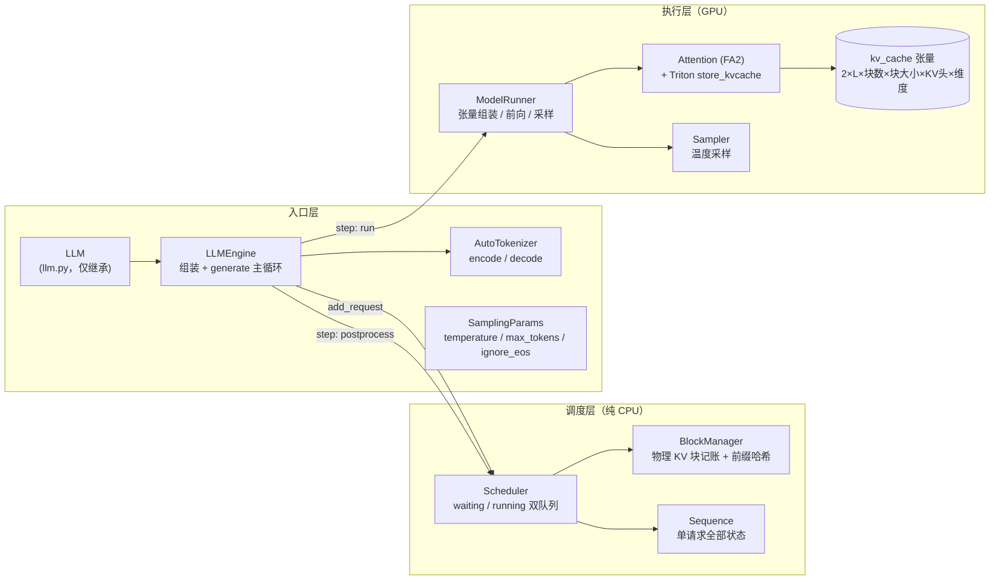
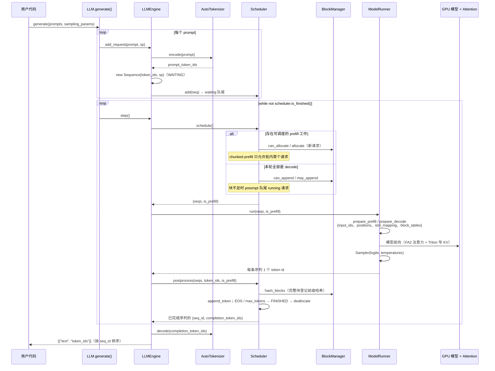
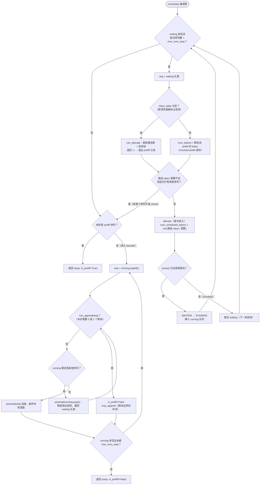

# Day 2 端到端架构与调用链

> 对应 `plan.md` Day 2：从 `LLM.generate` 入口跟踪调用，梳理 Engine、Scheduler、ModelRunner、Tokenizer、SamplingParams 的职责，标出一次请求从进入队列到返回 token 的关键数据结构，并画出"请求路径"与"单轮调度路径"。
>
> 本文只描述当前仓库内原版 nano-vLLM 的离线推理链路（同步 `generate` 接口），HTTP 服务、流式输出等属于 Day 11+ 的扩展，不在本文范围。

- 分析日期：2026-09-07
- 基准 commit：`78474b6`
- 行号引用均基于该 commit，格式为 `文件:行号`

## 1. 组件关系总览

## 2. 模块职责表

| 模块 | 文件 | 核心职责 | 持有的关键状态 |
| --- | --- | --- | --- |
| `LLM` | `nanovllm/llm.py:4` | 薄入口，仅继承 `LLMEngine`，对外提供 `generate` | 无 |
| `LLMEngine` | `nanovllm/engine/llm_engine.py:15` | 组装全部组件；`generate` 主循环驱动 `step()`；负责 prompt 编码与 completion 解码；TP>1 时拉起子进程 | `tokenizer`、`scheduler`、`model_runner`、子进程列表 `ps` |
| `Scheduler` | `nanovllm/engine/scheduler.py:8` | 决定每轮调度哪些请求（prefill 优先）、何时抢占；在 `postprocess` 中驱动序列状态迁移与块回收 | `waiting` / `running` 双端队列 |
| `BlockManager` | `nanovllm/engine/block_manager.py:26` | 物理 KV 块的分配、释放、引用计数与前缀缓存记账（详见 [kv-cache.md](./kv-cache.md)） | `blocks`、`free_block_ids`、`used_block_ids`、`hash_to_block_id` |
| `Sequence` | `nanovllm/engine/sequence.py:14` | 一条请求的逻辑 token 序列与调度进度，是贯穿三层的核心数据结构 | `token_ids`、`block_table`、`num_cached_tokens`、`status` 等 |
| `ModelRunner` | `nanovllm/engine/model_runner.py:15` | 把 `Sequence` 列表组装成 GPU 张量；执行模型前向；采样；CUDA Graph 捕获与重放；KV 池的显存测算与分配 | `model`、`kv_cache`、`graphs`/`graph_vars` |
| `Attention` | `nanovllm/layers/attention.py:43` | FlashAttention2 前向；用 Triton kernel 把新算出的 K/V 按 `slot_mapping` 写入物理块 | 每层持有的 `k_cache` / `v_cache` 视图 |
| `Sampler` | `nanovllm/layers/sampler.py:5` | 按温度采样：logits 除以温度后做 Gumbel-max 风格采样（无 greedy 分支） | 无 |
| `SamplingParams` | `nanovllm/sampling_params.py:5` | 用户侧采样参数：`temperature`、`max_tokens`、`ignore_eos`；`__post_init__` 直接禁止 greedy（`temperature` 必须大于 1e-10） | 无 |
| `Config` | `nanovllm/config.py:6` | 全局配置；从 HF config 读取层数、KV 头数等结构信息 | `num_kvcache_blocks` 在 ModelRunner 测算后才回填 |
| `AutoTokenizer` | transformers | prompt ↔ token id 互转、chat template；由 Engine 持有，调度层和执行层不感知文本 | 词表 |

## 3. 请求路径：一次 `generate` 的完整生命周期

文字版关键节点（含行号）：

1. **创建请求**：`generate` 把所有 prompt 先经 `add_request` 入队（`llm_engine.py:69-70`）。字符串 prompt 在这里 tokenize（`llm_engine.py:44-45`），随后构造 `Sequence` 并追加到 `scheduler.waiting` 队尾（`llm_engine.py:46-47`，`scheduler.py:22-23`）。此刻请求只有逻辑 token，没有任何 KV 块。
2. **主循环**：`while not self.is_finished()`（`llm_engine.py:73`）反复调用 `step()`。`step` 的三段式是整个引擎的心跳：`schedule()` 决定调度 → `model_runner.run()` 执行 → `postprocess()` 记账（`llm_engine.py:49-55`）。
3. **每轮产出**：本轮 `FINISHED` 的序列连同 completion token 一起返回，按 `seq_id` 汇总（`llm_engine.py:54`、`llm_engine.py:84-88`）；循环结束后统一 decode 成文本（`llm_engine.py:89`）。
4. **张量并行**（TP>1）：Engine 在启动时为 rank 1..N-1 各拉起一个 `ModelRunner` 子进程（`llm_engine.py:24-30`）；rank 0 每次执行前把 `(方法名, 序列状态)` pickle 后写入共享内存并置 event 通知各子进程镜像执行（`model_runner.py:76-83`）。`Sequence.__getstate__` 刻意只传 6 个标量/列表而非全部 token（`sequence.py:72-74`），减小广播开销。

## 4. 单轮调度路径：`schedule()` 的分支逻辑

要点（均可在 `nanovllm/engine/scheduler.py:25-73` 对照）：

- **prefill 优先**：只要 waiting 里还有能调度的 prefill 工作，本轮就整轮做 prefill 并直接返回（`scheduler.py:54-55`），decode 完全让路。这是原版最简化的 mixed-batch 策略，也是 Day 9 混合调度要改进的点。
- **前缀缓存查询只发生在新请求首次进入时**（`scheduler.py:35-39`）：`can_allocate` 返回可复用的完整块数；返回 `-1` 表示连新块都不够，prefill 分支立刻停止接纳。
- **chunked prefill 仅限批内首个序列**（`scheduler.py:42-43`）：后续序列必须能一次性放完整个 prompt 才准进入，避免多个长请求互相拆碎。
- **decode 每序列只前进 1 个 token**（`scheduler.py:67`）。跨过块边界（`len(seq) % block_size == 1`）时 `may_append` 补 1 个新块（`block_manager.py:106-108`）。
- **抢占牺牲队尾**（`scheduler.py:60-64`）：decode 需要新块而空闲池为空时，`preempt(running.pop())` 释放最后进入的序列的全部块，把它塞回 waiting 队首（`scheduler.py:75-79`）；恢复方式是整段重新 prefill（recompute，无 swap）。
- **postprocess 记账**（`scheduler.py:81-92`）：先 `hash_blocks` 为新写满的完整块登记前缀哈希，推进 `num_cached_tokens`；chunked prefill 未完成时本轮采样 token 直接丢弃（`scheduler.py:86-87`）；命中 EOS（未设 `ignore_eos`）或达到 `max_tokens` 即 `FINISHED` 并 `deallocate` 全部块。

## 5. 关键数据结构

### 5.1 `Sequence`：一条请求的全部逻辑状态（`sequence.py:14-31`）

| 字段 | 含义 | 谁修改它 |
| --- | --- | --- |
| `seq_id` | 自增计数器，即提交顺序 | 创建时分配 |
| `status` | `WAITING` / `RUNNING` / `FINISHED`（`sequence.py:8-11`） | Scheduler |
| `token_ids` | prompt + 已生成 token 的完整列表 | `append_token`（postprocess） |
| `num_prompt_tokens` / `num_tokens` | prompt 长度 / 当前总长度 | 前者不变，后者随生成增长 |
| `num_cached_tokens` | KV 已写入（或前缀已复用）的 token 数，兼作 chunked prefill 进度 | postprocess / allocate |
| `num_scheduled_tokens` | 本轮调度的 token 数（prefill 可 >1，decode 恒为 1） | schedule |
| `is_prefill` | 下一次执行是否按 prefill 语义 | schedule / preempt |
| `block_table` | 逻辑块号 → 物理 block_id 的映射表 | BlockManager |
| `temperature` / `max_tokens` / `ignore_eos` | 从 `SamplingParams` 拷贝 | 创建时拷贝，之后独立 |

注意 `num_cached_tokens` 一字段承担两职：新请求时表示前缀缓存命中的 token 数（`block_manager.py:92`），chunked prefill 期间又作为"已写入 KV 的进度"（`scheduler.py:84`）。

### 5.2 `Context`：一次前向的 GPU 侧打包（`utils/context.py`）

`ModelRunner.prepare_*` 构造、`Attention.forward` 消费，模块级全局单例，跑完即 `reset_context`：

| 字段 | prefill 时 | decode 时 |
| --- | --- | --- |
| `cu_seqlens_q` / `cu_seqlens_k` | varlen 注意力的累计序列长（k 侧含缓存前缀） | 不用 |
| `slot_mapping` | 本轮所有要写 KV 的 token 的物理槽位 | 每序列 1 个槽位 |
| `block_tables` | 仅前缀命中时给出（供 FA2 读物理缓存） | 每序列一份（补齐同长） |
| `context_lens` | 不用 | 每序列当前总长 |
| `max_seqlen_q/k` | FA2 varlen 需要的最大长度 | 不用 |

### 5.3 GPU 张量

- `kv_cache`：形状 `[2(K/V), 层数, 块数, block_size, KV头数, head_dim]`（`model_runner.py:115`），本机实测 `(2, 28, 698, 256, 8, 128)`、bf16、19.1 GiB。每层 `Attention` 持有其中的 `k_cache/v_cache` 视图（`model_runner.py:117-121`）。
- `block_tables`：`[batch, 最大块数]` int32，不足处补 -1（`model_runner.py:123-127`）。
- `slot_mapping`：物理槽位 = `block_id × block_size + 块内偏移`，Triton kernel 据此散射写入（`attention.py:11-30`）。

### 5.4 `Config` 的初始化顺序依赖

`num_kvcache_blocks` 初始为 -1（`config.py:18`），要等 `ModelRunner` 完成 warmup 并实测显存后回填（`model_runner.py:103-114`）。因此 Engine 必须先建 `ModelRunner` 再建 `Scheduler`（`llm_engine.py:31-34`）——Scheduler 构造时读取的就是回填后的块数。这是隐式顺序约束，重构时容易踩坑。

## 6. 四个关键问题（用自己的话回答）

1. **谁创建请求？** `LLMEngine.add_request`。它把字符串 prompt 交给 tokenizer 编码成 token id，构造 `Sequence`（初始 `WAITING`），塞进 Scheduler 的 `waiting` 队尾。此后请求的身份、进度、采样参数全部由这个 `Sequence` 对象承载。
2. **谁分配 KV block？** Scheduler 在 `schedule()` 里通过 BlockManager 分配，模型层完全不插手。prefill 首次进入时按整个 prompt 的块数 `allocate`（先查前缀哈希能白拿几个完整块）；decode 每步用 `can_append/may_append` 最多补 1 块；块不够时 Scheduler 自己决定抢占谁（队尾 running 序列）并 `deallocate` 腾地方。物理显存池本身则由 ModelRunner 在启动时按剩余显存一次性划出。
3. **谁执行模型？** ModelRunner（rank 0；TP>1 时通过共享内存 + event 把调度结果广播给其他 rank 的 ModelRunner 子进程镜像执行）。它把 `Sequence` 列表打包成 `input_ids/positions/slot_mapping/block_tables` 张量，跑 Qwen3 前向；真正读写 KV 的是每层的 Attention：Triton kernel 按 `slot_mapping` 写入物理块，FlashAttention 按 `block_tables` 读回做注意力；最后 Sampler 按 `Sequence.temperature` 采样出每序列 1 个 token。
4. **谁决定下一轮？** 分两层：**要不要再来一轮**由 `LLMEngine.generate` 的 `while not is_finished()` 决定（waiting 和 running 都空才停）；**下一轮跑什么**由 `Scheduler.schedule()` 决定——prefill 优先、预算（`max_num_batched_tokens`）内能塞几个塞几个、塞不下整段的只准队首 chunk、实在没 prefill 才轮到 decode。序列的状态迁移（完成、回收）则发生在 `postprocess`。

## 7. 阅读中值得注意的设计取舍与隐患

- **prefill 饿死 decode**：有长 prompt 持续到达时 decode 停滞，TPOT 无上界。Day 9 计划中的混合调度正是针对这一点。
- **抢占 = 全量重算**：被抢占序列丢弃全部块、回到 waiting 队首，恢复时重新 prefill（可能借前缀哈希快速找回部分块）。没有 swap 路径，实现最简单，代价是恢复成本高。
- **无 greedy 采样**：`SamplingParams` 显式断言 `temperature > 1e-10`（`sampling_params.py:11`）。后续做正确性对比（Day 4/18）时需要用极小温度近似或自行加 greedy 分支。
- **超长 prompt 直接崩溃**：若单个 prompt 需要的块数超过整个物理池，`can_allocate` 永远返回 -1 且两队列非空，`schedule` 里 `assert scheduled_seqs`（`scheduler.py:71`）会以 AssertionError 崩溃，而不是报"上下文超限"。
- **同步批式 API**：`generate` 一次性收集结果，没有单请求流式返回；Engine 也非 AsyncEngine。服务化（Day 11-13）需要把 `step()` 心跳搬到事件循环里。
