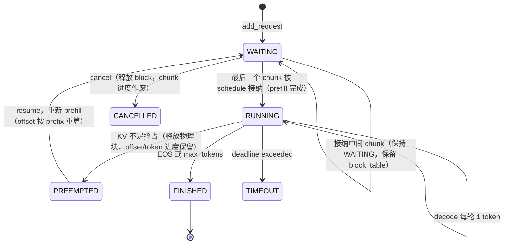

# Day 8 Chunked Prefill 设计

> 本文对应 `plan.md` 阶段二 Day 8，目标是把长 prompt 的 prefill 拆成显式、可验证的多个 iteration，逐块写入 KV Cache，并保证跨 chunk 的 token 顺序、位置编码和 attention 语义与一次性 prefill 完全一致。本文是**待实现的设计与验收标准**，不是实现完成报告；文中“当前实现”指编写文档时 `feature/chunked-prefill` 分支（基线为 dev=`5d56710`，含 Day7）的实际代码。

- 适用范围：`Sequence` 的 prefill 进度语义、`Scheduler` 的 prefill 分块接纳、`BlockManager` 的进度提交、`ModelRunner`/`Context`/`Attention` 的输入构造与执行契约、采样行为、以及 CPU/GPU 测试与性能对比。
- 不在本日范围：混合 Prefill/Decode batch（Day9）、完整取消/超时/抢占与恢复策略（Day10）、HTTP/SSE 与流式输出（Day11–13）、Prefix Cache 淘汰策略（LRU/LFU）、自适应 chunk size、请求优先级、量化/投机解码/PD 分离。
- 相关设计：[请求生命周期](./request-lifecycle.md)、[每轮 Token Budget](./token-budget.md)、[Prefill/Decode](./prefill-decode.md)、[KV Cache](./kv-cache.md)、[架构](./architecture.md)。
- 涉及代码：`nanovllm/config.py`、`nanovllm/engine/sequence.py`、`nanovllm/engine/scheduler.py`、`nanovllm/engine/block_manager.py`、`nanovllm/engine/model_runner.py`、`nanovllm/engine/llm_engine.py`、`nanovllm/engine/context.py`（`nanovllm/utils/context.py`）、`nanovllm/layers/attention.py`、`nanovllm/layers/sampler.py`。

## 1. 需求背景与当前差距

Day7 已建立每轮 token budget：prefill 首候选可按 `min(needed, remaining)` 拆分，后续候选必须整段放下。这套“预算驱动的隐式分块”保证了 `0 <= sum(num_scheduled_tokens) <= B`，但它有三个本质局限：

1. **进度语义是隐式的、双重的**。当前 prefill 进度完全由 `num_cached_tokens` 承载，它同时表示“prefix 命中的完整块 token 数”（`BlockManager.allocate` 设置）和“已执行并写入 KV 的 query token 数”（`postprocess` 累加）。两个语义共用一个字段，靠调用时序隐式区分，没有任何显式校验；一旦出现部分执行、异常或抢占恢复，就没有独立的事实源可以核对。
2. **没有 per-chunk 控制面**。单轮 prefill 的 query 数只受预算 `B` 约束，无法表达“每个请求每轮最多推进 256/512/1024 个 token”这类计算量控制。`plan.md` Day8 要求的 `chunk_size` 显式上限、`prefill_offset` 进度和完成标志均不存在。
3. **采样行为与分块正确性互相耦合**。`ModelRunner.run` 把整个 prefill 批次的 `[T, vocab]` logits 交给 `Sampler`，而 `temperatures/top_ps/generators` 的长度只有 `len(seqs)`——`zip` 会静默取前 `len(seqs)` 行 logits，单序列 chunk 大于 1 时采样的是**第一个 token** 的 logits，多序列变长时整体错位。同时部分 chunk（非最后一个）也会消费 sampler RNG，导致“分块与一次性 prefill 输出一致”的验收在不改采样路径前无法成立。

Day8 的核心工作是：把 prefill 进度从隐式字段升级为显式、单一事实源的 `prefill_offset`，引入固定 `chunk_size` 上限和派生的完成标志，修正采样行选择与 RNG 消耗问题，并用 CPU 契约测试 + GPU 实测证明跨 chunk 的位置编码、attention 语义和最终输出与一次性 prefill 一致。

## 2. 目标与非目标

### 2.1 必须达到的目标

1. `Sequence` 增加显式 `prefill_offset`（已成功写入 KV 的逻辑 token 数）、配置级 `chunk_size`（单请求单轮 prefill query 上限）和派生的 `prefill_complete` 完成标志。
2. 长 prompt 拆成多个 iteration：每轮调度一个 chunk，逐块写入 KV Cache；chunk 区间连续、单调、无重叠、无遗漏。
3. 跨 chunk 正确性：token 顺序保持；位置编码使用绝对位置（不从 0 重置）；attention 的 key 长度为“历史有效 KV + 当前 query”，causal mask 语义不变；`slot_mapping` 与 `block_table` 对齐、跨物理块边界正确。
4. `chunk_size` 与 Day7 token budget 同时生效：每轮每个 prefill 请求 `q_i <= chunk_size` 且 `sum(q_i) <= B`；两条上限独立校验，互不替代。
5. 8K prompt 可分块完成且不 OOM（在合理 KV 容量配置下）。
6. Chunked Prefill 与一次性 Prefill 在 greedy（temperature=0）模式下最终 token_ids 与文本一致（至少 5 个固定 prompt）。
7. 对 `chunk_size = 256/512/1024` 三档记录执行时间与显存峰值，形成可复现的对比数据（只报告观测值，不承诺性能改善）。
8. 全程保持 Day6 状态机与 Day7 预算的不变量：`schedule()` 返回 tuple、`step()` 正负工作量、终态幂等清理、预算延后零资源副作用、所有权保护、事件日志契约（含 `observed_at`）。

### 2.2 明确不做的事情

- 不实现 Day9 的 mixed prefill/decode batch；每轮仍返回单阶段批次（纯 prefill 或纯 decode）。
- 不实现 Day10 的完整取消/超时/抢占恢复增强；沿用 Day6/Day7 既有行为，仅保证 chunk 进度在这些路径上不被破坏。
- 不做 HTTP/SSE、优先级调度、Prefix Cache 淘汰、自适应 chunk size、投机解码。
- 不把 `chunk_size` 当作显存硬上限：物理 block 仍按逻辑上下文一次性分配（沿用现有 `BlockManager` 语义），chunk_size 只限制每轮计算 query 数。
- 不改变 `generate()` 输出格式、`schedule()`/`step()` 返回协议、采样参数语义和随机数语义（修正采样行选择属于 bug 修复，不属于行为扩展）。
- 不支持运行中热修改 `chunk_size`；它与 budget 一样由初始化配置固定。
- 不承诺吞吐/TTFT/显存峰值的改善方向；benchmark 只如实记录。

## 3. 术语、数据模型与状态语义

### 3.1 三个核心定义

| 概念 | 定义 | 性质 |
| --- | --- | --- |
| `prefill_offset` | 已成功提交到 KV Cache 的有效上下文 token 数；下一次 prefill query 的起点区间为 `[prefill_offset, prefill_offset + q)` | `Sequence` 上的**唯一进度事实源**，只在模型执行成功后由 postprocess 推进 |
| `chunk_size` | 配置级常量：单个请求单个调度轮最多执行的 prefill query token 数 | `Config` 字段，严格正整数，默认 1024，初始化后不可变 |
| `prefill_complete` | 该请求的有效 prefill 是否全部提交 | **派生只读标志**：`prefill_offset == prefill_target`；不是可独立赋值的状态 |

三种“大小”必须严格区分，不得混用：

| 量 | 含义 | 层面 |
| --- | --- | --- |
| `chunk_size` | 单请求单轮 prefill query 上限 | 调度计算量控制（Day8 新增） |
| `max_num_batched_tokens`（B） | 全轮所有请求 query token 总上限 | 调度预算（Day7） |
| `kvcache_block_size` | 物理 KV 块容纳的 token 数 | 显存分配粒度（Day3，默认 256） |

### 3.2 有效上下文与 prefill 目标

请求需要 prefill 的 token 范围称为**有效上下文**，分三种来源：

| 来源 | 有效上下文 | 初始 `prefill_offset` |
| --- | --- | --- |
| 普通新请求 | `prompt token_ids`（长度 `num_prompt_tokens`） | 0 |
| prefix 命中的新请求 | prompt 全量，但前部完整块已可复用 | `命中完整块数 * block_size`（只命中完整块，尾块永不假命中，沿用 `can_allocate` 协议） |
| 抢占恢复（recompute） | prompt + 已生成 token（恢复时 `token_ids` 已含生成部分） | 重新做 prefix 查询后按命中块重算；物理块已释放，不能沿用旧 KV 进度 |

`prefill_target`（本轮 prefill 阶段的目标终点）定义：

- prefill 阶段：`prefill_target = num_tokens`（prompt；对恢复请求为 prompt+已生成）。
- 一旦 `prefill_offset == prefill_target`，prefill 阶段结束，请求进入 decode 阶段。

`prefill_complete` 即 `prefill_offset >= prefill_target` 的只读属性。终态（FINISHED/CANCELLED/TIMEOUT）请求同样保持该属性成立或按 §4.5 清理，不存在第三个可写来源。

### 3.3 与现有字段的关系（单一事实源）

- `num_cached_tokens` 现有的两个语义拆分：prefix 命中量在 `allocate` 时直接计入 `prefill_offset`；执行进度由 `postprocess` 推进 `prefill_offset`。`num_cached_tokens` 改为**兼容只读属性**（返回 `prefill_offset`），不再作为可写字段单独存在，避免双事实源漂移。
  - 兼容性影响：`__getstate__/__setstate__`、`BlockManager.allocate/deallocate`、Scheduler 估算、ModelRunner 起点全部改为读写 `prefill_offset`；对外的数值语义与 Day7 完全一致（prefix 命中的新请求 offset = 命中块×block_size）。
- `num_scheduled_tokens` 保留 Day7 语义：本轮已接纳、待执行的 query token 数（对 prefill 即 `q`）。调度接纳时设置，postprocess 成功后清零。
- `is_prefill` 保留：标记请求当前所处阶段；最后一个 chunk 执行完成后由调度判定转入 decode 阶段。

### 3.4 状态机关系

chunk 进度不新增业务状态，完全建立在 Day6 六态之上：



- 中间 chunk 的请求保持 `WAITING` 且持有 `block_table`（Day6 §3.1 已预留此约定，Day8 兑现“明确释放时机”：block 从首次 `allocate` 持有到终态释放或抢占释放，中间 chunk 不释放）。
- WAITING→RUNNING 的迁移条件与 Day7 一致：`prefill_offset + q == prefill_target`（最后一个 chunk 被接纳）时才迁移。

### 3.5 chunk 区间与提交时机

一轮 prefill chunk 的生命周期：

```text
schedule():   计算计划 q = min(prefill_target - prefill_offset, chunk_size, B - used)
              接纳：设置 num_scheduled_tokens = q（不推进 offset，不写 KV）
run():        ModelRunner 按 [offset, offset+q) 组装输入并执行
postprocess(): 安全检查（终态/取消/超时）→
              成功：hash_blocks → prefill_offset += q → num_scheduled_tokens = 0
                    中间 chunk 丢弃采样；最后 chunk 追加首 completion
              失败/异常：不推进 offset（引擎已在模型异常后锁定，见 §4.5）
```

提交时机规则：

1. **只提交一次**：每个 chunk 只能被成功执行它的那一轮 postprocess 提交；重复 postprocess、迟到旧批次不得重复推进（复用 Day6/Day7 所有权保护）。
2. **失败不提交**：模型异常、执行期间取消、postprocess 安全检查命中超时——任何一条都不推进 offset、不 hash、不清零 `num_scheduled_tokens`（终态清理路径除外，终态时整个请求作废）。
3. **单调有界**：`0 <= prefill_offset <= prefill_target`，任何时刻成立；postprocess 推进后立即校验，违反即显式抛错。

## 4. 端到端执行契约

### 4.1 Scheduler：chunk 接纳与 Day7 预算组合

`schedule()` 的 prefill 阶段改造（保持函数签名与返回 tuple 不变）：

```text
对 waiting 队首候选（阶段内 FCFS，不跳过）：
  1. 估算需求（只读）：prefix 查询得到命中块数 → initial_offset = 命中块数*block_size
     已有 block_table 的分块/恢复请求：offset 为当前值
  2. 计算计划 q = min(prefill_target - offset, chunk_size, B - used)
  3. 若 q <= 0 且 B - used == 0：预算耗尽，按 Day7 规则归因停止（budget/HOL）
  4. 首候选允许 q < 需求（拆分）；后续候选必须整段放下，否则停止扫描（FCFS 不跳过）
  5. 接纳：首次分配 block（一次性按逻辑上下文）→ 设置 num_scheduled_tokens = q
     → 若 offset + q == prefill_target：WAITING→RUNNING 并转入 running 队列
```

关键规则：

- **每请求每轮至多一个 chunk**：接纳后该请求在本轮不会再被扫描（循环按队列前进，接纳即 popleft 或保持 WAITING 原地；需防止“chunk_size 导致首请求未完成又被重复 append 到同一批次”的 bug——实现时以“每个 seq_id 每轮至多出现在批次/决策中一次”为硬校验）。
- **chunk_size 不取代 B**：两条上限独立生效。`chunk_size < B` 时每请求每轮更小；`B < chunk_size` 时受预算限制。归因优先级沿用 Day7：sequence_cap > budget，新增**不因 chunk_size 产生新的等待原因**——chunk_size 造成的“本轮只推进部分”是 `scheduled`（部分推进仍属被调度），不是 budget 等待。
- **needed/计划快照**：调度决策与日志中记录 `chunk_index`、`offset_before`、`requested_q`、`actual_q`、`is_last_chunk`，供验证与排查；不含 prompt/token 内容。
- decode 路径不受 Day8 影响：仍受 B 与 max_num_seqs 约束，每序列 1 token。

### 4.2 BlockManager：分配、缓存与提交

分配语义不变（`plan.md` 明确 Day8 不改 KV 分配粒度）：

- 首个 chunk 被接纳时一次性分配该请求完整逻辑上下文所需 block（prompt + max_tokens 预留与现状一致）。
- 后续 chunk 不再分配新 block（decode 阶段的 `may_append` 除外）。
- prefix 命中只复用完整块；最后一块永不命中（`can_allocate` 遍历 `range(num_blocks - 1)` 协议保留）。

提交语义显式化：

- `hash_blocks(seq)` 目前从 `num_cached_tokens/num_scheduled_tokens` 推导区间；Day8 改为接收显式 `[start, end)`（`start = offset_before`，`end = offset_before + q`），只把本次执行写满的完整块登记进 prefix 索引，尾块不登记。中间 chunk 写满的块同样登记（这是 chunked prefill 仍能享受 prefix 复用的前提）。
- `deallocate` 清空 `block_table` 并把 `prefill_offset` 归零（进度随物理块作废；恢复时重新按 prefix 重算）。已释放请求对象的 offset 不得被复用 ID 的新请求继承。

### 4.3 ModelRunner：输入构造（显式 offset 契约）

`prepare_prefill` 改造为消费显式进度：

```text
对每个 seq：
  start = seq.prefill_offset
  q     = seq.num_scheduled_tokens
  end   = start + q
  显式校验：0 <= start < end <= seq.prefill_target（否则抛错，不静默组装）
  input_ids   = seq[start:end]                  # 跨 chunk 的正确片段
  positions   = range(start, end)               # 绝对位置，绝不从 0 重置
  cu_seqlens_q += q
  cu_seqlens_k += end                           # 历史有效 KV + 当前 query
  slot_mapping 覆盖 [start, end) 的物理槽位（按 block_table 跨块正确切分）
```

- `prefill_target` 对 prefill 请求即当时的 `seq.num_tokens`；恢复请求 recompute 时 `num_tokens` 已含生成 token，`prepare_prefill` 天然覆盖重算区间。
- **decode 位置修正**：`prepare_decode` 的 `positions/ context_lens` 使用 `seq.num_tokens - 1` / `seq.num_tokens`（元数据），而不是 `len(seq)` 对空 `token_ids` 的依赖——TP worker 反序列化后 decode 序列 `token_ids` 为空，现状存在潜在错误；Day8 顺手修正并补序列化测试。
- 防御断言：展平 `input_ids` 长度 == `sum(num_scheduled_tokens)`；`positions` 长度与之一致；`slot_mapping` 长度一致；`cu_seqlens_q[-1] == input_ids` 长度。这些断言使用显式 raise，不用 assert（`python -O` 仍生效）。

### 4.4 Attention：跨 chunk 的 causal 语义

- 每层 attention 仍用 `store_kvcache(slot_mapping)` 写当前 chunk 的 K/V；`flash_attn_varlen_func(..., causal=True, cu_seqlens_q, cu_seqlens_k, block_table)` 读取“历史缓存 + 当前 chunk”。
- 正确性由两个上游契约保证，attention 层不需要改动：
  1. `positions` 是绝对位置 → RoPE 编码与一次性 prefill 完全一致；
  2. `cu_seqlens_k = offset + q` → 每个当前 query 能看到其历史 KV 与更早的当前 chunk query（causal）。
- 跨请求隔离由 `cu_seqlens` 的 varlen 语义保证；测试必须覆盖多请求变长 chunk 混合批次不串扰。
- prefix cache 命中场景：`cu_seqlens_k > cu_seqlens_q` 时传入 `block_tables`（沿用现有分支），历史 K/V 直接从缓存读取，不重算。

### 4.5 采样、postprocess 与异常边界

**采样行选择修正**（正确性前提，不是优化）：

- prefill 批次中每个请求只应采样**最后一个 query row** 的 logits：按 `cu_seqlens_q[1:] - 1`（即每段结束位置）从 `[T, vocab]` logits 中收集出 `[len(seqs), vocab]` 再交给 Sampler。`temperatures/top_ps/generators` 的行序与 seqs 一一对应。
- **中间 chunk 不采样、不消耗 RNG**：只有 `offset + q == prefill_target` 的最后 chunk 才走采样；中间 chunk 的模型输出（logits）直接丢弃。理由：`torch.multinomial` 消耗 generator 状态，若中间 chunk 也采样，chunk 划分不同会改变 RNG 流，导致“chunked vs one-shot 输出一致”在随机采样下不可达。greedy 不受 RNG 影响，但统一“最后 chunk 才采样”语义可同时满足两者。`ModelRunner.run` 需支持“无采样”返回（如返回 None），`postprocess` 相应区分中间/最后 chunk。
- 每请求每轮至多一个采样 token（最后 chunk 的首 completion，或 decode 的 1 token）。

**postprocess 契约**：

```text
安全检查（沿用 Day7）：终态/取消标记/跨 deadline → 终止并清理，不推进 offset
成功路径：
  1. 校验批次快照一致（seq 集合与调度计划一致，防迟到/重复 postprocess）
  2. hash_blocks(seq, start=offset_before, end=offset_before+q)
  3. prefill_offset += q；num_scheduled_tokens = 0
  4. 校验 offset <= prefill_target（违反抛错）
  5. 若 prefill 未完成（offset < target）：丢弃采样结果，保持 WAITING，continue
  6. 否则（最后 chunk）：append_token(sampled)；按 EOS/max_tokens 判定完成/转入 decode
token 数校验：token_ids 数量与“需采样请求数”一致（中间 chunk 不产生 token），
  不匹配显式抛错，不使用会静默截断的 zip
```

**异常边界**：沿用 Day7 收尾契约——模型异常时 Engine 记录 error 事件（`executed_tokens=null`）并锁定，禁止在同一 Engine 上重试；offset 不推进、KV 已写入部分块的处理与 Day6 终态清理一致（重新走 recompute 恢复或终态释放）。Day8 不新增 FAILED 状态。

### 4.6 Chunked 与 one-shot 的参考语义

“输出一致”的参考定义：

- 同一 token 输入、相同采样参数（greedy：temperature=0）、相同 seed 环境（如非 greedy）下：
  - 一次性 prefill：B 足够大且 chunk_size >= prompt 长度，单轮完成 prefill；
  - chunked prefill：chunk_size 小于 prompt 长度，多轮完成；
  - 两者的最终 `token_ids` 与 decode 文本必须逐 token 一致。
- 数学上等价的原因：模型可见的历史 KV、绝对位置、causal mask 在两种方式下逐位相同；浮点上 attention kernel 对同一 K/V 集合的计算顺序一致（varlen kernel 对同一 seq 内连续 q 段与一次性全长的数值差异视为可接受，若 greedy 出现差异须分析并记录，不得偷改预期——沿用 Day7 greedy 对比规则）。
- prefix cache 命中的场景属于同一语义族：命中块跳过执行只影响算力，不影响数学结果。

## 5. 状态时序与不变量

### 5.1 单请求多 chunk 时序（示例：prompt=20，chunk_size=8，B=8）

```text
轮1  schedule: offset=0,  q=min(20,8,8)=8   （首候选拆分；block 一次性分配 3 块）
     run/postprocess: 写 KV [0,8)  → offset=8   中间 chunk：不采样，保持 WAITING
轮2  schedule: offset=8,  q=min(12,8,8)=8
     run/postprocess: 写 KV [8,16) → offset=16  中间 chunk：不采样，保持 WAITING
轮3  schedule: offset=16, q=min(4,8,4)=4
     run/postprocess: 写 KV [16,20) → offset=20 最后 chunk：采样首 completion
     → prefill_complete；WAITING→RUNNING；后续进入 decode 每轮 1 token
```

区间序列 `[0,8) [8,16) [16,20)` 连续、单调、无重叠、无遗漏，并集恰为 `[0,20)`。

### 5.2 多请求单阶段批次（Day8 不引入 mixed batch）

一轮 prefill 批次可含多个请求，各自处于不同 chunk 进度（如 A 第 2 块、B 首块），varlen 语义隔离；一旦本轮有任何 prefill 接纳，整轮返回 prefill（phase_priority 沿用 Day7）。decode 请求本轮统一按 phase_priority 记因。Day9 才允许同轮混合。

### 5.3 不变量清单

1. **进度**：`0 <= prefill_offset <= prefill_target` 恒成立；offset 只在 postprocess 成功路径推进，单调不减。
2. **区间**：同一请求的 chunk 区间连续无重叠；全部 chunk 的并集 == 有效上下文。
3. **上限**：每轮 `q_i` 为正整数、`q_i <= chunk_size`、`sum(q_i) <= B`、`len(batch) <= max_num_seqs`；四条独立校验。
4. **对应**：每轮 `input_ids` / `positions` / `slot_mapping` 数量一致，`cu_seqlens_q[-1] == input_ids` 长度。
5. **位置**：query j 的绝对位置 == `offset + j`；跨 chunk 不重置。
6. **attention**：每请求 `seqlen_k == offset + q`；causal；跨请求无串扰。
7. **采样**：每请求每轮至多 1 个采样 token；中间 chunk 不采样、不消耗 RNG；最后 chunk 的 logits 行是该请求最后一个 query。
8. **资源**：block 首次接纳一次性分配、后续 chunk 不重复分配；终态/抢占释放幂等；释放后 offset 作废，不污染复用 ID。
9. **状态**：中间 chunk 保持 WAITING；WAITING→RUNNING 仅在最后 chunk 接纳时发生；一切迁移走 `transition_to`。
10. **预算延后零副作用**（Day7 继承）：未选中请求不改状态、不动 KV、不追加 token。
11. **提交原子性**：每 chunk 至多提交一次；取消/超时/异常不提交；迟到/重复 postprocess 被所有权保护拒绝。
12. **协议**：`Sequence` pickle 升级 v3 并向后兼容 v1/v2；`prefill_offset` 等执行数据进 TP payload，rank 0 统计不进。
13. **日志**：新事件字段白名单化管理，含 `observed_at`；无 prompt/token 明文。

## 6. 配置与接口设计

### 6.1 Config：chunk_size 字段

```python
@dataclass(slots=True)
class Config:
    ...
    chunk_size: int = 1024   # Day8：单请求单轮 prefill query 上限
```

- 复用 `validate_positive_int` 显式校验（拒绝 0/负/float/str/bool，`python -O` 仍生效）；校验先于任何资源创建。
- 无须要求 `chunk_size <= max_num_batched_tokens` 或与 `kvcache_block_size` 对齐：三者独立。
- `Scheduler` 直接构造路径（SimpleNamespace）读同一字段；缺省时回退默认值并在测试中显式提供。

### 6.2 Sequence 字段与接口

```python
self.prefill_offset = 0            # 唯一进度事实源；allocate 时设为命中块*block_size
self.chunk_size = None             # 冗余缓存调度上限（可选，便于 prepare 校验）；None 表示未注入

@property
def prefill_target(self) -> int:   # prefill 阶段目标终点 = 当前 num_tokens
    ...

@property
def prefill_complete(self) -> bool:
    return self.prefill_offset >= self.prefill_target

@property
def num_cached_tokens(self) -> int:  # 兼容只读：返回 prefill_offset
    ...
```

- `num_cached_tokens` 从实例属性改为 property；所有旧写入点（`allocate`、`deallocate`、`postprocess`）改为操作 `prefill_offset`。
- `__getstate__/__setstate__`：`STATE_VERSION = 3`；payload 中 `num_cached_tokens` 字段改名为 `prefill_offset`（v3），v2/v1 旧格式读取时映射到 `prefill_offset`（单向兼容，语义不变）。配套序列化往返测试与旧格式用例。

### 6.3 Scheduler / BlockManager / ModelRunner 接口

```python
# Scheduler
_estimate_prefill_tokens(seq) -> tuple[int, int | None]
    # 返回 (命中块数, needed)；needed 基于显式 offset 计算，不改资源
# BlockManager
hash_blocks(seq, start: int, end: int) -> None   # 显式区间，替代内部推导
# ModelRunner
prepare_prefill(seqs)   # 消费 prefill_offset/num_scheduled_tokens，含显式校验
prepare_decode(seqs)    # positions/context_lens 改用 num_tokens 元数据
run(seqs, is_prefill)   # 支持“最后 chunk 才采样”；返回 None 表示本轮无采样 token
```

Engine `step()` 的调用前快照扩展为 `(seq_id, request_id, n, offset, is_last_chunk)`（rank 0 统计字段，不进 TP payload），供日志与迟到结果校验；返回协议不变。

### 6.4 日志与统计字段

`scheduler_round` 的 decisions 扩展（保持白名单机制，版本化更新验证脚本）：

```json
{"seq_id": 21, "request_id": "req-21", "needed_tokens": 20,
 "scheduled_tokens": 8, "reason": "scheduled", "kv_checked": true,
 "chunk_index": 1, "offset_before": 0, "is_last_chunk": false}
```

`engine_round` 增加 `prefill_chunks`（本轮 prefill 批次的 chunk 数）与每请求 `runner_input_len` 观测（由脚本侧 runner 包装注入，不属于库内事件）。等待统计、episode、`observed_at` 等 Day7 契约原样继承。

## 7. 实现步骤

1. **契约测试先行**：新增 `tests/test_chunked_prefill.py` 骨架，用 SimpleNamespace + 真实 `ModelRunner.__new__` 调用 `prepare_*`（CPU、无权重）定义输入组装契约；固定注入时钟。
2. **字段与单一事实源**：`Config.chunk_size` 校验；`Sequence.prefill_offset/prefill_target/prefill_complete` 与 `num_cached_tokens` property 化；pickle v3 + v1/v2 兼容；全量回归确认无语义变化。
3. **调度**：prefill 循环接入 `q = min(剩余需求, chunk_size, B-used)`；防同请求重复入批；决策/日志字段扩展；Day7 测试全部保持通过（20-token/B=8 的 8/8/4 行为由 chunk_size=1024 默认下预算主导，不变）。
4. **KV 提交**：`hash_blocks` 显式区间化；`deallocate` 清 offset；prefix 尾块协议保持。
5. **执行契约**：`prepare_prefill` 显式校验与组装；`prepare_decode` 元数据修正；context/attention 断言（不修改 kernel）。
6. **采样与 postprocess**：最后 query 行采样、中间 chunk 不采样不耗 RNG；postprocess 快照校验、原子提交、token 数显式校验。
7. **生命周期组合**：chunk 中取消/超时/抢占恢复/终态清理/ID 复用回归；Engine 异常锁定语义保持。
8. **CPU 全量回归**：新测试 + Day6/Day7/KV/sampler + 全量 + `python -O`。
9. **GPU 最小验证**：8K prompt 分块完成不 OOM；至少 5 个固定 prompt chunked vs one-shot greedy 一致；prefix 命中；保存 JSONL 证据。
10. **benchmark**：chunk_size 256/512/1024 执行时间与显存峰值对比，原始数据归档。
11. **验收记录**：`docs/day8-validation.md`（实际命令/结果/未覆盖边界）、必要时 `docs/day8-review.md`；更新 `docs/README.md` 索引。

## 8. 风险与取舍

| 风险 | 说明 | 对策 |
| --- | --- | --- |
| 双事实源漂移 | offset 与 cached 进度并行演化 | `num_cached_tokens` property 化，单一可写字段；不变量测试逐轮断言 |
| prefix 尾块假命中 | 尾块进入 prefix 索引导致错位复用 | 沿用 `range(num_blocks-1)` 协议；`hash_blocks` 显式区间只登记写满块 |
| slot/position off-by-one | 跨块边界、末块 `end - i*block_size` 计算 | 契约测试逐 token 核对 slot；8K/跨多块用例 |
| 采样 RNG 污染 | 中间 chunk 采样改变随机流 | 中间 chunk 不采样（§4.5）；greedy 一致性测试 + 随机 seed 下 chunk-size 无关性测试 |
| logits 行错位（既有 bug） | `zip` 静默截断 | 按 `cu_seqlens_q` 收集每请求最后一行；显式长度校验替代静默 zip |
| chunk_size 与 B/block_size 混淆 | 归因错误或容量误判 | 文档与日志严格区分三量；chunk_size 不产生新等待原因 |
| 8K 双重约束 | `max_model_len` 与 KV 容量不足被误判为 chunk 失败 | GPU 脚本先做容量自检（沿用 Day7 `check_kv_capacity`）；不足时报配置错误 |
| 小 chunk 开销 / 大 chunk 峰值 | 256 档 kernel/调度开销上升；1024 档激活显存峰值高 | benchmark 如实记录，不预设方向 |
| 严格 FCFS 尾部延迟 | 首 chunk 拆分后持续 prefill 可能压住后续请求 | 沿用 Day7 边界：不承诺公平性，Day9 mixed batch 解决 |
| TP 序列化 | 新字段破坏旧格式 | v3 版本化 + v1/v2 单向兼容 + 往返单测 |
| decode 元数据修正的行为变化 | `positions/context_lens` 改用 `num_tokens` 在 TP=1 下数值不变，TP>1 下修正 | 补序列化与 CPU 组装测试说明语义；TP>1 实测仍列为未覆盖 |

## 9. 测试设计（先 CPU，后真实 GPU）

### 9.1 新增 `tests/test_chunked_prefill.py`（无 GPU/模型依赖）

文件头注明覆盖范围、执行命令。沿用 SimpleNamespace Config 桩、`Sequence.__new__`、runner spy、固定时钟、`postprocess` 参数注入采样 token 的既有测试方法学。

| 类别 | 必须覆盖的场景与断言 |
| --- | --- |
| 配置 | chunk_size=1 合法；0/负/float/str/bool 拒绝；默认 1024；优化模式校验仍生效 |
| 字段语义 | 初始 offset=0；`prefill_complete` 派生只读；`num_cached_tokens` 兼容读取；deallocate 归零；复用 ID 不继承 |
| chunk 边界 | prompt 长度 0/1、chunk-1/chunk/chunk+1、B-1/B/B+1、8K；offset 单调推进至 target；区间无重叠遗漏 |
| 预算交互 | chunk_size 与 B 的 小/等/大 组合；sum(q)<=B、q_i<=chunk_size 独立校验；预算耗尽归因不变（chunk 部分推进记 scheduled，不记 budget） |
| 调度规则 | 每请求每轮至多 1 chunk；首候选拆分、后续整段放下、FCFS 不跳过；同请求不重复入批 |
| 输入组装（真实 prepare_*） | input_ids 片段、positions 绝对连续、cu_seqlens_q/k、slot_mapping 跨块、展平长度断言；decode 用 num_tokens 元数据；越界 offset 显式抛错 |
| prefix 与恢复 | 命中块计入初始 offset；尾块不命中；恢复 recompute 按命中重算；hash_blocks 显式区间只登记写满块 |
| 采样 | 中间 chunk 不产生 token、不耗 RNG；最后 chunk 采样行 == 该请求最后 query；多请求变长混合行对齐；token 数与需采样数一致（不静默截断） |
| 生命周期 | chunk 中 cancel/timeout/外部 mark_*：不推进、KV 释放、无过期 token；preempt→resume recompute；重复 postprocess/迟到结果被拒；ID 复用隔离 |
| 一致性（CPU 桩） | 固定 token 注入下 one-shot 与多 chunk 的 completion 序列一致 |
| TP 协议 | v3 pickle 往返；v1/v2 旧格式读取映射；offset/is_prefill/status 正确恢复 |
| 随机混合 | 固定 seed 交错 add/cancel/timeout/preempt/resume/旧结果，轮次上限防挂；最终队列/索引/ref/free-used 全平衡 |

### 9.2 全量兼容回归

```bash
python -m pytest tests/test_chunked_prefill.py -q
python -m pytest tests/test_token_budget.py tests/test_request_lifecycle.py -q
python -m pytest tests/test_kv_cache_lifecycle.py tests/test_block_manager.py tests/test_sampler.py -q
python -m pytest -q
python -O -m pytest tests/test_chunked_prefill.py -q
```

Day7 的“预算即分块”既有断言（如 20-token → 8/8/4）在默认 chunk_size=1024 下必须原样保持；若测试显式设置 chunk_size，则断言按新上限调整并在文件头说明。

### 9.3 GPU 最小验证（§8.3 方法学沿用）

环境记录口径同 Day7（GPU 型号/显存/torch/transformers/模型快照/TP=1/enforce_eager/物理 block_size/KV 池大小），不自动下载权重。

- **8K 主场景**：8192-token prompt（<= max_model_len，先做 KV 容量自检）在 chunk_size=256/512/1024 下分块完成，不 OOM；offset 事件序列连续覆盖 [0,8192)。
- **greedy 一致性**：至少 5 个固定 prompt，one-shot（chunk_size>=prompt 长度或充裕预算）vs chunked（受限 chunk_size）的最终 token_ids 对比；出现数值差异时分析记录，不偷改预期。
- **prefix 命中**：共享前缀（2 个完整物理块）第二条请求初始 offset 正确、只执行未缓存部分。
- **边界取消/超时**：chunk 执行边界取消/超时不推进 offset、无过期 token、终态 KV 清空（沿用 Day7 注入方法学，明确标注非并发取消）。
- **证据**：`docs/evidence/day8/` 下 JSONL（结构化事件 + run_config + offset 轨迹 + 对比结果），验收脚本独立重算 offset 连续性、input 长度、预算上限、资源收尾。

### 9.4 性能矩阵（§2.1 第 7 条）

| 维度 | 取值 |
| --- | --- |
| chunk_size | 256 / 512 / 1024（对照：one-shot） |
| prompt | 8K 主场景 + 中短 prompt 控制组 |
| 记录 | 端到端 wall time、TTFT（首 token 观测点为最后 chunk 完成轮）、`torch.cuda.max_memory_allocated/reserved`、完成状态、轮次数 |
| 原则 | 只报告观测值；每档保存原始 JSONL/CSV + 配置/命令/seed；不承诺改善方向 |

## 10. 最终验收清单（实施时逐项核对）

### 功能与口径

- [ ] `Config.chunk_size` 显式正整数校验，默认 1024，运行中不可变，`python -O` 仍生效。
- [ ] `prefill_offset` 为唯一进度事实源，`num_cached_tokens` 兼容只读，`prefill_complete` 派生；终态/释放后进度作废不污染复用 ID。
- [ ] 长 prompt 分块推进：区间连续单调无重叠遗漏，每请求每轮至多一个 chunk，首候选拆分、FCFS 不跳过。
- [ ] 每轮 `q_i <= chunk_size` 且 `sum(q_i) <= B`、`len(batch) <= max_num_seqs` 独立校验；chunk 部分推进不误记为 budget 等待。
- [ ] prefix 命中/抢占恢复按显式 offset 正确重算；尾块永不命中；`hash_blocks` 显式区间只登记写满块。
- [ ] 中间 chunk 不采样、不消耗 RNG、不追加 completion；最后 chunk 采样该请求最后 query 行并完成 prefill。

### 执行正确性

- [ ] `prepare_prefill` 消费显式 offset 并通过范围/长度校验；input_ids/positions/slot_mapping/cu_seqlens 一一对应；positions 为绝对位置。
- [ ] attention key 长度 = 历史有效 KV + 当前 query；causal 不变；多请求混合批次无串扰。
- [ ] decode 位置/上下文长度使用序列元数据（TP worker 空 token_ids 不影响）。
- [ ] postprocess 原子提交：成功才推进 offset；取消/超时/异常/重复收尾不推进；批次快照校验拒绝迟到结果。
- [ ] `Sequence` pickle v3 + v1/v2 单向兼容，往返测试通过；rank 0 统计不进 TP payload。

### 实测与交付

- [ ] 8K prompt 在 256/512/1024 三档下分块完成且不 OOM（KV 容量自检先行）。
- [ ] 至少 5 个固定 prompt 的 chunked vs one-shot greedy 输出一致（差异须分析记录）。
- [ ] 256/512/1024 执行时间与显存峰值原始数据归档，配置/命令/seed 可复现。
- [ ] CPU 全量回归（新测试 + Day2–7）与 `python -O` 通过，数字为实际执行结果。
- [ ] `docs/day8-validation.md` 记录 GPU/模型可用性、实际命令、结果与未覆盖边界；设计文档加入 `docs/README.md` 索引；日志证据无 prompt/token 明文。
- [ ] TP>1 / CUDA Graph / 真实并发取消：实测或如实记录未测。

## 11. 与 Day9–10 的衔接

- **Day9 mixed prefill/decode**：一轮 batch 表示改为包含 prefill chunk 与 decode token 的混合结构；Day8 的 `prefill_offset/chunk_size/原子提交` 直接复用为 per-request 进度单元，`q_i <= chunk_size` 与 decode 每 seq 1 token 在混合轮内仍成立；`budget_deferred/phase_priority` 归因按新批次重新设计，等待统计与事件契约延续。
- **Day10 完整取消/超时/抢占**：chunk 进度使抢占恢复的 recompute 区间显式化（从 offset 重算）；取消/超时在 chunk 边界的清理语义按 Day8 §4.5 继承并扩展异步场景。
- **Day11+ 服务化**：TTFT 观测点（最后 chunk 完成轮）、chunk 进度事件可直接映射为流式进度与 Prometheus 指标。
