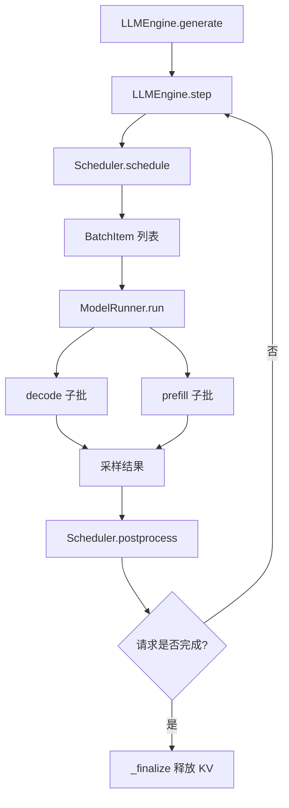
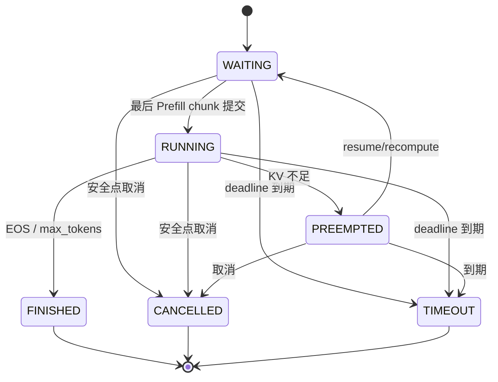

# Day 10 教程：取消、超时、抢占与恢复

> 本教程面向刚开始学习大模型推理引擎的读者，沿用 Day6 教程的“整体调用链 → 核心对象 → 时序示例 → 不变量 → 测试验证”方式，解释 NanoServe 在请求生命周期、KV Cache 和异常路径上的 Day10 改动。
>
> 代码基线：`feature/request-cancellation-preemption`，基于 Day9 合并提交 `36ae91c`。教程中的行号以当前工作区为准，代码发生后可优先搜索函数名。

## 1. Day10 要解决什么问题？

在最简单的推理程序里，请求似乎只有一条路径：

```text
输入 prompt
  → 模型前向
  → 采样下一个 token
  → 重复直到结束
```

真实推理服务远不止如此。请求可能：

- 还在等待队列中就被用户取消；
- 已经占用 KV Cache，但客户端在模型执行期间断开；
- 到达 deadline，需要被系统终止；
- 因为显存不足暂时让出 KV Cache，之后再恢复；
- 与其他请求组成混合 Prefill/Decode batch 时，只被取消其中一个 item；
- 在模型、采样或资源记账阶段遇到异常。

Day6–Day9 已经逐步建立了基础：

```text
Day6：请求状态机
Day7：每轮 token budget
Day8：Chunked Prefill 与 prefill_offset
Day9：混合 Prefill/Decode 与 BatchItem
Day10：安全取消、超时、抢占恢复、异常收尾
```

Day10 的核心问题可以概括为：

> **控制信号可以随时到达，但破坏性资源操作只能在安全点发生。**

### 1.1 正常执行调用链



主要入口位于：

- `nanovllm/engine/llm_engine.py`：`LLMEngine.step()` / `generate()`；
- `nanovllm/engine/scheduler.py`：`schedule()` / `postprocess()`；
- `nanovllm/engine/sequence.py`：请求状态和 token 进度；
- `nanovllm/engine/block_manager.py`：物理 KV block 账本；
- `nanovllm/engine/model_runner.py`：模型前向和采样。

代码位置参考：`llm_engine.py:145-310`、`scheduler.py:953-1293`、`model_runner.py:288-366`。

### 1.2 Day10 增加的控制路径

```text
取消：
  cancel_request()
    → request_cancel：只设置信号
    → 安全点 cancel：CANCELLED + 释放资源

超时：
  schedule 边界 / postprocess
    → now >= deadline
    → TIMEOUT + 释放资源

抢占：
  KV 不足
    → 选择 running victim
    → RUNNING → PREEMPTED
    → 释放物理 KV
    → PREEMPTED → WAITING
    → 后续重新 Prefill

异常：
  schedule / forward / sample / postprocess 异常
    → abort_round / abort_all_active
    → Engine 失败锁
    → 不允许在半完成 KV 上重试
```

设计背景详见 [`request-cancellation-preemption.md`](./request-cancellation-preemption.md) §1–§2。

## 2. 三种进度：为什么抢占后“进度不丢”

Day10 最容易混淆的地方，是把 token、KV block 和本轮计划当成同一个进度。实际上必须区分三种量。

| 进度 | 代码字段 | 含义 | 抢占后 |
| --- | --- | --- | --- |
| 逻辑 token 进度 | `Sequence.token_ids` | prompt 加上已经生成的 completion token | 保留 |
| 有效 KV 进度 | `prefill_offset`、`block_table` | 当前物理 block 中已经可用的上下文 | 可以归零 |
| 本轮计划进度 | `num_scheduled_tokens`、`BatchItem.scheduled_tokens` | 当前轮计划执行但尚未提交的 query token | 异常/取消时清零 |

### 2.1 一个具体例子

假设请求：

```text
prompt       = [P0, P1, P2, P3]
已生成 token  = [C0, C1]
token_ids    = [P0, P1, P2, P3, C0, C1]
```

抢占前：

```text
逻辑 token 数 = 6
有效 KV       = 6（或命中 prefix 后的某个有效偏移）
block_table   = [b3, b8, ...]
```

抢占时，`Scheduler.preempt()` 会释放物理 block，但不会修改 `token_ids`：

```text
逻辑 token 数 = 6       # 不变
有效 KV       = 0       # 物理 KV 作废后重新计算
block_table   = []       # 已释放
```

恢复时重新 Prefill 的输入仍然包含 `P0...P3,C0,C1`。它不能再次追加 `C0` 或 `C1`，恢复后的下一个新 token 应该是 `C2`。

`Sequence` 中相关字段和派生属性位于 `nanovllm/engine/sequence.py:128-242`；释放 block 后清零有效进度位于 `block_manager.py:134-164`。

### 2.2 三本账的关系

可以把请求想象成三本账：

```text
逻辑账：我已经拥有多少 token？
资源账：这些 token 当前有多少被 KV block 覆盖？
计划账：本轮承诺了多少 query token？
```

安全提交只允许这样发生：

```text
模型成功返回
  → hash_blocks
  → prefill_offset += q
  → num_scheduled_tokens = 0
  → 必要时 append_token
```

取消、超时或异常则必须阻止最后三步中的提交动作，并清理活动资源。

## 3. 六种状态与状态—队列—资源一致性

NanoServe 的请求状态由 `SequenceStatus` 表示：

| 状态 | 是否终态 | 队列位置 | KV 约定 |
| --- | --- | --- | --- |
| `WAITING` | 否 | `waiting` | 可以没有 block，也可以保留 chunk 进度 |
| `RUNNING` | 否 | `running` | `block_table` 是当前有效 KV |
| `PREEMPTED` | 否 | 不在工作队列，但仍在 `requests` | 可回收 block 已释放 |
| `FINISHED` | 是 | 不在队列/索引 | 必须释放 block |
| `CANCELLED` | 是 | 不在队列/索引 | 必须释放 block |
| `TIMEOUT` | 是 | 不在队列/索引 | 必须释放 block |

合法迁移集中定义在 `sequence.py:35-58`：



有三个检查点值得记住：

1. 状态机只负责“请求允许走哪条状态边”；
2. Scheduler 负责状态、队列和 KV 的联动；
3. BlockManager 负责物理 block 的真实所有权。

因此不能只修改：

```python
seq.status = SequenceStatus.CANCELLED
```

因为这样可能留下：

```text
请求还在 running 队列
block_table 仍持有 block
requests 索引仍然存在
free_block_ids 没有增加
```

Day10 把这些动作集中到 `_finalize()`，代码位于 `scheduler.py:246-267`。

## 4. 取消是“两段式”：signal-only 与 safe-point cleanup

### 4.1 为什么不能立即释放 block？

假设 `ModelRunner` 正在使用请求 A 的 `block_table`：

```text
线程 1：GPU forward 读取 A.block_table
线程 2：cancel_request(A)
线程 2：立即清空 A.block_table / 释放 block
线程 1：继续使用已经被改写的引用
```

这会让模型执行期的数据面和控制面互相踩踏。因此 Day10 把取消分为两步。

### 4.2 第一步：只设置取消信号

`Sequence.request_cancel()` 位于 `sequence.py:281-294`，逻辑是：

```python
if self.is_terminal:
    return False
if not self.cancel_requested:
    self.cancel_requested = True
    self.cancel_reason = reason
return True
```

它不会：

- 改状态；
- 移队列；
- 释放 block；
- 修改 token；
- 推进或回退 `prefill_offset`。

重复调用保留首次 reason。`Scheduler.request_cancel()` 在 `scheduler.py:275-305` 中用 `RLock` 保护这个信号。

### 4.3 第二步：安全点清理

`Scheduler.cancel()` 才执行：

```text
CANCELLED
  → _finalize
      → 从 waiting/running 移除
      → 释放 block
      → 清零本轮计划
      → 从 requests 删除
      → 清理 request_id 所有权
```

Engine 的 `cancel_request()` 在 `llm_engine.py:100-142` 中按 request ID 原子查找并设置信号：

- Engine 空闲：可以立即调用安全点取消；
- Engine 正在 `step()`：只设置信号，等待 postprocess 或下一轮 schedule；
- 不跨 GPU forward 持有控制锁。

### 4.4 控制锁为什么是 `RLock`？

调度安全点内部会嵌套调用 `cancel()`、`timeout()` 或 `_finalize()`。普通 `Lock` 在同一线程再次获取时会死锁，`RLock` 允许同一线程重入，同时仍阻止不同线程并发修改控制面账本。

这解决的是控制面竞态，不是让 GPU forward 变成可中断操作。Day10 仍不在 kernel 中途强制终止模型。

## 5. deadline 与优先级

### 5.1 单调绝对时间

请求的 deadline 使用单调时钟 `perf_counter()` 语义：

```text
created_at = 单调时钟读数
deadline   = 同一时钟轴上的绝对时间
到期条件   = now >= deadline
```

构造时若 deadline 早于 created_at，`Sequence` 立即拒绝，避免请求刚进入系统就以“神秘秒退”结束。代码位于 `sequence.py:94-127`。

单调时钟很重要：墙上时钟可能因为 NTP、手动校时或夏令时变化而回拨；deadline 判断不能依赖这种可回拨时间。

### 5.2 固定优先级

Day10 把安全点顺序固定为：

```text
终态兜底
  > cancel_requested
  > deadline exceeded
  > 正常 token 提交
```

于是：

- 取消和超时同时到达，结果是 `CANCELLED`；
- forward 返回后才发现超过 deadline，结果是 `TIMEOUT`；
- 命中取消/超时后不调用 `hash_blocks()`；
- 不推进本轮 offset；
- 不追加本轮 token。

`postprocess()` 的逐 item 安全检查位于 `scheduler.py:1181-1293`。

### 5.3 时序例子

```text
t0：schedule 接纳 X
t1：ModelRunner 开始执行
t2：X 的 deadline 到期
t3：postprocess(now=t3)

结果：
  X → TIMEOUT
  丢弃本轮采样 token
  不推进本轮有效 KV 进度
  释放 X 的 block
```

如果同一时间收到取消信号：

```text
X → CANCELLED
finish_reason 保留取消原因
```

对应测试包括 `test_direct_timeout_respects_existing_cancel_signal` 和 `test_postprocess_timeout_discards_sample`。

## 6. 抢占与恢复：释放物理 KV，不取消请求

### 6.1 victim 怎么选？

当新请求需要 block、free pool 不足时，Scheduler 从 `running` 队列队尾向队首搜索 victim：

```text
只允许：
  当前 Scheduler 活动索引中的对象
  状态为 RUNNING
  仍在 running 队列
  没有本轮待执行计划
  不是本轮已经接纳的 item
```

代码位于 `scheduler.py:430-467`。

为什么从队尾开始？这是一个简单、可解释的 FCFS 取舍：尽量保留较早进入服务的请求。Day10 没有引入优先级评分或公平性算法。

### 6.2 自动抢占的时序

```text
running = [A, B]
waiting = [C]
C 需要新 block，但 free=0

1. 选择队尾 B
2. B: RUNNING → PREEMPTED
3. 释放 B.block_table
4. B.token_ids 和 completion 计数保持不变
5. B: PREEMPTED → WAITING
6. B 插入 waiting 队首
7. 重新查询 C 的 KV 需求
8. 后续轮次重新 Prefill B
```

`preempt()` 和 `resume()` 位于 `scheduler.py:480-540`。显式 `preempt()` 只停在 `PREEMPTED`；自动调度路径会立即 `resume()`，这样当前调度轮可以继续寻找容量。

### 6.3 为什么没有 victim 时不“自抢占”？

如果唯一的 running 请求自己缺 block：

```text
自己释放自己的 KV
自己重新计算自己的 KV
并没有为其他请求创造新的容量
```

因此 Day10 改为：

```text
保留 RUNNING
保留已有 block
原地延后
记录 kv_capacity
```

这比无意义地释放再重算更容易理解，也避免损失已经有效的 KV 进度。相关测试在 `tests/test_request_control.py` 的 victim 测试组中。

### 6.4 为什么恢复时重新 Prefill？

NanoServe 目前不做 CPU/NVMe swap。释放物理 KV 后，最简单且正确的方案是 recompute：

```text
保留逻辑 token
丢弃物理 KV
恢复后从 prefix 命中位置重新 Prefill
```

这可能增加恢复请求的延迟，但 Day10 首要目标是正确性和资源安全，而不是承诺性能提升。

## 7. Day9 混合轮中的逐 item 安全点

Day9 一个 batch 可能是：

```text
[A(decode), B(decode), C(prefill)]
```

现在 forward 期间取消 C：

```text
1. schedule 冻结三个 BatchItem 和 round_id
2. cancel_request(C) 只设置 C.cancel_requested
3. decode/prefill forward 正常完成
4. postprocess A：正常追加 token
5. postprocess B：正常追加 token
6. postprocess C：取消，丢弃 token，释放 C 的资源
```

### 7.1 为什么不能从结果列表删除取消 item？

假设 A、C 都需要采样，ModelRunner 返回：

```text
samples = [token_for_A, token_for_C]
```

C 被取消时，不能把第二项直接从列表中删除后继续用一个隐式 `zip`。`postprocess()` 仍要消费 C 的占位：

```text
处理 A：消费 samples[0]，追加
处理 C：消费 samples[1]，但丢弃
```

否则后续 prefill item 可能拿到前一个请求的 token，产生静默错位。

`BatchItem.needs_sample` 是采样顺序的冻结快照，`postprocess()` 用相同谓词推进游标。代码位于 `scheduler.py:1156-1293`。

### 7.2 round_id 的作用

`num_scheduled_tokens` 解决“当前对象有没有本轮计划”，`round_id` 解决“这个 batch 是否属于当前调度轮”。两者一起防止：

```text
旧 batch 迟到
  → 请求已经被重新规划
  → 旧结果误按新计划追加 token
```

## 8. Engine step 事务与异常安全

### 8.1 正常路径

```text
step()
  1. 检查 Engine 是否已失败
  2. scheduler.schedule()
  3. 保存 BatchItem 快照和 planned token
  4. 显式校验 phase/q/seq_id/budget
  5. ModelRunner.run()
  6. scheduler.postprocess()
  7. finally 清理 num_scheduled_tokens/current_round_id
```

Day10 还要求 `schedule()` 本身进入事务边界。若 `allocate()`、`may_append()` 或状态/账本操作在修改后抛异常，Engine 必须：

```text
设置 _execution_failed
  → abort_round（若有本轮 item）
  → abort_all_active
  → check_ledger
  → 记录 error 事件
  → 原始异常继续抛出
```

相关代码：`llm_engine.py:172-310`。

### 8.2 为什么既要 abort_round 又要 abort_all_active？

模型异常发生时，请求可能处于不同位置：

```text
本轮 items：可能已有计划和 block
waiting：没有进入本轮，但仍是活动请求
running：可能持有其他有效 KV
PREEMPTED：不在工作队列，但仍在 requests
```

Engine 已经被锁定为不可重试，留下任何活动请求都会让上层误以为还能继续调用 `step()`。因此要清理本轮和剩余活动请求。

### 8.3 清理异常不能覆盖原异常

假设模型先抛出 `cuda oom`，清理第一个请求又抛出另一个异常。正确行为是：

```text
继续清理后续请求
记录 cleanup error
保留并重新抛出原始 cuda oom
```

`abort_round()` 和 `abort_all_active()` 对每个对象单独隔离错误；Engine 也分别保护日志、清理和账本检查。

### 8.4 ModelRunner 的 Context

Day9 在一轮中执行 decode 子批和 prefill 子批。每个子批都必须：

```python
try:
    prepare → forward → sample
finally:
    reset_context()
```

否则 decode 的全局 Context 可能泄漏给 prefill，或者异常后污染下一轮。实现位于 `model_runner.py:310-366`。

## 9. BlockManager 账本与对象所有权

### 9.1 统一释放入口

所有终态动作都经过 Scheduler 的 `_finalize()`，再调用 `BlockManager.deallocate()`。不要直接操作：

```python
free_block_ids
used_block_ids
block.ref_count
```

这些是物理资源账本，必须由 BlockManager 统一维护。

### 9.2 `check_ledger()` 检查什么？

Day10 增加了显式账本检查：

1. free deque 不包含重复 ID；
2. free/used ID 都在合法范围；
3. free 与 used 互斥；
4. 两者完整覆盖所有 block；
5. used block 的 `ref_count > 0`；
6. free block 的 `ref_count == 0`。

代码位于 `block_manager.py:166-220`。关键检查使用显式异常，`python -O` 不会删掉。

### 9.3 为什么要在修改前校验？

错误的 `block_table=[0,0]` 如果直接释放：

```text
第一次递减 block 0
第二次再次递减 block 0
ref_count 可能变成负数
```

Day10 先完整检查 block ID、重复项、used 所有权和 ref_count，再执行任何修改；`allocate()` 也保存账本快照，异常时恢复 free/used/hash/ref_count/table。

### 9.4 对象身份比 seq_id 更可靠

请求 ID 可以复用：

```text
old request_id="reuse" 完成
new request_id="reuse" 被创建
old batch 结果迟到
```

如果只按 ID 清理，旧结果可能删除 new。当前 `_finalize()` 要求：

```python
self.requests.get(seq.seq_id) is seq
```

不是当前 owner 就直接返回。`round_id` 则防止旧 batch 借用新计划提交 token。

## 10. Sequence pickle 与 rank 0

Day10 没有新增 pickle payload 字段，因此仍使用 `STATE_VERSION = 3`。v3 已包含：

- `status`；
- `cancel_requested`；
- `is_prefill`；
- `prefill_offset`；
- `num_scheduled_tokens`；
- `block_table`；
- 生成进度所需的 token 状态。

读取兼容：

```text
v1：无版本六元组
v2：num_cached_tokens 映射到 prefill_offset
v3：当前字段名和控制字段
未知版本：显式拒绝
```

测试位于 `tests/test_request_control.py` 的序列化测试组；代码位于 `sequence.py:324-405`。

TP 设计中 rank 0 负责控制面权威和采样，worker 负责前向/KV 写入。当前证据只覆盖 CPU pickle 协议和 TP=1 GPU：

- TP>1 NCCL/shared-memory 端到端控制传播未测；
- CUDA Graph 路径未测；
- CPU 协议通过不等于多 GPU 端到端通过。

## 11. 结构化控制事件与审计

一次控制事件包含：

```json
{
  "event": "request_control",
  "round_id": 10,
  "seq_id": 7,
  "request_id": "req-7",
  "action": "cancel",
  "from_status": "RUNNING",
  "to_status": "CANCELLED",
  "reason": "client_cancelled",
  "num_preempts": 0,
  "released_blocks": 3,
  "free_blocks_before": 117,
  "used_blocks_before": 11,
  "free_blocks": 120,
  "used_blocks": 8,
  "observed_at": 123.456
}
```

事件不记录 prompt/token 明文。`released_blocks` 来自真实 used 账本差值，而不是计划估算。

验收脚本 `scripts/validate_request_control.py` 现在检查：

- 事件白名单和禁止明文字段；
- `request_id` 与 `seq_id` 在历史中保持一致；
- 同一请求的 `from_status` 与上一事件的状态连续；
- preempt/resume 使用栈式历史配对；
- free/used 是非负整数且总数等于场景 block 池；
- 错误事件的 `released_blocks` 和状态字段可被发现。

要注意一个边界：轮外取消、显式抢占和异常清理的 `round_id` 可以是 `null`。因此当前审计器是“事件 schema + 单事件/跨事件安全检查”，不声称能重建所有未记录的内部状态迁移。

## 12. 缺陷复盘：为什么这些检查有价值？

Day10 真实审查中发现并修复了以下问题：

| 问题 | 现象 | 根因 | 修复原则 |
| --- | --- | --- | --- |
| 调度异常未收尾 | allocate/may_append 抛错后请求和 block 残留 | schedule 在异常事务外 | schedule 也必须进入 step 失败收尾 |
| 清理异常遮蔽原异常 | 原始 OOM 被 cleanup exception 覆盖 | 清理步骤没有隔离 | 保留原异常，继续清理后续对象 |
| 未注册对象可抢占/恢复 | 外部对象污染当前 Scheduler | 缺少 owner 检查 | 先验证活动索引和队列身份 |
| timeout 绕过 cancel | 已取消请求被标成 TIMEOUT | 入口未统一优先级 | `CANCELLED > TIMEOUT` |
| free deque 重复 | 集合检查通过但 deque 已损坏 | 只检查 set | 检查序列本身和 ID 范围 |
| 非法 block_table 破坏 ref_count | 释放后 ref_count 变负 | 修改前没有完整校验 | 先验证，后批量修改 |
| resume 双队列 | 同一对象同时在 waiting/running | 只检查状态没检查队列 | 状态和队列一起验证 |
| Context 泄漏 | 子批异常后下一轮状态污染 | reset 不在 finally | 每个子批独立 finally |
| exit 异常跳过 join | runner 错误导致 worker 未回收 | 退出路径未隔离 | runner/join/reference 分段保护 |
| 事件审计漏报 | 错误资源快照仍被认为合法 | 只检查负数 | 按场景总量和历史差值重算 |

这些问题对应代码审查记录 [`day10-review.md`](./day10-review.md) §2。它们说明推理引擎的难点不只是模型 forward 本身，而是状态、资源、并发和异常四条边界同时保持一致。

## 13. 测试和验收

### 13.1 为什么先写 CPU 测试？

GPU/模型测试很慢，也不适合覆盖全部错误分支。Day10 的 CPU 测试使用：

- `SimpleNamespace` 作为 Config；
- 小 block size；
- `LLMEngine.__new__` 跳过 GPU 初始化；
- runner 桩直接注入 token；
- 固定/显式 `now`，不依赖 sleep；
- 手动调用 `check_ledger()`。

测试文件开头的说明和公共构造工具位于 `tests/test_request_control.py:1-115`。

### 13.2 测试矩阵

| 测试主题 | 说明 |
| --- | --- |
| 控制信号 | 三种活动状态取消、重复取消和首次 reason |
| deadline | 边界时间、waiting/running/PREEMPTED 覆盖 |
| 优先级 | cancel、timeout、postprocess 安全边界 |
| 混合轮隔离 | 一个 item 取消/超时，其他 item 正常提交 |
| 抢占状态机 | victim、有限搜索、无 victim 延后 |
| recompute 恢复 | 逻辑 token 和 completion 计数不丢不重 |
| KV 账本 | 重复/越界 ID、非法 table、double free |
| 异常清理 | runner、postprocess、schedule、allocate、may_append 异常 |
| exit | runner 退出异常时继续 join 和释放引用 |
| 事件审计 | 历史状态、身份、资源总量和抢占配对 |
| 序列化 | v1/v2/v3 读取和当前版本往返 |

当前 `test_request_control.py` 展开后共 **74 passed**；全量回归共 **377 passed**。

### 13.3 可重复命令

```bash
python -m pytest tests/test_request_control.py -q
python -m pytest -q
python -O -m pytest -q
PYTHONPATH=. python scripts/validate_request_control.py \
    --mode cpu --output docs/evidence/day10/day10-cpu-final.jsonl
```

修复后实测结果：

```text
Day10 专项：74 passed
全量：377 passed
python -O 全量：377 passed（pytest 优化模式提示 1 条）
CPU 验收脚本：PASS
```

GPU 使用本地 Qwen3-0.6B、TP=1、`enforce_eager=True`，修复后六组验收均 PASS；原始证据：

```text
docs/evidence/day10/day10-gpu-final.jsonl
```

修复后 GPU 100 请求组收敛为 100 条请求、129 轮，最终 `used=0`；16 块小池组观察到 3 次自动抢占和 3 次恢复。

### 13.4 应如何理解“通过”

通过意味着当前测试范围内的契约成立，不意味着所有部署环境都已验证。当前明确未测：

- TP>1 多 GPU 端到端控制传播；
- CUDA Graph 捕获路径；
- 真正服务线程并发取消压力；
- HTTP/SSE 客户端断连（属于 Day13）；
- GPU 100 请求大池场景中的自动高水位抢占；
- 不同 GPU 型号上的小池自适应构造。

## 14. 给初学者的思考题

1. 为什么 `request_cancel()` 不能立即调用 `_finalize()`？
2. `token_ids`、`prefill_offset`、`num_scheduled_tokens` 分别代表哪一种进度？
3. 抢占后为什么可以让 `prefill_offset` 归零，却不能删除已生成 token？
4. 为什么取消和超时同时命中时必须选择 `CANCELLED`？
5. 为什么 `timeout()` 也必须检查 `cancel_requested`？
6. 如果混合 batch 的一个 item 被取消，为什么不能从 `samples` 列表中删除对应位置？
7. 为什么 victim 从队尾反向搜索，而不是随机选择？
8. 没有合法 victim 时，为什么保持 RUNNING 比“自抢占”更合理？
9. `abort_round()` 和 `abort_all_active()` 分别解决什么问题？
10. 为什么清理异常不能覆盖原始模型异常？
11. `_finalize()` 为什么要检查对象身份，而不是只检查 seq_id？
12. `check_ledger()` 为什么必须检查 free deque 的重复项，而不只是 `set(free)`？
13. 为什么 BlockManager 要在修改 ref_count 之前完整验证 block_table？
14. `RLock` 保护了哪些状态？为什么不能跨 GPU forward 持有它？
15. 事件 replay 如果只检查每条事件自己的 `from_status → to_status`，会漏掉什么错误？
16. 如果未来实现 CPU swap，需要重新设计哪些状态、资源和恢复不变量？
17. Day11 HTTP 层为什么应该返回只读状态 DTO，而不是直接暴露 `Sequence`？
18. 如果要验证 TP>1，除了 pickle 单测，还需要哪些多进程和多 GPU 证据？

## 15. 与后续 Day 的衔接

- **Day11 服务化**：HTTP 层复用 `add_request(deadline=...)`、`cancel_request()` 和 `finish_reason`，不直接操作 block 或状态。
- **Day13 SSE/客户端断连**：网络断连回调只设置取消信号，Engine 在安全点完成清理。
- **Day14 可观测性**：把 `request_control` 事件映射为取消、超时、抢占、恢复和资源水位指标。
- **后续性能优化**：CPU swap、优先级、公平性、fused mixed attention、CUDA Graph 和 TP 并发都必须重新验证本教程中的状态—队列—KV 不变量。

Day10 的价值不是让请求“永远不出错”，而是让错误、取消和资源压力都沿着可解释、可测试、可回收的路径结束。