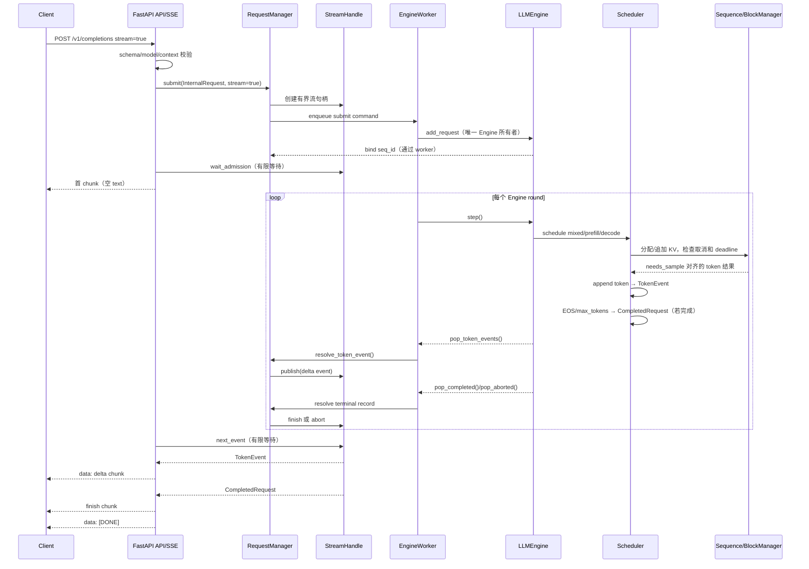
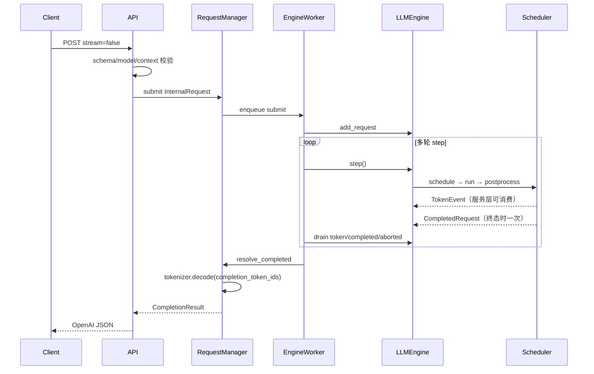
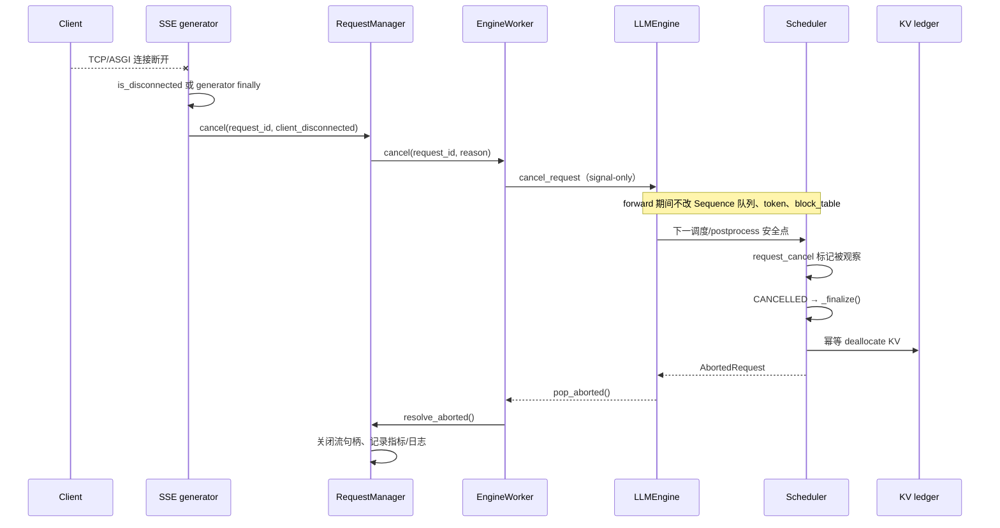

# Day 13–14 教程：从非流式结果到 SSE 与可观测推理服务

> 读者假设：你刚开始学习大模型推理引擎，已经了解 Day 1–10 的 token、Prefill/Decode、Paged KV Cache、Continuous Batching、请求状态机和安全点取消。本文沿用 [Day 6 教程](./day6-tutorial.md) 的“先看全局、再读代码、最后跑测试”的教学方式。
>
> 配套设计基线是 [sse-observability-day13-14.md](./sse-observability-day13-14.md)，Day 11–12 背景见 [day11-12-tutorial.md](./day11-12-tutorial.md)。当前实现主要位于 `nanovllm/engine/` 和 `nanoserve/`。实际验收数字与未覆盖边界以 [day13-14-validation.md](./day13-14-validation.md) 为背景；本文还记录了撰写本教程时在当前工作树重新执行的命令结果。
>
> 建议读法：先读 §1–§4，理解“为什么要有事件通道”；再读 §5–§9 对照代码；最后执行 §12 的 CPU/ASGI 命令，并把 §13 的 TCP/GPU 内容当作实验方法而不是已通过证据。

## 1. Day 11–12 留下的问题：完整答案太晚了

### 1.1 非流式服务已经能做什么

Day 11–12 把离线推理引擎接成了一个 OpenAI 风格的 HTTP 服务。请求链大致是：

```text
POST /v1/completions 或 /v1/chat/completions
        │
        ▼
FastAPI schema / model / context 校验
        │
        ▼
InternalRequest（统一的 token prompt + SamplingParams）
        │
        ▼
RequestManager 登记 Future
        │
        ▼
EngineWorker（一个专用线程）
        │
        ▼
LLMEngine.add_request() → Scheduler → ModelRunner → postprocess()
        │
        ▼
CompletedRequest 或 AbortedRequest
        │
        ▼
RequestManager 解码、resolve Future
        │
        ▼
OpenAI 风格 JSON
```

这条链解决了几个基础问题：

- HTTP handler 不直接调用 `engine.step()`，因此多个 HTTP 请求不会同时修改同一个 Scheduler 和 KV 账本；
- completion 字符串和 chat messages 在进入 Engine 前都变成同一类 `InternalRequest`；
- `Sequence` 完成后会被清理，但 `CompletedRequest` 已经保存了 request ID、completion token IDs、usage 和 finish reason；
- Engine 异常、取消、超时和 shutdown 都能让 Future 得到终态，而不是永久等待。

### 1.2 为什么 `stream=true` 不能只返回完整 JSON

非流式接口在所有 token 生成完之后才返回，因此它只需要一个最终结果：

```text
token 1 → token 2 → token 3 → ... → 完成
                                      │
                                      └─ 一次性返回完整文本
```

这对聊天 UI、逐字显示、长答案和客户端早停都不理想。客户端希望看到：

```text
首帧（流已建立）
  ↓
增量 token/token 片段
  ↓
增量 token/token 片段
  ↓
finish chunk
  ↓
[DONE]
```

Day 11–12 的正确做法是对 `stream=true` 返回 `501 stream_not_implemented`，而不是忽略字段后返回完整 JSON。静默退化会让客户端误以为自己接收了 SSE，却无法使用事件、断连和增量语义。Day 13 的任务不是修改原有非流式契约，而是增加一个**旁路的增量出口**。

### 1.3 Day 13–14 的核心演进

```text
Day 11–12：
  CompletedRequest（仅在终态产生）
       ↓
  非流式 JSON

Day 13：
  TokenEvent（每个真实 completion token 可产生） ──→ SSE delta
       │
       └─ CompletedRequest（仍然只在终态产生） ──→ finish/usage/非流式 JSON

Day 14：
  同一批时间点与资源快照 ──→ Prometheus metrics + 结构化 JSON 日志
```

最重要的设计不是“把 JSON 改成字符串”，而是把以下三个边界分别固定下来：

1. **数据面**：模型、调度、Sequence、KV 和 token 仍由 Engine/Scheduler 管；
2. **控制面**：事件、完成记录、Future、流句柄和 request/seq 世代校验由服务层管；
3. **观测旁路**：指标和日志只能读取时间线与只读快照，失败时不得阻止模型执行和 KV 清理。

## 2. 总体架构：谁负责什么

先记住一条原则：**同一个 Engine 只有一个直接驱动者，HTTP 层没有资格触摸底层可写对象。**

```text
客户端
  │ HTTP JSON / SSE
  ▼
FastAPI API（nanoserve/api.py）
  │ schema、模型检查、SSE 序列化、断连观察
  ▼
RequestManager（nanoserve/service.py）
  │ InternalRequest、RequestHandle、StreamHandle、Future、事件关联
  ▼
EngineWorker（nanoserve/worker.py）
  │ 唯一调用 add_request / step / exit 的线程
  ▼
LLMEngine（nanovllm/engine/llm_engine.py）
  │ 公开 drain API、step 事务、资源快照
  ▼
Scheduler（nanovllm/engine/scheduler.py）
  │ BatchItem、mixed round、状态安全点、事件和终态记录
  ├──────────────┐
  ▼              ▼
Sequence       BlockManager
请求进度/状态    物理 KV block、prefix cache、资源账本
```

### 2.1 Engine

`LLMEngine` 是推理核心和服务层之间的窄边界。当前与 Day 13–14 相关的公开方法包括：

- `add_request(...)`：把 prompt token 和采样参数包装成 `Sequence`，交给 Scheduler；
- `step()`：执行一轮 `schedule → ModelRunner → postprocess`，仍返回原来的 `(outputs, num_tokens)` 形状；
- `pop_token_events()`：排出并清空当前 token 增量事件；
- `pop_completed()`：排出 `CompletedRequest`；
- `pop_aborted()`：排出 `AbortedRequest`；
- `resource_snapshot()`：返回 running、waiting、paused、KV 和 prefix 统计的标量副本；
- `cancel_request(request_id, reason)`：signal-only 取消入口；
- `exit()`：幂等释放 Engine 资源。

Engine 继续兼容离线 `generate()`。离线路径每轮会 drain 新增的 token/completion/abort 队列，避免离线调用不使用服务 sink 时让控制面事件长期堆积；离线结果仍以 `step()` 的正常完成输出为来源。

### 2.2 Scheduler

Scheduler 是状态、队列、KV 和事件的核心所有者。它负责：

- 在 `waiting`、`running` 和活动索引中管理请求；
- 以 `BatchItem` 记录每个请求本轮是 prefill 还是 decode；
- 按 decode-first 组成纯 prefill、纯 decode 或 mixed batch；
- 把 `needs_sample` 作为本轮采样是否属于该 item 的快照；
- 在 `postprocess()` 的安全点检查终态、取消和 deadline；
- 成功追加 token 后产生 `TokenEvent`；
- 进入终态后在 `_finalize()` 捕获 `CompletedRequest` 或 `AbortedRequest`，释放 KV 并删除活动索引；
- 提供 `pop_token_events()` 与 `resource_snapshot()` 等公共只读出口。

服务层不能直接访问 `scheduler._control_lock`、`waiting`、`running` 或 `block_manager`。`LLMEngine` 内部仍需要锁，但这是 Engine/Scheduler 内部实现，不是 HTTP 层的 API。

### 2.3 Sequence

`Sequence` 是“一个正在推理的请求”在底层的可变对象。它保存：

- `seq_id` 和服务传来的稳定 `request_id`；
- `WAITING/RUNNING/PREEMPTED/FINISHED/CANCELLED/TIMEOUT` 状态；
- prompt 与已生成 token；
- `prefill_offset`、`num_scheduled_tokens` 和 `is_prefill`；
- `block_table`；
- `max_tokens`、temperature、top-p 等采样配置；
- `cancel_requested`、deadline、`finished_at` 等控制面字段。

它仍通过 `transition_to()` 使用唯一合法迁移表。Day 13 没有为了 SSE 新增一套状态机。`request_cancel()` 只设置取消标记；真正的 `CANCELLED` 迁移、`_finalize()` 和 KV 释放仍在安全点发生。

### 2.4 BlockManager

BlockManager 管理物理 KV block：

- `can_allocate()` 查询首次 prefill 可使用多少 prefix block；
- `allocate()` 分配新 block 或增加命中 block 的引用；
- `can_append()`/`may_append()` 为 decode 追加空间；
- `hash_blocks()` 登记已写满的完整块；
- `deallocate()` 递减引用并把空 block 放回 free 池；
- `check_ledger()` 检查 free/used/ref_count 守恒；
- `record_prefix_lookup()` 和 `prefix_cache_snapshot()` 提供 prefix 统计。

SSE 断连不能从网络线程调用 `deallocate()`。正确链路是 `worker.cancel()` → `engine.cancel_request()` → `Sequence` 置位 → Scheduler 安全点收尾 → BlockManager 幂等释放。

### 2.5 EngineWorker

EngineWorker 是服务层最关键的所有权边界。它的专用线程是唯一执行这些动作的地方：

```text
engine.add_request()
engine.step()
engine.exit()
```

它的命令/工作模型是：

- 有活动请求：排空 submit/cancel 相关控制，再调用 `step()`，随后 drain token、completed、aborted；
- 无活动请求：阻塞在命令队列，不忙循环调用 `step()`；
- `step()` 返回空批次但仍有活动请求：按 Day 10 的无进展语义抛出 EngineError，不无限重试；
- worker 异常：停止接收、消费已有记录、失败所有 pending handle、调用 Engine 清理并进入 `FAILED`；
- shutdown：停止接收新请求、失败尚未 admission 的命令、给活动请求发送 shutdown cancel signal、有限 drain，最后由 worker 调用 `engine.exit()`。

`asyncio.to_thread(engine.step)` 不能替代 EngineWorker。它只能把调用移到线程池，却不能保证多个 HTTP handler 不同时进入同一个 Engine。

### 2.6 RequestManager

RequestManager 管的是服务层请求句柄，不是 Sequence。它负责：

- 构造并登记 `RequestHandle`；
- 在 pending 表中保存 Future、kind、request ID、admission 后的 `seq_id`；
- 把请求提交给 worker；
- 用 `(request_id, seq_id)` 校验 token/completion/abort 记录；
- 非流式请求解码 `CompletedRequest` 并设置 Future；
- 流式请求把事件送进对应的 `StreamHandle`；
- 将 timeout、engine error、shutdown 和 cancellation 映射成服务异常；
- 处理未知、重复或迟到记录而不误完成另一个复用 ID 的请求。

pending 的登记、worker 命令入队和 shutdown 之间有锁保护。这里保护的是一个业务事务“检查 accepting → 登记句柄 → 入队”，而不是只依赖 Python GIL 的单次 dict 操作。

### 2.7 StreamHandle

`StreamHandle` 是一个独立、有界、线程安全的 `queue.Queue` sink。它保存：

- request ID、kind、created 时间；
- admission 后的 `seq_id`；
- 有界事件队列，默认从 `NANOSERVE_STREAM_EVENT_QUEUE_SIZE` 读取，默认值为 16；
- `_ready`/`_output_ready` 等同步事件；
- terminal record 或 terminal error。

`publish()` 使用 `put_nowait()`，不会让 EngineWorker 因慢客户端无限阻塞。队列满时将该流收口为 `stream_backpressure`，并通过取消/错误路径最终释放资源。终态 envelope 排在已经发布的 token 后面；`next_event()` 使用有限 timeout，避免流生成器无限悬挂。

### 2.8 TokenEvent

`TokenEvent` 是单独的不可变 DTO，当前字段包括：

```python
TokenEvent(
    seq_id, request_id, round_id, token_ids,
    completion_index, emitted_at, is_first_token,
    is_final=False, finish_reason=None, phase="decode"
)
```

它表达“某个真实 completion token 已经安全地追加，并且可以被服务层消费”。

- `request_id + seq_id` 是世代身份；
- `token_ids` 只含本次新增 completion token；
- `completion_index` 从 0 开始；
- `round_id` 可与 Scheduler/Engine round 日志关联；
- `emitted_at` 使用 `perf_counter()` 时间域；
- `phase` 可区分 decode 和最后一个 prefill chunk；
- 它不包含 prompt、block table 或生成文本。

`TokenEvent` 不是 `CompletedRequest` 的替代品。一个请求可以有多个 TokenEvent，但只能有一次 CompletedRequest。

### 2.9 Observability

`nanoserve/observability.py` 集中定义：

- `RequestTimeline`：提交、admission、首 token、后续 token、完成时间和 token 时间点；
- `Observability`：Histogram、Counter、Gauge 和独立 `CollectorRegistry`；
- `ResourceSnapshot`：KV、running 和 prefix 的不可变快照；
- `LifecycleLogger`：版本化 JSON event envelope 和敏感字段白名单；
- `validate_labels()`：限制 Prometheus 低基数标签。

它是旁路：指标或日志 handler 出错只记录 warning，不能阻止 `resolve_*`、`_finalize()`、KV 释放或其他请求继续执行。

## 3. mixed prefill/decode：为什么必须有 `needs_sample`

### 3.1 一个 mixed round 的例子

设每轮预算 `B=8`，当前有两个 running 请求 A/B，还有一个 prompt 很长的 waiting 请求 C。decode-first 的某一轮可以是：

```text
items = [
    BatchItem(A, phase="decode",  scheduled_tokens=1, needs_sample=True),
    BatchItem(B, phase="decode",  scheduled_tokens=1, needs_sample=True),
    BatchItem(C, phase="prefill", scheduled_tokens=6, needs_sample=False),
]

planned_tokens = 1 + 1 + 6 = 8
phase = "mixed"
```

A/B 的 decode 子批先执行；C 的 prefill 子批后执行。因为 C 只推进了长 prompt 的中间区间，本轮不应该从模型输出中取一个 completion token。

当 C 最后一个 chunk 被接纳时：

```text
BatchItem(C, phase="prefill", scheduled_tokens=2, needs_sample=True)
```

最后 chunk 的模型输出才是 C 的首个 completion token；C 由 `WAITING` 迁移到 `RUNNING`，但本轮不再重复添加一个 decode item。

### 3.2 `needs_sample` 的三个规则

当前 Scheduler 在构造 `BatchItem` 时冻结采样计划：

| item | `scheduled_tokens` | `needs_sample` | 解释 |
| --- | ---: | :---: | --- |
| prefill 中间 chunk | `q > 0` | `False` | 只写 KV，不产生 completion token |
| prefill 最后 chunk | `q > 0` | `True` | 同时完成 prefill，并采样首 token |
| decode item | `1` | `True` | 每轮产生一个 completion token |

这解决了一个很容易犯的错误：如果只看全批 `is_prefill`，mixed batch 中会无法区分“prefill 中间 chunk”和“prefill 最后 chunk”，从而错误地采样或错位消费 token。

### 3.3 计划和输出如何对齐

`Scheduler.postprocess(items, token_ids)` 使用同一个 `needs_sample` 谓词：

```text
needs_sample = [True, True, False]
token_ids    = [token_for_A, token_for_B]
```

处理时按 item 顺序维护 token 游标：

```text
A 需要 sample → 消费 token_ids[0]
B 需要 sample → 消费 token_ids[1]
C 不需要     → 不消费 token
```

含活动请求时，当前实现显式检查：

```text
len(token_ids) == sum(item.needs_sample for item in items)
```

不会使用会静默截断的 `zip` 来掩盖数量不匹配。中间 prefill chunk 即便底层 runner 返回了某种占位结果，也不会进入 completion append 和 TokenEvent 路径。

### 3.4 事件产生的安全顺序

对需要采样的 item，`postprocess()` 的成功路径顺序是：

```text
终态/取消/deadline 检查
        ↓
hash_blocks + prefill_offset 推进
        ↓
清除 num_scheduled_tokens
        ↓
Sequence.append_token(token_id)
        ↓
TokenEvent 入队
        ↓
EOS/max_tokens 判断
        ↓
mark_finished() + _finalize()（如果本轮完成）
```

因此：

- 取消信号在安全点被观察到时，本轮 sample 被丢弃，不产生取消后的事件；
- token event 只对应成功追加的 completion token；
- `CompletedRequest` 可以紧跟最后一个 TokenEvent，但 worker 必须先 drain token event；
- 最后 token 不会因为终态清理而丢失，Sequence 清理之前已经把 event 和 completed record 写入控制面队列。

## 4. `CompletedRequest` 与 `TokenEvent` 为什么必须分离

### 4.1 两种记录的职责

| 记录 | 产生时机 | 内容 | 主要消费者 |
| --- | --- | --- | --- |
| `TokenEvent` | 每个真实 completion token 成功追加后 | 增量 token IDs、index、round、时间 | SSE、TTFT/ITL、逐 token日志 |
| `CompletedRequest` | `FINISHED` 的 `_finalize()` 收尾时 | 完整 completion token IDs、prompt/completion 数、finish reason、完成时间 | 非流式 JSON、SSE finish、usage |
| `AbortedRequest` | CANCELLED/TIMEOUT/异常收尾时 | request/seq、原因、完成时间 | 错误映射、流异常收口 |

`CompletedRequest` 的 `completion_token_ids` 当前明确表示**只包含 completion，不含 prompt**。服务层用同一个 tokenizer 解码，并由 `prompt_tokens + completion_tokens` 构造 usage。

`AbortedRequest` 当前没有 completion token usage 字段。已经产生的 token 仍可通过 TokenEvent/Timeline 的旁路计数观察，但不能从 `max_tokens` 或 finish reason 猜测中止请求实际生成了多少 token。

### 4.2 为什么不能把每个 TokenEvent 累加成最终记录

如果把增量事件当最终记录，会产生几个问题：

1. 终态 reason 可能还未确定；
2. Sequence 可能在最后一个 token 后马上被取消或超时；
3. 非流式 `generate()` 需要一个完整结果，但不应该依赖 SSE sink 是否存在；
4. 迟到、重复或 ID 复用事件可能污染新句柄；
5. 服务层需要一个一次性、幂等、可 drain 的终态凭证。

因此当前协议是：

```text
TokenEvent × N       → 增量观察和 SSE delta
CompletedRequest × 1 → 完整结果、usage、finish reason 的校验和
```

`RequestManager.resolve_token_event()` 先校验 `(request_id, seq_id)` 和连续的 `completion_index`。`resolve_completed()` 再校验同一对身份，并只允许 pending 中的正确句柄被收口。迟到记录会记录 warning 并丢弃，不会完成 ID 已复用的新请求。

## 5. 完整调用链与 Mermaid 时序

### 5.1 正常流式请求



实际实现中 worker 在每轮 `step()` 后调用 `_consume_records()`，顺序是：

```text
pop_token_events()
  → resolve_token_event() / publish()
  → pop_completed()
  → resolve_completed() / StreamHandle.finish()
  → pop_aborted()
```

这个顺序防止 finish chunk 先于最后一个 delta。`[DONE]` 不由 Engine 产生，而由 `nanoserve/api.py` 的 `_stream_body()` 在成功发送 finish chunk 后生成。

### 5.2 非流式回归路径



新增事件通道不能改变 `stream=false` 的响应 body、ID 前缀、usage、finish reason 或 `LLMEngine.step()` 返回结构。

### 5.3 断连和安全点取消



已写出的 token 不能撤回；断连后尚未产生的 token 不应继续发送。因为 Python 线程和 GPU kernel 不能被安全强杀，断连不是“瞬时中止正在执行的 kernel”，而是“尽快发出信号，并在安全点收口”。

## 6. SSE wire format：客户端实际看到了什么

### 6.1 通用 SSE 帧

当前 `_sse(payload)` 使用紧凑 JSON，返回：

```text
data: {"id":"...","object":"...","created":1780000000,"model":"Qwen3-0.6B","choices":[...]}

```

每个事件以两个换行结束。`[DONE]` 是唯一不是 JSON 的 data：

```text
data: [DONE]

```

当前响应头包括：

```text
Content-Type: text/event-stream; charset=utf-8
Cache-Control: no-cache
Connection: keep-alive
x-request-id: <本次响应 ID>
```

HTTP 响应中的 `created` 来自 `time.time()`，是 OpenAI 协议展示用的 Unix 秒；它不参与 queue wait、TTFT、ITL 或 latency 计算。所有服务耗时使用 `perf_counter()`。

### 6.2 Completion chunks

`/v1/completions` 使用 `object="text_completion"`、`cmpl-<uuid>` ID 和 `choices[0].text`：

```text
data: {"id":"cmpl-...","object":"text_completion","created":1780000000,"model":"Qwen3-0.6B","choices":[{"index":0,"text":"","logprobs":null,"finish_reason":null}]}

data: {"id":"cmpl-...","object":"text_completion","created":1780000000,"model":"Qwen3-0.6B","choices":[{"index":0,"text":"A","logprobs":null,"finish_reason":null}]}

data: {"id":"cmpl-...","object":"text_completion","created":1780000000,"model":"Qwen3-0.6B","choices":[{"index":0,"text":"B","logprobs":null,"finish_reason":null}]}

data: {"id":"cmpl-...","object":"text_completion","created":1780000000,"model":"Qwen3-0.6B","choices":[{"index":0,"text":"","logprobs":null,"finish_reason":"length"}],"usage":{"prompt_tokens":1,"completion_tokens":2,"total_tokens":3}}

data: [DONE]

```

当前 completion 路径的规则：

1. 首 chunk 的 text 为空，`finish_reason=null`；
2. 增量 chunk 只放本次 TokenEvent 解码出的新文本，不发送累计文本；
3. finish chunk 的 text 为空，reason 来自 `CompletedRequest` 的 `stop` 或 `length`；
4. usage 固定放在 finish chunk；
5. finish 成功写出后只发送一次 `[DONE]`。

### 6.3 Chat chunks

`/v1/chat/completions` 使用 `object="chat.completion.chunk"`、`chatcmpl-<uuid>` ID 和 `choices[0].delta`：

```text
data: {"id":"chatcmpl-...","object":"chat.completion.chunk","created":1780000000,"model":"Qwen3-0.6B","choices":[{"index":0,"delta":{"role":"assistant","content":""},"finish_reason":null}]}

data: {"id":"chatcmpl-...","object":"chat.completion.chunk","created":1780000000,"model":"Qwen3-0.6B","choices":[{"index":0,"delta":{"content":"A"},"finish_reason":null}]}

data: {"id":"chatcmpl-...","object":"chat.completion.chunk","created":1780000000,"model":"Qwen3-0.6B","choices":[{"index":0,"delta":{},"finish_reason":"stop"}],"usage":{"prompt_tokens":1,"completion_tokens":1,"total_tokens":2}}

data: [DONE]

```

首 chunk 才表达 assistant role；后续 delta 只表达新的 `content`，不重复 role，也不重复已经发送的文字。当前服务只支持单候选 `index=0`，不支持 `n>1` 或多候选。

### 6.4 完成、取消和错误

首 chunk 前的 schema/model/context/admission 错误仍可以返回普通 OpenAI 错误 JSON，例如 400、404、503 或 504。首 chunk 已经发出后，不能再伪造一个成功 JSON；当前 `_stream_body()` 对 abort/API error 直接结束流，不发送成功 finish 和 `[DONE]`。

| 情形 | 客户端可见行为 | 内部行为 |
| --- | --- | --- |
| schema/model/context 错误 | 普通错误 JSON | 不 submit、不分配 KV |
| 首 chunk 前 Engine 错误 | 5xx/504 错误 JSON | handle 收口 |
| 首 chunk 后 Engine 错误 | 流结束，不发成功 finish | EngineError 收口、清理 |
| 客户端断连 | 不再发送事件 | `client_disconnected` signal，安全点释放 KV |
| timeout | 不发正常 finish | TIMEOUT、错误收口、释放 KV |
| shutdown | 流结束或错误关闭 | `server_shutdown` signal、有限 drain |

## 7. Day 14 指标：Prometheus 看到的账本

### 7.1 指标类型

`Observability` 为每个 app 实例创建独立 `CollectorRegistry`，不使用全局注册表。当前计划指标为：

| 指标 | 类型 | 当前口径 |
| --- | --- | --- |
| `request_queue_time_seconds` | Histogram | `admitted_at - submitted_at` |
| `time_to_first_token_seconds` | Histogram | `first_token_at - submitted_at`，服务 TTFT |
| `time_per_output_token_seconds` | Histogram | 相邻真实 token 的时间差 ITL |
| `request_latency_seconds` | Histogram | `finished_at - submitted_at`，按低基数 status 区分 |
| `prompt_tokens_total` | Counter | 成功 admission 的 prompt token 数 |
| `generation_tokens_total` | Counter | 已实际产生/消费的 completion token 数 |
| `kv_cache_utilization` | Gauge | 物理 `used_blocks / total_blocks` |
| `prefix_cache_hit_rate` | Gauge | 请求级首次 lookup 的 `hits / lookups` |
| `running_requests` | Gauge | 当前 `SequenceStatus.RUNNING` 数 |

Prometheus client 对 Histogram 还会导出 `_bucket`、`_count`、`_sum`；对 Counter 会导出对应累计样本。不要只在文本中寻找恰好没有后缀的 Histogram 名称来判断它是否存在，应按前缀和类型检查。

### 7.2 时间点和公式

一个请求的 `RequestTimeline` 至少涉及以下单调时间点：

```text
submitted_at   = 服务层将请求登记并入队的提交基线
admitted_at    = worker 成功调用 Engine.add_request 后
first_token_at = 首个真实 TokenEvent 被服务层消费时
last_token_at  = 最后一个真实 completion token 被消费时
finished_at    = CompletedRequest/AbortedRequest 的底层终态时间
```

对应公式：

```text
queue_wait       = admitted_at - submitted_at
service_ttft     = first_token_at - submitted_at
admission_ttft   = first_token_at - admitted_at
ITL[i]           = token_timestamp[i] - token_timestamp[i-1]
request_latency  = finished_at - submitted_at
```

当前 `time_to_first_token_seconds` 使用 service TTFT，会把 HTTP/Manager 排队纳入服务端首 token 体验；结构化日志同时保留 admission 相关时间，便于区分排队和 Engine 内部等待。

两个重要的“不伪造”规则：

- 没有首 token，就不记录成功 TTFT；
- 少于两个真实 token，就不记录 ITL/TPOT 样本；不能用完成时间差、batch step 时长或 max_tokens 猜一个 TPOT。

需要注意当前代码中的实际取点：`InternalRequest.created_at` 在 builder 中使用 `perf_counter()` 生成，`RequestManager.submit()` 将它作为提交时间线基线；admission 和 TokenEvent 使用后续的 `perf_counter()`。因此所有值在同一个单调时间域中，但 `submitted_at` 是统一的 builder/submit 约定，不是 HTTP server 收到 socket 字节的精确时间。

### 7.3 Counter 的计数边界

- `prompt_tokens_total` 只统计成功 admission 的请求；schema、模型、上下文错误不应计入；
- `generation_tokens_total` 统计真实 TokenEvent/Sequence append 的 completion token，包括后来被取消的请求已经产生的 token；
- `CompletedRequest.completion_tokens` 是校验和，不应在服务层再次作为 generation counter 累加；
- 当前 `AbortedRequest` 没有 token usage，所以中止请求的历史 token 数应以 Timeline/Event 账本为准，不能从 abort reason 推断。

### 7.4 running 与 KV 物理账本

`Scheduler.resource_snapshot()` 在控制锁内构造新的标量 dict：

```python
{
    "active": ...,
    "waiting": ...,
    "paused": ...,
    "running": ...,
    "used_blocks": ...,
    "total_blocks": ...,
    "kv_cache_utilization": used / total if total else 0.0,
    ...
}
```

`running_requests` 严格是状态为 `RUNNING` 的请求，不是 `requests` 字典长度，也不是 running 队列长度。KV utilization 严格使用物理 block used/total；prefix hash 表条目数不能当成显存使用率。

零容量时当前 `ResourceSnapshot.kv_cache_utilization` 固定为 `0.0`。这是一项要在测试中固定的边界，而不是让 Prometheus 获得除零异常。

### 7.5 prefix cache 账本

prefix 统计必须把三种结果分开：

```text
lookup 返回 >0  → 请求级 hit，并累计 hit blocks
lookup 返回 0   → 请求级 miss
lookup 返回 -1  → KV capacity failure，不算 miss
```

Scheduler 在请求首次 `can_allocate()` 查询时记录 lookup，并用 seq_id 去重；后续 chunk 或重试不能放大同一请求的分母。当前快照的命中率是：

```text
prefix_cache_hit_rate = prefix_cache_hits / prefix_cache_lookups
```

零分母时固定为 `0.0`。`hash_to_block_id` 的长度表示 prefix 元数据条目数量，不表示“有多少请求命中”，更不表示物理 KV 利用率。

### 7.6 低基数标签

当前 Histogram/Counter 主要使用：

```text
kind = completion | chat
status = completed | cancelled | timeout | engine_error | server_shutdown | ...
```

允许的值由 `validate_labels()` 白名单控制。以下内容禁止作为 Prometheus label：

- request ID、seq ID；
- prompt、messages content；
- token 文本或 token ID；
- 用户自定义 role 扩展；
- 原始 URL 或异常全文。

request ID 和 seq ID 可以出现在结构化日志中作为关联字段，但不能制造每个请求一条时间序列。

## 8. 结构化日志：既能串联又不泄漏

### 8.1 Envelope

`LifecycleLogger` 输出版本化 JSON 行：

```json
{
  "schema_version": 1,
  "event": "request_first_token",
  "observed_at": 12345.678,
  "request_id": "cmpl-...",
  "seq_id": 7,
  "round_id": 12
}
```

`observed_at` 是 `perf_counter()` 时间；如有 Unix 时间，只作为展示字段，不能替代耗时计算。

### 8.2 请求生命周期事件

服务层可能记录这些低基数事件名：

```text
request_received
request_submitted
request_admitted
request_first_token
request_token
request_finished
request_aborted
request_disconnected
request_rejected
```

例如一条 happy path 可通过同一个 request ID 串成：

```text
received → submitted → admitted → first_token → token... → finished
```

终态日志带 queue wait、TTFT、latency 和 token 数，但不带 prompt 或生成文字。底层 Scheduler/Engine 还会产生 `scheduler_round`、`engine_round`、`request_control` 等事件；它们包含 round、状态、原因和资源数字，不应包含 token 明文。

### 8.3 白名单为什么比黑名单安全

`LifecycleLogger._SAFE_FIELDS` 采用允许列表。即使调用方错误地传入：

```python
observer.emit(
    "request_received",
    prompt="secret",
    text="generated secret",
    token_ids=[1, 2],
)
```

这些字段也不会进入 envelope。只允许标量字段，避免嵌套 dict/list 从未来扩展中绕过脱敏。日志 handler 或 JSON 序列化失败时，`emit()` 返回 `None` 并尝试记录 warning；它不能阻塞 Engine。

## 9. 关键文件和函数逐段导读

### 9.1 `nanovllm/engine/completed_request.py`

先读三个 DTO：

- `TokenEvent`：看字段语义，特别是 `completion_index`、`emitted_at`、`phase`；
- `CompletedRequest`：确认 completion token IDs 与 prompt token 数分开；
- `AbortedRequest`：确认取消/超时/异常不会伪装成正常 completion。

这里的 `@dataclass(frozen=True, slots=True)` 体现两个取舍：记录是控制面只读值，不能让消费者修改；slots 减少小对象开销。它们不是 `Sequence`，也不进入 TP 的模型 payload。

### 9.2 `nanovllm/engine/sequence.py`

重点阅读：

- `request_cancel()`：只置位，不释放资源；
- `transition_to()`：状态迁移唯一入口；
- `append_token()`：改变逻辑 token 进度；
- `completion_token_ids`/`num_completion_tokens`：服务完成记录使用的派生值；
- `is_last_chunk_scheduled`：prefill 最后 chunk 判定的单一权威。

阅读时问自己：如果网络线程直接把 `status` 改成 `CANCELLED`，为什么可能和 GPU 当前读取的 block table 冲突？答案是：模型 forward 尚未完成，Sequence/KV 仍在使用中；取消必须等待安全点。

### 9.3 `nanovllm/engine/scheduler.py`

建议按以下顺序读：

1. `BatchItem`：理解 phase、scheduled tokens、needs_sample 和 round_id；
2. `resource_snapshot()`：理解“状态口径”和“物理 KV 口径”如何变成只读标量；
3. `pop_token_events()`：理解控制面 drain；
4. `_estimate_prefill_tokens()` 与 `_record_prefix_lookup()`：理解首次 prefix lookup 分母；
5. `schedule()`：理解 decode-first；
6. `postprocess()`/`_postprocess()`：理解 token 对齐、安全检查、append 和 event；
7. `_finalize()`：理解完成/中止记录捕获、队列移除和 KV 释放的统一收尾。

`_postprocess()` 中最值得标记的是这段逻辑的相对位置：取消/超时检查在 `hash_blocks`、`append_token` 和 TokenEvent 之前。若把检查放到 append 之后，执行期间超时的请求可能先被记成正常完成，之后再也没有机会纠正。

### 9.4 `nanovllm/engine/llm_engine.py`

重点是 `step()` 的事务和兼容面：

- `_step_once()` 调度并保存调用前快照；
- 混合预算按 `prefill_tokens + decode_items` 校验；
- `ModelRunner.call("run", items)` 仍由 worker 间接调用；
- `postprocess()` 失败时 `abort_round()` + `abort_all_active()`；
- 成功时仍返回正常 FINISHED outputs；
- `generate()` drain 新事件，但仍使用原有输出路径。

`step()` 的第二个返回值当前是本轮 planned query token 总数，idle 是 0；不要再把正负号当作 prefill/decode 类型。分阶段数量在 `scheduler.last_schedule_stats` 和 engine round 日志中。

### 9.5 `nanoserve/service.py`

先看 `InternalRequest` 和 `RequestHandle`，确认服务层不保存可写 Sequence。然后阅读：

- `StreamHandle.publish()`：有界非阻塞写入和背压；
- `StreamHandle._put_terminal()`：终态排在已发布 token 后面；
- `RequestManager.submit()`：pending 登记与 worker 入队线性化；
- `bind_seq_id()`：admission 世代绑定；
- `resolve_token_event()`：request/seq/index 连续性校验；
- `resolve_completed()`/`resolve_aborted()`：非流式 Future 与流终态分开收口；
- `_abort_error()`：底层原因到 HTTP 服务错误的映射。

一个容易忽视的事实是：非流式请求也会经过 `resolve_token_event()`，只是没有 StreamHandle；这样 Day 14 的时间线可以记录真实 token，而不需要为非流式请求复制一条事件生成路径。

### 9.6 `nanoserve/worker.py`

阅读 `_loop()` 可以看到两个分支：

```text
has_active_requests() == True
    → drain commands → step → consume records
has_active_requests() == False
    → blocking commands.get()
```

再读 `_consume_records()` 的固定顺序：token events、completed、aborted。最后读 `_shutdown_phase()`：它展示了“先停止接收、再取消/排空、最后 exit”的所有权协议。

`cancel()` 是一个高风险函数：它调用 Engine 的公开 cancel 入口并放入 consume 哨兵，但不直接改 Sequence。只有 Engine/Scheduler 安全点可以做终态迁移和破坏性资源操作。

### 9.7 `nanoserve/api.py`

HTTP/SSE 相关的窄接口集中在这里：

- `_sse()`：SSE frame wire format；
- `_completion_chunk()`/`_chat_chunk()`：两个 OpenAI chunk 外形；
- `_stream_body()`：首帧、有限等待、断连检查、delta、finish、`[DONE]` 和 finally cancel；
- `_streaming_response()`：提交流句柄、有限等待 admission、创建 `StreamingResponse`；
- 两个 POST route：共用校验和 InternalRequest 构造，区别只在最终 chunk formatter。

这里没有 `scheduler`、`Sequence` 或 `BlockManager` 操作。若将来在这个文件看到直接 `deallocate()` 或 `seq.status = ...`，应把它当成架构回归来审查。

### 9.8 `nanoserve/observability.py` 与 `nanoserve/app.py`

`observability.py` 的推荐阅读顺序是 `RequestTimeline` → `ResourceSnapshot` → `LifecycleLogger` → `Observability.record_timeline()` → `refresh_resource_snapshot()`。

`app.py` 的关键点是：

- lifespan 创建独立 Observability、Manager 和 Worker；
- `/metrics` 只请求 Engine 的公开 `resource_snapshot()`；
- metrics snapshot 失败不会让请求或抓取路由崩溃；
- readiness 同时要求 ServiceState ready 和 worker 存活/运行；
- shutdown 不能在 worker 仍执行 Engine 时由 lifespan 线程越权调用 `engine.exit()`。

## 10. 并发竞态与失败模式

### 10.1 首 token 前断连

可能发生的顺序：

```text
submit 已登记
  → 尚未 admission
  → 客户端断连
  → cancel signal
  → worker 尚未处理 submit
```

当前 worker 在 `_handle_command()` 中先检查 `manager.is_cancel_requested()`，因此不会把已经标记断连的请求送入 Engine。句柄会收到明确的取消/服务关闭错误，而不是生成一段用户看不到的答案。

### 10.2 token 之间断连

已经发给客户端的 token 无法撤回。finally 中的 cancel 只保证后续安全点不再产生成功输出；已经产生的 token 仍计入实际 generation 观察，KV 在终态释放。

### 10.3 完成与取消竞争

有两个合法线性化结果：

```text
完成先到安全点：CompletedRequest 已捕获
    → 迟到 cancel 返回 False
    → 流正常发送 finish/[DONE]

取消先到安全点：CANCELLED/AbortedRequest 已捕获
    → 不发送成功 finish/[DONE]
```

不能用网络线程的“我先调用了 cancel”时间替代 Engine 控制锁中的实际线性化顺序。

### 10.4 最后 token 与 finish 顺序

如果 worker 先 drain `CompletedRequest`、后 drain TokenEvent，客户端可能先看到 finish，再看到最后一个 delta。当前 `_consume_records()` 明确 token 优先；StreamHandle 的终态也排在已有队列项后面。这个顺序需要用多个 token 的 fake 脚本测试，而不能只测试最终响应 status code。

### 10.5 request ID 复用和迟到事件

旧请求 A 和新请求 B 可能在服务策略中复用同一外部 ID。只按 request ID 关联会让 A 的迟到 event/record 完成 B。当前 handle 在 admission 后绑定 `seq_id`，事件和终态都检查：

```text
event.request_id == handle.request_id
且 event.seq_id == handle.seq_id
且 completion_index 连续
```

未绑定 seq_id 的兼容 Engine 只能退化为 request ID 关联；这是兼容能力，不是更强的世代隔离。应把无 `get_request()` 的 Engine 兼容测试视为需要继续补强的边界。

### 10.6 有界队列背压

慢客户端会让 StreamHandle 队列变满。当前策略不是阻塞 GPU，也不是静默丢 token 后发送成功 finish，而是将流标记为 `stream_backpressure` 并走取消/错误收口。需要继续验证 queue size=1、多个并发流和一个流背压时其他流是否不受影响；当前验收记录明确把这列为未覆盖边界。

### 10.7 Engine step 异常

`LLMEngine.step()` 的异常会锁定 Engine，不支持在同一个不完整 KV 状态上隐式重试。当前做法是：

```text
记录 engine_round error
  → abort_round 当前批次
  → abort_all_active 全活动请求
  → 检查 KV ledger
  → worker 失败 pending handles
  → engine.exit()
  → ServiceState 非 ready
```

这是“宁可明确失败，也不把损坏 Engine 当作可继续运行”的选择。

### 10.8 空批次和永久无进展

调度边界可能因取消/超时清空所有请求，也可能有活动请求但暂时没有可执行 candidate。`step()` 对空批次返回 `([], 0)`，不把它交给 ModelRunner。若仍有活动请求却长期无进展，worker 按显式 EngineError 失败，而不是无限重试造成 CPU 忙循环。

### 10.9 shutdown 和 worker 卡死

Python 线程无法安全强杀。若 worker 卡在很慢的 GPU forward：

- lifespan 线程不能因为 join 超时就跨线程调用 `engine.exit()`；
- 服务应报告关闭失败/failed，并依赖进程级 supervisor 回收；
- 当前实现有有限 drain 和 join，但不承诺底层永久阻塞可被线程级取消。

### 10.10 观测系统失败

日志 handler 抛异常、Prometheus 更新失败或 metrics snapshot 读取失败，都不应该跳过 Future 收口、终态记录或 KV 释放。当前实现对异常更新做了隔离；“慢 handler 长时间阻塞 Engine”的真实实验仍未完成，不能由“抛异常已隔离”推导出“所有慢 handler 场景已通过”。

## 11. 当前实现的边界：不要把设计目标当成证据

当前代码已经接通 CPU/FakeEngine 的核心 happy path，但以下能力仍不能从 CPU 证据推出：

- 真实客户端 TCP 主动断连后的 ASGI server 行为；
- Qwen3 等真实模型的 Day 13 流式 completion/chat；
- GPU 上的 SSE 聚合文本一致性、断连后 KV 稳定性和 GPU `/metrics`；
- TP>1、CUDA Graph、GPU 高并发和长时间压力；
- stream queue size=1 背压的完整隔离语义；
- 首帧前/首帧后流式 Engine error、timeout、shutdown 的全矩阵证据；
- TokenEvent 重复、乱序、completion index 跳跃和无 `get_request()` Engine 的完整扩展测试；
- 中止/异常/shutdown 的所有指标状态和生命周期日志数值断言；
- 慢日志 handler 或永久阻塞观测后端；
- 10⁴ 级请求的长期内存泄漏与稳定性。

尤其要区分：Day 11–12 历史上曾有 RTX 4090 D + Qwen3-0.6B + TP=1 eager 的非流式 HTTP 证据，但那不是本轮 Day 13–14 的真实 GPU 流式证据。当前结论必须写成“CPU/ASGI 核心功能有证据，生产边界部分覆盖”，不能写成“Day 13–14 全部验收通过”。

## 12. CPU 与 ASGI 测试：先验证控制面

### 12.1 定向 pytest

当前工作树实际执行：

```bash
python -m pytest tests/test_service_sse.py tests/test_stream_disconnect.py \
    tests/test_observability.py tests/test_observability_unit.py -q
```

结果：

```text
16 passed, 1 warning
```

这组测试覆盖：

- completion SSE 首帧、增量、finish、usage 和 `[DONE]`；
- chat chunk object、assistant role、delta 和 `[DONE]`；
- 流/非流文本与 usage 一致（FakeTokenizer）；
- schema 错误在首帧前返回 JSON；
- worker 层断连 signal 和 pending 清理；
- TestClient stream close 的生命周期收口；
- `/metrics` 计划指标名称；
- Timeline 的 TTFT 和“不伪造 ITL”；
- JSON 日志敏感字段过滤；
- registry 隔离、prefix/KV 快照、低基数 label 和观测异常隔离。

测试文件都不加载模型权重、不初始化 CUDA/NCCL。FakeEngine 只模拟 Engine 契约和预设 token，不证明模型输出质量。

### 12.2 全量回归

当前工作树实际执行：

```bash
python -m pytest -q
python -O -m pytest -q
```

结果分别为：

```text
516 passed, 1 warning
516 passed, 2 warnings
```

warning 来自 pytest 优化模式断言提示以及 Starlette/anyio 的弃用提示，不应被描述成业务测试失败。全量通过支持“新增事件/服务层没有破坏当前 CPU 回归”；它不支持真实 GPU、TCP 或压力结论。

### 12.3 CPU 验收脚本

当前工作树实际执行：

```bash
python scripts/validate_sse_observability.py --mode cpu
```

结果：`4/4 pass`：

```text
completion_sse_contract
chat_sse_contract
metrics_contract
worker_single_owner
```

脚本验证的是 FakeEngine + FastAPI TestClient/ASGI 路径。它确认 worker 的 `step()` 线程集合只有一个，但不是 TCP 断连测试。

### 12.4 通过 ASGI 读 raw frames

想学习 wire format 时，可以直接在测试或 Python shell 中复用 `tests/test_service_sse.py` 的 `frames()` 思路：

```python
blocks = [part for part in response.text.split("\n\n") if part.strip()]
for block in blocks:
    assert block.startswith("data: ")
    data = block.removeprefix("data: ")
    if data != "[DONE]":
        event = json.loads(data)
        print(event["object"], event["choices"])
```

注意不要只断言 HTTP 200；还要检查首 chunk、delta 只新增文本、finish reason、usage 和 `[DONE]` 恰好一次。

## 13. TCP 与 GPU 测试方法：方法和证据要分开

### 13.1 真实 TCP 断连实验

设计目标要求使用真实 Uvicorn/TCP，而不是把 TestClient close 当成完整 TCP 证据。一个合适的实验流程是：

1. 用 FakeEngine + `create_app()` 启动本地 Uvicorn；FakeEngine 每轮使用 `("pending",)`，并设置 `step_delay`，让连接有时间处于流式等待；
2. 用 `httpx.Client.stream()` 连接 `/v1/completions` 或 `/v1/chat/completions`；
3. 读到首帧或第一个增量后主动关闭 response/socket；
4. 等待有限时间，检查 FakeEngine 的 `cancel_calls` 含 `(request_id, "client_disconnected")`；
5. 检查 manager pending/active 清零，worker 仍可接收后续请求；
6. 检查 shutdown 不挂起，必要时读取 resource snapshot。

示意命令（需要自行准备真实 TCP fixture；不是当前已执行证据）：

```bash
python -m uvicorn <fake-app-factory>:app --host 127.0.0.1 --port 8000
```

当前仓库的 `scripts/validate_sse_observability.py` 只有 `--mode cpu`，并没有声称完成 TCP 验收。现有 `tests/test_stream_disconnect.py` 的 TestClient/worker 测试只能证明模拟 ASGI 和 worker 控制路径。

### 13.2 GPU 最小流式实验

如果 GPU、FlashAttention 和固定模型可用，建议固定以下变量：

```text
模型：Qwen3-0.6B（或验收记录中明确的固定模型）
TP：1
enforce_eager：True
采样：temperature=0，固定 max_tokens
输入：固定 completion prompt 和 chat messages
```

启动命令可沿用 Day 11–12 的入口：

```bash
python -m nanoserve.server \
  --model /root/huggingface/Qwen3-0.6B \
  --model-id Qwen3-0.6B \
  --host 127.0.0.1 --port 8000 \
  --tensor-parallel-size 1 --enforce-eager
```

然后分别验证：

```bash
curl -N -sS http://127.0.0.1:8000/v1/completions \
  -H 'Content-Type: application/json' \
  -d '{"model":"Qwen3-0.6B","prompt":"解释 Paged KV Cache。","max_tokens":16,"temperature":0,"stream":true}'

curl -N -sS http://127.0.0.1:8000/v1/chat/completions \
  -H 'Content-Type: application/json' \
  -d '{"model":"Qwen3-0.6B","messages":[{"role":"user","content":"解释 continuous batching。"}],"max_tokens":16,"temperature":0,"stream":true}'

curl -sS http://127.0.0.1:8000/metrics
```

GPU 证据至少应保存：GPU 型号、驱动/CUDA、torch/transformers/flash-attn 版本、模型目录、commit、TP/eager、block/chunk 配置、完整命令、原始 SSE/metrics/log 输出。

应做的比较是：同一个模型、同一输入、同一采样参数下，将所有增量文本拼接，与非流式最终文本比较；不能因为一次 greedy 文本相同就声称所有采样配置一致。

截至本教程撰写时，Day 13–14 的真实 GPU 流式、GPU `/metrics` 和真实 TCP 断连均未在本轮重新执行，因此上面的命令是复现实验方法，不是“已通过”记录。

## 14. 练习题与思考题

### 14.1 基础理解

1. Day 11–12 为什么需要 `CompletedRequest`？如果 `_finalize()` 后只剩 `request_id`，还能从哪里可靠取到 completion token、usage 和 finish reason？
2. 为什么 `TokenEvent` 不能直接替代 `CompletedRequest`？请分别列出两者的产生次数、消费者和终态语义。
3. `stream=true` 为什么返回 `501` 比静默返回完整 JSON 更诚实？如果客户端期待 SSE，静默退化会造成什么协议错误？
4. completion 首 chunk 和 chat 首 chunk 分别有哪些字段？为什么 chat 要在首 chunk 表达 `role="assistant"`？
5. `[DONE]` 为什么必须由 API/SSE 层产生，而不能由 Engine 直接塞进 TokenEvent？

### 14.2 mixed batch 与采样对齐

6. 对 `needs_sample = [True, False, True]` 的 items，若 `token_ids=[101, 202]`，每个 item 应该消费哪一个 token？中间 prefill item 为什么没有 token？
7. 如果混合轮只使用全批 `is_prefill=True/False`，如何构造一个能复现错误采样的测试？
8. `decode` item 为什么总是 `scheduled_tokens=1`？prefill 最后 chunk 为什么可以同时迁移到 RUNNING 并产生首 completion token？
9. `sum(prefill scheduled_tokens) + count(decode items)` 为什么是 mixed round 的预算，而不是简单的 `len(items)`？
10. 当前 `postprocess()` 在 append 前检查取消和 deadline。把检查移动到 append 后，会出现哪一种“请求已超时却被记录为正常完成”的竞态？

### 14.3 并发和资源安全

11. 设计一个“首 token 前断连”的测试：断连 signal、worker submit 和 admission 的先后顺序如何排列？应该检查哪些 pending、active 和 KV 结果？
12. 如果同一 request ID 的旧请求 TokenEvent 晚到，而新请求已经 admission，为什么只比较 request ID 不够？如何构造 `(request_id, seq_id)` 断言？
13. StreamHandle 队列大小设为 1 时，应该发生什么？为什么不能在 GPU forward 中同步等待客户端消费？
14. shutdown 时 worker 仍在 `step()`，为什么 lifespan 线程不能直接调用 `engine.exit()`？如果线程被强杀，哪些账本可能处于半完成状态？
15. 一个请求的观测 handler 抛异常时，为什么必须让其他请求继续完成？请为 `record_timeline()` 写一个故障注入测试。

### 14.4 Prometheus 与时间语义

16. 用四个时间点 `submitted=10.0`、`admitted=10.2`、`first=10.8`、`finished=12.0` 计算 queue wait、service TTFT、admission TTFT 和 latency。
17. 只有一个 completion token 时，为什么不能把 latency 当作 ITL？写一个测试，断言 `time_per_output_token_seconds` 没有样本。
18. `hash_to_block_id` 有 100 个条目时，能否直接说 prefix cache 命中率是 100/请求数？为什么？
19. 为什么 `running_requests` 不能等于活动 `requests` 字典长度？请分别举出 WAITING、PREEMPTED 和 RUNNING 的例子。
20. 如果把 request ID 加成 Prometheus label，100 万个请求大约会带来什么时间序列生命周期问题？request ID 更适合放在哪里？

### 14.5 实验设计

21. 为 FakeEngine 增加一个脚本：第一轮产生 token event，第二轮抛 EngineError。首帧已发出后客户端应该看到什么？应当禁止什么？
22. 设计一个 queue size=1 的背压测试，要求一个流失败时另一个流仍能获得完成记录。
23. 设计一个真实 TCP 断连实验，证明 TestClient close 和 socket close 的差别。你要保存哪些原始证据，才能声称 cancel signal 真的到达？
24. 固定 temperature=0，分别比较流式聚合文本与非流式文本；再把 temperature 改成非零。哪些结论可以推广，哪些不能？
25. 如果未来要支持 SSE 重连，当前 StreamHandle 缺少什么信息？为什么“重新从最后一个 token 继续读”不能只靠 request ID 实现？

## 15. 一句话总结

Day 13–14 的核心不是把返回值包成 `data:`，而是建立了两条安全的只读出口：

```text
真实 token 成功追加后
    → TokenEvent → StreamHandle → SSE delta

请求终态安全收尾后
    → CompletedRequest/AbortedRequest → finish、usage、Future 和错误

同一组单调时间点与物理资源快照
    → Prometheus metrics + 结构化日志
```

底层仍由一个 EngineWorker 串行驱动，取消仍然只在安全点修改状态和释放 KV，观测系统仍然不能成为推理主链的阻塞点。掌握这三条边界，你就从“会调用一个 HTTP 模型接口”进入了“理解流式推理服务如何保持协议、并发和资源账本一致”的阶段。
