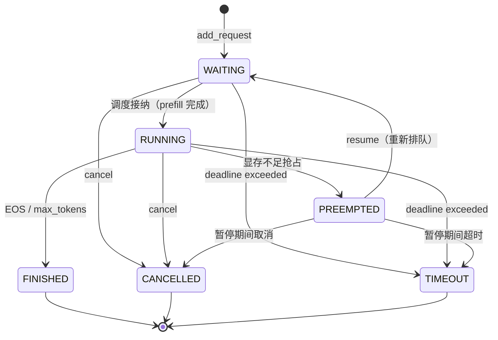

# Day 6 教程：请求生命周期与状态机——推理引擎如何管理一个请求

> 读者假设：你刚接触大模型推理引擎，已经跟着本项目走完 Day 1–5（跑通了 Qwen3 推理、理解了 Paged KV Cache 和 Prefill/Decode 调度），现在想搞清楚"一个请求从进来到出去到底经历了什么"。
> 配套代码：`nanovllm/engine/sequence.py`、`scheduler.py`、`llm_engine.py`；需求来源：[`request-lifecycle.md`](./request-lifecycle.md)；验收与审查记录：[`day6-validation.md`](./day6-validation.md)、[`day6-review.md`](./day6-review.md)。
> 建议读法：先通读 §1–§3 建立全局图，再对照代码精读 §4–§6，最后用 §8 的命令亲手跑一遍测试。

## 1. 先看全局：一个请求在 nano-vLLM 里的一生

在讲状态机之前，先回忆 Day 1–5 建立的执行模型。nano-vLLM 是一个**同步批处理**引擎，没有事件循环、没有线程池，一切由 `LLMEngine.generate()` 里的一个 `while` 循环驱动：

```text
LLM.generate(prompts)
 └─ LLMEngine.generate()
     ├─ add_request()   × N        # 每条 prompt 编码成一个 Sequence，进调度器
     └─ while 未全部完成:
         └─ step()
             ├─ scheduler.schedule()        # 决定这一轮跑哪些请求（prefill 批或 decode 批）
             ├─ model_runner.call("run")    # 真正执行模型 forward + 采样（GPU）
             └─ scheduler.postprocess()     # 记账：KV 哈希、追加 token、判定完成
```

几个关键角色（详见 [`architecture.md`](./architecture.md)）：

- **`Sequence`**（`engine/sequence.py`）：一条请求的全部状态——prompt token、已生成 token、采样参数、block table（逻辑块 → 物理块的映射）。它就是"请求"这个概念在代码里的实体。
- **`Scheduler`**（`engine/scheduler.py`）：持有 `waiting` 和 `running` 两个队列。每轮 `schedule()` 从队首凑批次：等待中的请求做 prefill，运行中的请求做 decode。
- **`BlockManager`**（`engine/block_manager.py`）：管理物理 KV 块的分配/释放/prefix 缓存，是显存这本账的记账员。

### Day 6 之前的世界：隐式规则

Day 5 之前，`SequenceStatus` 只有三个值 `WAITING / RUNNING / FINISHED`，状态变更散落在调度器各处，长这样：

```python
# 旧代码：直接赋值，没有校验
seq.status = SequenceStatus.RUNNING      # schedule() 里
seq.status = SequenceStatus.WAITING      # preempt() 里
seq.status = SequenceStatus.FINISHED     # postprocess() 里
```

这种写法能跑通正常流程，但隐含的问题随着功能增长会爆发：

1. **没有"取消"和"超时"的位置**。请求中途不想要了怎么办？显存不够让它暂停怎么办？三状态表达不了"为什么停下来"。
2. **非法迁移静默通过**。谁也拦不住某处代码把一个 `FINISHED` 的请求又改成 `RUNNING`——这种 bug 不会立刻报错，而是悄悄把队列和显存记账弄乱，几轮之后以 `double free` 或输出错乱的形式出现。
3. **状态、队列、KV 三本账各自为政**。"请求已结束"和"块已释放""已从队列移除"是三件独立的事，靠约定保持一致，没有统一收尾。

Day 6 的全部工作，就是把这些隐式规则**显式化、集中化、可测试化**。这也是所有成熟推理引擎（vLLM、SGLang 等）的第一块地基：请求生命周期状态机。

## 2. 六状态模型：给"停下来"一个原因

### 2.1 状态定义

```python
class SequenceStatus(Enum):
    WAITING = auto()     # 已接收，还没完成首轮 prefill，或抢占后等待恢复
    RUNNING = auto()     # 已被调度，参加本轮执行
    PREEMPTED = auto()   # 显存不足被抢占，暂停等待恢复
    FINISHED = auto()    # 正常生成结束（EOS 或达到 max_tokens）——终态
    CANCELLED = auto()   # 用户主动取消 —— 终态
    TIMEOUT = auto()     # 超过 deadline 被系统终止 —— 终态
```

两个设计点值得停下来想：

**为什么 `PREEMPTED` 和 `WAITING` 要分开？** 两者都会重新排队等待，但含义不同：`WAITING` 是"正常排队"，`PREEMPTED` 是"曾经拥有资源、因显存不足被剥夺"。分开后，日志和指标能区分"队列拥堵"和"显存压力"这两个完全不同的系统症状，恢复路径也可以区别对待（抢占恢复走 recompute，见 §5.4）。

**为什么终态有三种而不是一种？** 对调用方来说，"结束"之后 next step 完全不同：正常完成要返回结果，取消要返回"用户中断"，超时要告警统计。三态合一会把区分原因的责任推给上层重新推断，不如在状态机里一次定死。对应地，`Sequence.finish_reason` 记录更细的原因：`stop`（EOS）/ `length`（达到 max_tokens）/ `cancelled` / `timeout`。

### 2.2 迁移表：唯一权威



关键工程决策：**迁移表用数据（字典）定义，而不是用 if/else 散落在各处**：

```python
# sequence.py —— 全仓库唯一的状态机规则定义处
VALID_TRANSITIONS: dict[SequenceStatus, frozenset[SequenceStatus]] = {
    SequenceStatus.WAITING:   frozenset({RUNNING, CANCELLED, TIMEOUT}),
    SequenceStatus.RUNNING:   frozenset({PREEMPTED, FINISHED, CANCELLED, TIMEOUT}),
    SequenceStatus.PREEMPTED: frozenset({WAITING, CANCELLED, TIMEOUT}),
    SequenceStatus.FINISHED:  frozenset(),   # 终态：空集合，任何迁出都非法
    SequenceStatus.CANCELLED: frozenset(),
    SequenceStatus.TIMEOUT:   frozenset(),
}
```

数据化的好处：规则可被测试逐项枚举（见 `test_transition_table_matches_state_diagram`），改规则就是改一行数据，而审查时一眼能看出全貌。注意 `WAITING → FINISHED` 是**非法**的——没执行过模型就不能"完成"，这条规则拦住的正是"把没跑过的请求标成已完成"这类记账错误。

## 3. Sequence：从数据容器到状态对象

### 3.1 生命周期字段

```python
def __init__(self, token_ids, sampling_params=SamplingParams(),
             request_id=None, deadline=None):
    self.seq_id = next(Sequence.counter)      # 内部自增 ID，用于排序
    self.request_id = request_id or f"req-{self.seq_id}"  # 对外稳定 ID，用于日志/取消
    self.status = SequenceStatus.WAITING
    self.created_at = perf_counter()          # 单调时钟！不用可回拨的 wall clock
    self.started_at = None                    # 首次进入 RUNNING 的时间
    self.finished_at = None                   # 进入终态的时间
    self.deadline = deadline                  # 单调时钟语义的超时点
    self.cancel_requested = False             # 取消"请求标记"
    self.cancel_reason = None
    self.finish_reason = None                 # stop/length/cancelled/timeout
    self.num_preempts = 0                     # 抢占次数（指标用）
    self.last_preempted_at = None
    ...
```

两个容易忽略的细节：

**时钟必须用 `perf_counter()`（单调时钟）而不是 `time.time()`**。deadline 判断的本质是"现在是否晚于某个时刻"，wall clock 会被 NTP 校时回拨，可能出现"deadline 永远不到"或"瞬间全部超时"的诡异现象。单调时钟只前进，语义才成立。

**`started_at` 只在首次进入 RUNNING 时设置**。抢占恢复后再次进入 RUNNING 不能重置它，否则"首 token 延迟"这类指标会被抢占污染。

### 3.2 统一迁移入口：校验和派生字段在一个事务里完成

```python
def transition_to(self, new_status, *, reason=None, now=None):
    old_status = self.status
    if new_status not in VALID_TRANSITIONS[old_status]:
        raise InvalidStateTransition(self, old_status, new_status, reason)
    self.status = new_status                  # 校验通过才落笔
    ...
    if new_status == SequenceStatus.RUNNING:
        if self.started_at is None:           # started_at 只设一次
            self.started_at = now
    elif new_status == SequenceStatus.PREEMPTED:
        self.num_preempts += 1                # 抢占历史
        self.last_preempted_at = now
    elif new_status in TERMINAL_STATUSES:
        self.finished_at = now
        self.finish_reason = reason or _DEFAULT_FINISH_REASONS[new_status]
```

注意顺序：**先校验、后赋值、再维护派生字段**。非法迁移抛异常时对象状态一个比特都没动——这叫"无副作用失败"，是后面所有"原子性"讨论的基础。异常信息带上 `request_id`、原状态、目标状态，让你在日志里能直接定位是哪条调用路径出的问题。

### 3.3 幂等：重复的清理动作必须安全

终态操作都可能被重复触发（比如取消请求和自然完成几乎同时发生），所以 `mark_*` 方法都是幂等的：

```python
def mark_finished(self, reason="stop", now=None) -> bool:
    if self.is_terminal:
        return False          # 已经结束：不重复清理，报告"无事可做"
    self.transition_to(SequenceStatus.FINISHED, reason=reason, now=now)
    return True
```

`mark_cancelled` / `mark_timeout` 同构。返回 `bool` 让调用方区分"我完成了这次终态化"和"它早就结束了"，但无论哪种情况，调用后的世界状态一致——这就是幂等。

取消则更进一步，拆成了**两段式**：

```python
def request_cancel(self, reason="client_cancelled") -> bool:
    """只打标记，不迁移状态。真正的迁移发生在调度边界。"""
    if self.is_terminal:
        return False
    if not self.cancel_requested:             # 首次记录的原因不被覆盖
        self.cancel_requested = True
        self.cancel_reason = reason
    return True
```

为什么不在 `request_cancel` 里直接改成 `CANCELLED`？因为同步引擎里取消可能发生在**模型正在执行**的时刻——此刻 GPU 正在用这个请求的 KV 块，强行改状态、释放资源会踩到正在执行的计算。正确做法是：只贴一张"请终止我"的便签，等执行到达安全边界（模型返回后、下一轮调度前）再真正终止。这是并发编程里典型的 **coordination flag（协作标记）** 模式，Day 11 的 HTTP 异步取消会直接复用它。

### 3.4 序列化：张量并行 invisible 的坑

TP>1 时，`Sequence` 对象要经共享内存 `pickle` 传给子进程。子进程只需要数据面字段（进度、block table），但 `__setstate__` 反序列化出的对象若缺少任何被访问的属性就会 `AttributeError`。Day 6 的处理是**版本化 + 显式同步 + 兜底默认**：

```python
def __getstate__(self):
    payload = {
        # 数据面：照旧
        "num_tokens": ..., "block_table": ..., "last_state": ...,
        # 控制面：必须同步（子进程据此不误判请求状态）
        "status": self.status, "is_prefill": self.is_prefill,
        "cancel_requested": self.cancel_requested,
    }
    return (Sequence.STATE_VERSION, payload)   # (2, {...})
```

反序列化端做三件事：版本号不认识就抛清晰异常（防止静默按错误结构解读字段）；旧版六元组走兼容分支单向读取（按 `last_state` 类型推断 prefill/decode 模式）；子进程用不到的字段（时间戳等）补默认值，保证访问不炸。教训是：**修改任何被 pickle 的对象，都要同时考虑"新代码读新格式、新代码读旧格式"两种情况**。

## 4. Scheduler：状态、队列、KV 三本账的记账员

如果只记一句话，记这个：**状态机正确性的关键不是枚举值，而是"状态、队列、KV Cache 三本账永远一致"**。`Scheduler` 是唯一同时摸过三本账的角色，所以所有收尾动作必须收拢到它这里。

### 4.1 三本账与统一收尾

```python
self.waiting:  deque[Sequence]   # 等待队列
self.running:  deque[Sequence]   # 运行队列
self.requests: dict[int, Sequence]           # 活动请求索引（seq_id → 对象）
self._active_request_ids: set[str]           # 活动 request_id 集合（外部身份唯一性）
```

一切终态收尾走同一个函数：

```python
def _finalize(self, seq: Sequence):
    """终态收尾：移出所有队列 + 释放资源 + 从活动索引删除（幂等）。"""
    owned = self.requests.get(seq.seq_id) is seq   # 所有权检查！
    self._remove_from_queues(seq)
    self._release_sequence(seq)                    # 释放 KV block，清空 block_table
    if owned:
        del self.requests[seq.seq_id]
        self._active_request_ids.discard(seq.request_id)
```

逐条解释为什么这样写：

- **`_release_sequence` 幂等**：`BlockManager.deallocate` 以 `block_table` 为准做引用计数扣减，释放后清空 table，重复调用自然是空操作——不会 double free。
- **队列移除允许"对象不在队列"**：`_remove_from_queues` 对两个队列各做一次 try-remove，缺席即跳过。因为调用方可能已经把对象 pop 出来了（decode 循环里就是先 pop 再处理）。
- **所有权检查 `owned`**：这是两轮审查换来的教训。假设请求 A 用 ID `"same"` 完成并被收尾，请求 B 复用 `"same"` 注册；此时若对 A 的旧批次重复执行一次后处理，A 的收尾函数会把 B 的 ID 标记误删掉——B 的唯一性保护瞬间失效。`owned` 检查保证：**只有当前索引里的"正主"收尾时才动身份账本**，旧对象再怎么重复收尾都是无害空操作。

### 4.2 入口校验：先验证，后写入

```python
def add(self, seq: Sequence):
    if seq.status != SequenceStatus.WAITING:
        raise ValueError(...)                 # 显式异常，不用 assert（-O 会去除）
    if seq.seq_id in self.requests:
        raise ValueError(...)                 # 同一 seq_id 不允许两个活动对象
    if seq.request_id in self._active_request_ids:
        raise ValueError(...)                 # 外部 ID 在活动期内必须唯一
    self.requests[seq.seq_id] = seq           # —— 全部校验通过后才写账本
    self._active_request_ids.add(seq.request_id)
    self._enqueue_waiting(seq)
```

审查发现的缺陷形态值得记住：最初版本先写 `requests` 再校验，校验失败（抛 `AssertionError`）后索引里残留了脏对象，而且 `python -O` 会把 assert 整个去掉，保护彻底失效。两个原则：**失败必须零污染（不变量 7），保护不能依赖会被优化掉的 assert**。

### 4.3 schedule()：每一轮调度前的"体检"

```python
def schedule(self):
    # 调度边界：统一生命周期扫描（顺序即优先级）
    self._purge_terminal()      # ① 外部 mark_* 弄出来的终态请求：兜底清理
    self._purge_cancelled()     # ② 带取消标记的请求：终态化为 CANCELLED
    self.check_deadlines()      # ③ 过了 deadline 的请求：终态化为 TIMEOUT
    ...
```

为什么调度开头要扫描？因为请求的状态可能在**你不看它的时候**被改变——比如模型执行期间客户端调了 `cancel_request()`，或外部代码直接调了公开的 `seq.mark_timeout()`。若不做体检：`running` 队列里的终态请求会再次进 decode，`waiting` 里的会先分配块然后在状态迁移时抛异常，留下"块已分配但请求已死"的烂账。

三个扫描的范围都是 `self.requests`（活动索引）而不是两个队列——这覆盖了第三种位置：**被抢占后暂停在队列之外的请求**（`PREEMPTED` 不在任何队列里，但仍是活动请求）。这也是审查抓到的缺陷：第一版只扫队列，暂停请求的超时和取消标记全部漏掉，`is_finished()` 还会误报"全部完成"。

另外注意扫描顺序就是**优先规则**：取消标记优先于 deadline。一个请求同时"被取消"和"已超时"时，按 `CANCELLED` 记账——客户端的显式意图优先于系统的机械判断，这对上层指标统计很重要。规则在 `schedule()` 和 `postprocess()` 两处严格一致。

### 4.4 抢占与恢复：recompute 方案

显存不够 decode 时（`can_append` 失败），调度器抢占队尾的请求腾块：

```python
while not self.block_manager.can_append(seq):
    if self.running:
        victim = self.running.pop()   # 抢队尾（最年轻的活动请求）
        self.preempt(victim)          # RUNNING -> PREEMPTED + 释放物理块
        self.resume(victim)           # PREEMPTED -> WAITING，回到等待队首
    ...
```

`preempt()` 只释放**物理块**，不碰 `token_ids`、`num_prompt_tokens` 等进度字段——这叫 recompute（重算）方案：恢复时重新 prefill，用已生成的 token 重建 KV。代价是多算一次 prefill，换来实现简单（不用换出到 CPU 内存，swap 方案是 Day10 的事）。`resume()` 把请求放回等待队列**队首**，因为它是"有进度 halfway 的老人"，优先于全新请求恢复。

注意观察点语义：`preempt` 和 `resume` 在同一次 `schedule()` 内连续执行，所以外部观察到的状态是 `WAITING`，但 `num_preempts` 和 `last_preempted_at` 记录了这次抢占——状态语义不模糊，历史也没有丢。

### 4.5 postprocess()：模型返回后的三重安全边界

```python
def postprocess(self, seqs, token_ids, is_prefill, now=None):
    for seq, token_id in zip(seqs, token_ids):
        if seq.is_terminal:                    # 边界 ①：终态兜底
            self._finalize(seq); continue
        if seq.cancel_requested:               # 边界 ②：取消优先于超时
            seq.mark_cancelled(...); self._finalize(seq); continue
        if seq.deadline is not None and now >= seq.deadline:   # 边界 ③：超时
            seq.mark_timeout("deadline_exceeded"); self._finalize(seq); continue
        # —— 通过全部边界检查，才允许记账和产出 ——
        self.block_manager.hash_blocks(seq)
        seq.num_cached_tokens += seq.num_scheduled_tokens
        ...
        seq.append_token(token_id)
        if eos/max_tokens: seq.mark_finished(...); self._finalize(seq)
```

三个边界检查全部放在**追加 token 和 KV 记账之前**。这是审查抓到的最典型的 P1 缺陷：初版只在 `postprocess` 开头检查取消标记，没检查 deadline——模型执行期间超时的请求，如果这一轮采样恰好达到 `max_tokens`，会被记成 `FINISHED/length`。之后请求从活动索引删除，下一轮 deadline 检查根本看不到它了，**错误成为既成事实**。教训：安全边界检查必须发生在"不可逆记账"之前，否则检查形同虚设。

## 5. LLMEngine：两个契约与控制面

### 5.1 step() 的空批次契约

调度器在边界体检后可能清空队列——比如最后一个请求的 deadline 刚好过期。此时 `step()` 必须：

```python
def step(self):
    seqs, is_prefill = self.scheduler.schedule()
    if not seqs:
        return [], 0        # 空批次：零输出零工作量，绝不交给 ModelRunner
```

没有这行，空批次会进 `ModelRunner.prepare_decode`，在 `max()` 空序列上崩溃。这是审查用"真实 GPU 复现"抓出来的：**契约的每一端都要有明确行为，"应该不会发生"不是实现依据**。

### 5.2 generate() 的暂停契约

同步驱动循环还有一个死角：如果存在一个健康暂停（`PREEMPTED`、没设 deadline、没人 resume）的请求，每轮 `step()` 都是空批次，`is_finished()` 永远为假——循环空转，CPU 100%，永不返回。Day 6 的解法是**显式拒绝**：

```python
while not self.is_finished():
    output, num_tokens = self.step()
    if not output and num_tokens == 0 and not self.is_finished():
        paused = [seq.request_id for seq in self.scheduler.requests.values()
                  if seq.status == SequenceStatus.PREEMPTED]
        raise RuntimeError(f"generate() 无法推进：存在暂停（PREEMPTED）请求... {paused}")
```

为什么选择报错而不是自动恢复或等待？自动 resume 会践踏调用方"我想让它停着"的意图；同步引擎也没有等待机制可提供。**把"无法推进"作为显式错误抛出**，既不伪装成功也不无界空转，等服务化阶段（Day 11+）有事件循环时再升级成真正的等待/唤醒。判断条件 `not output and num_tokens == 0` 精确匹配空批次契约的返回值——正常轮次即使没有请求完成（如 prefill 中间 chunk），`num_tokens` 也不为 0，不会误伤。

### 5.3 控制面

```python
rid = engine.add_request(prompt, params)   # 返回 request_id（原来是 None！）
engine.get_request(rid)      # 查询活动请求
engine.cancel_request(rid)   # 取消（幂等：重复取消返回 False）
```

`add_request` 返回可追踪 ID 是服务化的前置条件：HTTP 层要靠它把"客户端连接"和"引擎里的请求"关联起来做取消和结果路由。ID 唯一性由 Scheduler 的活动集合保证，终态后 ID 释放可复用（当前策略，服务层后续可改成永久保留）。

## 6. 资源不变量：一张检查清单

设计文档 §5 列了 8 条不变量，实现后每条都有对应测试。建议把它们当成代码评审的 checklist：

1. **队列唯一性**：一个请求最多在一个队列里；终态请求不在任何队列。
2. **运行一致性**：`RUNNING` 请求必须在 `running` 队列，且 `block_table` 有效。
3. **等待一致性**：`WAITING` 请求可以没块（chunked prefill 例外，Day 8 处理）。
4. **抢占一致性**：`PREEMPTED` 不得参加 decode；释放块后才能 `resume()`。
5. **终态清理**：三种终态都必须最终释放块；重复清理不能让空闲块计数涨两次。
6. **进度不丢失**：抢占只释放物理块，不回滚 token；恢复靠重新 prefill。
7. **状态与异常原子性**：前置条件不满足就在改动任何账本前报错。
8. **时间语义统一**：单调时钟判断 deadline。

## 7. 缺陷复盘：两轮审查教了什么

Day 6 经历了三轮审查（两轮发现缺陷、一轮确认），共 10 个问题。每个问题的"根因"其实只有几种模式，值得背诵：

| 编号 | 现象一句话 | 根因模式 |
| --- | --- | --- |
| R1 | 最后一个请求被边界清理后，Engine 拿空批次去跑模型崩溃 | 契约单边：调度器新增了"返回空批次"的正常路径，消费端没跟上 |
| R2 | 执行期间超时的请求被记成正常完成 | 安全检查放在了不可逆记账**之后**，检查形同虚设 |
| R3 | 外部直接 `mark_*` 的终态请求再次被调度 | 队列里的对象被"体外"改了状态，调度入口没有体检 |
| R4 | 同名 request_id 注册两次都成功 | 外部身份唯一性只在单点校验，且收尾动作会误删他人标记 |
| R5 | 暂停请求被扫描和完成判断遗漏 | 用"遍历队列"当"遍历活动请求"，漏掉了不在队列里的第三种位置 |
| R6 | `add()` 校验失败后索引残留脏对象 | 先写账后校验 + 依赖会被 `-O` 去除的 assert |
| N1 | 序列化版本号不参与校验 | 兼容逻辑只认结构不认版本，静默误读比崩溃更危险 |
| N2 | 旧 decode 元组恢复成 prefill 模式 | 兼容分支丢失了模式信息，恢复对象二次序列化时退化 |
| 二轮 B | 旧对象重复收尾删掉了新请求的 ID 标记 | 幂等不等于无主：清理必须校验"我是不是这份记录的所有者" |
| 二轮 C | 健康暂停请求让同步循环空转 | 改完成判断修 bug 时引入了"无进展但不退出"的第三态，没有为它定义驱动行为 |

抽象出来是四条工程原则：

1. **单一权威**：状态规则、优先规则、清理路径各只有一份定义。
2. **先验证后落笔**：任何失败不得污染索引、队列、资源。
3. **安全边界先于不可逆操作**：记账/产出之前完成终态/取消/超时检查。
4. **幂等要有所有权**：重复执行的清理动作，必须先确认"该不该由我清理"。

## 8. 测试：怎么跑、怎么读

```bash
python -m pytest tests/test_request_lifecycle.py -q    # 状态机 79 项（纯 CPU）
python -m pytest -q                                    # 全量 99 项
python -O -m pytest tests/test_request_lifecycle.py -q # 验证保护不依赖 assert
```

测试的组织方式本身是学习材料：

- **不加载模型**：`Scheduler` 只需要几个配置字段，用 `SimpleNamespace` 造配置桩；采样 token 由测试直接注入 `postprocess()`，`ModelRunner` 用 `SimpleNamespace(call=...)` 桩替——于是状态机、调度、KV 记账的所有逻辑都能在毫秒级 CPU 测试里覆盖。
- **确定性时间**：所有时间参数（`now=`、`deadline`）由测试显式传入，不 sleep、不 mock 全局时钟，测试永远稳定。
- **缺陷即测试**：两轮审查的每个缺陷都先有复现脚本、修复后原样转成回归测试（如 `TestStaleCleanupIdOwnership`、`TestGeneratePausedContract`），防止同类问题复发。
- **组合场景**：单点正确 ≠ 组合正确。"取消 → ID 复用 → 旧批次重复后处理"这种三步组合才是真实事故的形态，专门的组合测试覆盖它们。

## 9. 思考题（衔接 Day 7–10）

1. `preempt()` 现在直接释放物理块（recompute）。如果改成把 KV 块内容拷到 CPU 内存（swap），`Sequence` 需要新增什么字段？状态机会变吗？（答案：状态机不变——这正是把状态和资源策略解耦的收益。）
2. Day 7 要引入每轮 token budget。它应该作用在 `schedule()` 的哪个位置？会新增状态吗？（不会，budget 是调度策略，不是请求生命周期。）
3. `cancel_request()` 目前不是线程安全的。若 HTTP 层在另一个线程调用它，哪些访问会竞争？用 `request_cancel()` 标记 + 边界扫描怎么重构成线程安全版本？
4. 终态请求现在从 `requests` 索引删除。如果服务层要支持"完成后 30 秒内仍可查询结果"，索引和内存策略该怎么改？
