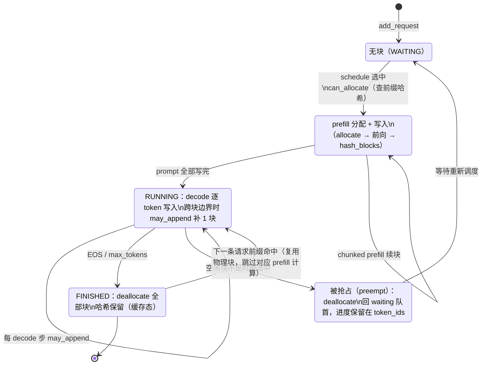

# Day 3 Paged KV Cache

> 对应 `plan.md` Day 3：阅读 Sequence、Block、BlockManager 与 prefix cache 实现，跟踪 block 的申请、写入、复用、释放和 preemption 路径，画出逻辑 token、逻辑 block、物理 KV block 的映射关系，并解释分页 KV Cache 为什么能减少碎片。
>
> 调度层如何决定何时调用这些接口，见 [architecture.md](./architecture.md) 第 4 节；本文聚焦块本身的生命周期。

- 分析日期：2026-09-07
- 基准 commit：`78474b6`
- 行号引用基于该 commit

## 1. 三层映射：逻辑 token → 逻辑 block → 物理 block / slot

```text
逻辑层（Sequence，scheduler/block_manager 视角）
  token_ids = [t0, t1, ..., t255 | t256, ..., t511 | t512, ...]
              └──── 逻辑块 0 ────┘└──── 逻辑块 1 ────┘└ 逻辑块 2(半空) ┘
                     block_size = 256 token（config.kvcache_block_size）
                          │                │                │
                 block_table[0]     block_table[1]    block_table[2]     ← 逻辑块号→物理块号的映射表
                          ↓                ↓                ↓
物理层（BlockManager，CPU 记账）
                  ┌──────────────┐  ┌──────────────┐  ┌──────────────┐
                  │ Block 37      │  │ Block 12      │  │ Block 590     │   ← 物理块可以不连续、乱序
                  │ ref_count=1   │  │ ref_count=2   │  │ ref_count=1   │      （Block 12 正被两条序列共享）
                  │ hash=0x9a3f.. │  │ hash=0x21c7.. │  │ hash=-1(半空) │
                  └──────────────┘  └──────────────┘  └──────────────┘
                          ↓ slot = block_id × 256 + 块内偏移
显存层（kv_cache 张量，model_runner.py:115）
  kv_cache[2(K/V), 28 层, 698 块, 256 slot, 8 KV头, 128 维]  (bf16, 19.1 GiB)
  每层 Attention 持有 k_cache / v_cache 视图（model_runner.py:117-121）
  Triton store_kvcache_kernel 按 slot_mapping 把新算的 K/V 散射写入（attention.py:11-30）
  FlashAttention 前向时按 block_tables 把整块读回（attention.py:64-74）
```

三条映射规则：

1. **token → 逻辑块**：`Sequence.block(i) = token_ids[i*bs : (i+1)*bs]`，块数 `num_blocks = ceil(num_tokens / bs)`（`sequence.py:56-65`）。
2. **逻辑块 → 物理块**：`block_table[i]` 存物理块号，由 BlockManager 分配，**不要求连续**——这是消除外部碎片的关键。
3. **物理块 → 显存偏移**：`slot = block_id × block_size + 块内偏移`。prefill 时对本次调度的 token 区间逐块展开成 slot 区间（`model_runner.py:151-161`）；decode 时每序列恰好 1 个 slot：`block_table[-1] × bs + last_block_num_tokens - 1`（`model_runner.py:181`）。

## 2. 物理池从哪来、有多大（本机实测）

KV 池不是配置写死的，而是启动时动态测算（`model_runner.py:103-114`）：

1. 先 `warmup_model` 跑一次最大 batch 的假前向（`model_runner.py:91-101`），让 PyTorch 记录权重 + 激活峰值；
2. `num_kvcache_blocks = (总显存 × gpu_memory_utilization − 已用 − 峰值 + 当前) // 单块字节数`；
3. 单块字节数 = `2(K和V) × 层数 × block_size × KV头数(按TP切分) × head_dim × dtype字节数`；
4. 一次性 `torch.empty` 出整个池子，把每层的 `k_cache/v_cache` 视图绑到 Attention 模块上。

本机（RTX 4090 D 24 GiB，Qwen3-0.6B，`enforce_eager=True`，TP=1）实测：

| 参数 | 值 |
| --- | --- |
| 层数 / KV 头 / head_dim / dtype | 28 / 8 / 128 / bfloat16 |
| block_size | 256 token |
| 单块字节数 | 2×28×256×8×128×2 = 29,360,128 B ≈ 28 MiB |
| num_kvcache_blocks | **698** |
| kv_cache 形状 | `(2, 28, 698, 256, 8, 128)` |
| KV 池总大小 | **19.086 GiB**（gpu_memory_utilization=0.9） |
| 可缓存 token 总数 | 698 × 256 = **178,688** |
| max_model_len / max_num_seqs | 4096 / 512 |

因为 `Config.num_kvcache_blocks` 要等 ModelRunner 测算后才回填，Engine 必须先构造 ModelRunner 再构造 Scheduler（`llm_engine.py:31-34`），否则 Scheduler 拿到的是 -1。

## 3. `Block`：物理块的记账结构（`block_manager.py:8-23`）

| 字段 | 含义 |
| --- | --- |
| `block_id` | 物理块号，即 `kv_cache` 第 3 维的下标 |
| `ref_count` | 有几条序列的 `block_table` 指向它；>1 表示前缀共享 |
| `hash` | 该块**链式哈希**值；-1 表示未登记（半空块或刚 reset） |
| `token_ids` | 登记哈希时的块内容快照，用于哈希命中后的二次校验 |

链式哈希（`block_manager.py:36-41`）：`hash(i) = xxh64(hash(i-1) ‖ token_ids[i])`。把前一块的哈希混入，使**相同内容在不同位置的块哈希不同**，天然避免"两个内容相同的块被误判为同一前缀"；命中后还要逐块比对 `token_ids`（`block_manager.py:66`）防哈希碰撞。只有**写满的完整块**才登记（`hash_blocks`，`block_manager.py:110-120`），尾部半空块内容还会追加，不能作为缓存前缀。

物理块的实际状态是两个维度的组合：

| 状态 | free 池中? | ref_count | hash | 说明 |
| --- | --- | --- | --- | --- |
| 全新空闲 | 是 | 0 | -1 | 从未使用 |
| 占用（未登记） | 否 | ≥1 | -1 | 尾部半空块，还在写入 |
| 占用（已登记） | 否 | ≥1 | 有 | 完整块，可被共享 |
| **释放但带缓存** | 是 | 0 | **保留** | prefix cache 的关键态：内容快照保留，物理 KV 视为仍有效 |
| 共享 | 否 | >1 | 有 | 多条序列命中同一前缀块 |

注意"释放但带缓存"态：`deallocate` 只把块放回 free 队列，**不清 hash 和 token_ids**（`block_manager.py:94-101`）；只有当该块被 `_allocate_block` 分配给新的写入时，旧哈希才被删除、内容才清空（`block_manager.py:43-51`）。也就是说淘汰是**被动的、由物理复用驱动**，没有 LRU/LFU 容量策略。

## 4. KV Cache 生命周期总图



## 5. 五条关键路径

### 5.1 申请：`can_allocate` + `allocate`（prefill 首次进入）

`can_allocate(seq)`（`block_manager.py:58-73`）做两件事：

1. 沿链式哈希逐块查 `hash_to_block_id`，统计可复用的完整块数 `num_cached_blocks`（从头连续匹配，首个不匹配即停）；
2. 检查空闲容量：需要的新块数 = 总块数 −（命中且**正在被占用**的块数）。正在被占用的命中块只需 `ref_count += 1`，不消耗空闲池；命中但已释放的块虽免计算，仍要从 free 池取出，照常占容量。**空闲块不足时返回 -1**，Scheduler 据此推迟该请求（`scheduler.py:37-38`）——这是"block 不足时的返回值"验收点，已由单元测试覆盖。

`allocate(seq, num_cached_blocks)`（`block_manager.py:75-92`）：命中块直接进 `block_table`（占用中则引用计数 +1；空闲中则保内容出队）；其余块从 free 队列头取出新分配（`_allocate_block` 会清掉该块残留的旧哈希）。最后 `num_cached_tokens = 命中块数 × block_size`。

### 5.2 写入：前向 + Triton kernel + `hash_blocks` 记账

写 KV 分两步：

1. **物理写入**（GPU）：`prepare_prefill/decode` 算出本轮每个 token 的 slot（`model_runner.py:151-161`、`model_runner.py:181`），前向时 `store_kvcache_kernel` 把每层新算的 K/V 散射到对应 slot（`attention.py:11-30`）。前缀命中的 token 不在 slot_mapping 里，物理 KV 直接沿用旧块内容，计算也跳过。
2. **逻辑记账**（CPU）：`postprocess` 里 `hash_blocks`（`scheduler.py:83`）把本轮新写满的完整块登记哈希（`block_manager.py:110-120`），并把 `num_cached_tokens` 前移。

### 5.3 复用：prefix cache

典型场景：请求 A 完成后块被释放但哈希保留；请求 B 与 A 共享前 2 个完整块。`can_allocate(B)` 命中 2 块 → `allocate` 把 A 留下的物理块直接挂到 B 的 `block_table` → B 只需 prefill 未命中的增量 token（本仓库测试中实测 `num_scheduled_tokens` 从 18 降到 2）。运行中的序列也能共享：两条序列指向同一物理块，`ref_count = 2`（`block_manager.py:83-84`）。

### 5.4 释放：`deallocate`（正常完成）

`postprocess` 发现序列 EOS 或达到 `max_tokens` 后调用（`scheduler.py:89-92`）。逆序遍历 `block_table`，`ref_count` 逐一减一，**减到 0 才回 free 队列**（`block_manager.py:94-101`）——共享块的最后一位使用者负责真正归还。哈希与内容快照保留，块进入"释放但带缓存"态。

### 5.5 抢占：`preempt`（空间不足时）

decode 需要新块而空闲池为空时（`can_append` 为 False，`block_manager.py:103-104`），Scheduler 抢占 `running` 队尾序列（`scheduler.py:60-64`）：`deallocate` 其全部块、状态回 `WAITING`、塞回 waiting 队首（`scheduler.py:75-79`）。**进度不丢失**——已生成的 token 都在 `token_ids` 里；恢复时把 prompt + 已生成 token 整段重新 prefill（recompute 模式，无 swap），若旧块哈希未被别人覆盖还可部分命中。被抢占序列释放的块立即回到 free 池供他人复用（单元测试已验证同一 block_id 被立即再分配）。

## 6. 单元测试（Day 3 验收点）

测试不依赖 GPU / 模型权重，`BlockManager`、`Scheduler.schedule/postprocess` 都是纯 CPU 逻辑；本轮采样 token 由测试直接注入。

| 文件 | 测试 | 验证的行为 |
| --- | --- | --- |
| `tests/test_block_manager.py` | `test_can_allocate_returns_minus1_when_blocks_insufficient` | **block 不足时 `can_allocate` 返回 -1**；恰好够时返回 0 |
| | `test_can_append_false_when_no_free_block` | **decode 需新块而池空时 `can_append` 返回 False**（触发抢占的条件） |
| | `test_deallocate_returns_blocks_to_free_pool` / `test_blocks_reusable_after_deallocate` | **释放后可复用**：块回到空闲池，可被更大的请求重新分配 |
| | `test_finished_sequence_prefix_is_reused_by_hash` | 释放后哈希保留，新请求复用同一物理块、免增量计算 |
| | `test_deallocate_shared_block_only_frees_last_reference` | 共享块引用计数：最后一个引用负责释放 |
| | `test_shared_prefix_block_does_not_consume_free_capacity` | 占用中的命中块不消耗空闲容量 |
| | `test_hash_blocks_only_hashes_full_blocks_with_chained_hash` | 只登记完整块；链式哈希逐块验证 |
| | `test_prefix_match_breaks_on_first_mismatched_block` / `test_token_ids_mismatch_rejected_even_if_hash_matches` | 前缀须从头连续匹配；token 二次校验防碰撞 |
| | `test_can_append_boundary_conditions` | 块边界处 `len % block_size == 1` 才需要新块 |
| `tests/test_kv_cache_lifecycle.py` | `test_prefill_then_decode_until_finish` | 申请 → 写入记账 → decode 增长 → 完成释放全链路 |
| | `test_chunked_prefill_allocates_once_and_progresses` | 块一次分配，进度由 `num_cached_tokens` 推进，中间块采样 token 被丢弃 |
| | `test_preemption_frees_blocks_and_reuses_them` | **抢占路径**：块不足 → 抢占队尾 → 释放的块被立即复用 → 被抢占请求恢复且进度不丢 |
| | `test_finished_prefix_blocks_are_reused_by_next_request` | 跨请求前缀复用：只调度未命中的 2 个 token |

运行方式与结果见 [day2-3-validation.md](./day2-3-validation.md)。

## 7. 为什么分页 KV Cache 能减少碎片

**对照：连续分配（PagedAttention 之前）**。为每条请求按其（潜在）最大长度预留一段**连续** KV 显存：

- **内部碎片**：必须按 `max_model_len` 预留而非实际生成长度。本机 `max_model_len=4096`，若 20 条并发请求平均只用 1K token，预留 4096×20 = 81,920 token（320 块 ≈ 8.75 GiB），实际仅需约 80 块 ≈ 2.2 GiB——四分之三的预留被浪费，且生成结束前无法回收。
- **外部碎片**：请求结束释放的连续区段与新请求需要的连续区段长度不一致，反复进出后显存被切成不连续空洞；最坏情况下总空闲足够却无一段够长，分配失败。
- **无法共享**：每条请求各存一份完整前缀，多轮对话/同 system prompt 的公共前缀被重复存储、重复计算。

**分页（本仓库实现）**：

- **按需增长，无内部碎片放大**：只为已产生的 token 分配 `ceil(len/256)` 个块；每条序列的浪费上界是尾部半空块，≤ 255 token（平均 ~128）。仍按上面 20 条请求估算：碎片开销 ≈ 20 × 128 = 2,560 token ≈ 10 块 ≈ 280 MiB，而不是 6.5 GiB。
- **物理块无需连续，无外部碎片**：任何空闲块等价可用（free 队列 FIFO），`block_table` 负责间接寻址。注意力 kernel（FA2 的 `block_table` 接口）原生支持按表取块，连续性约束彻底消失。
- **前缀可共享**：相同前缀的序列通过 `ref_count` 共享物理块，KV 显存只存一份（`can_append`/`hash_blocks` 维护一致性）。例如 20 条 2K 请求共享 80% 前缀：连续方案 20 × 2048 = 40,960 token，分页共享 ≈ 1,638 + 20 × 410 ≈ 9,838 token，省 76%。

代价与权衡：块间间接寻址让 attention kernel 实现更复杂（本仓库直接依赖 FA2 的 paged 接口）；`block_size` 越大，`block_table` 越短、每步调度开销越小，但尾部浪费上界越高。本仓库取 256（vLLM 默认 16），偏吞吐、面向长上下文；`Config` 还断言 `block_size % 256 == 0`（`config.py:22`），不支持更细粒度。

## 8. 与 vLLM 的差异（阅读结论）

- `block_size=256` vs vLLM 默认 16：碎片上界更大，换来更短的 block_table 与更低的记账开销。
- 无缓存淘汰策略：vLLM 的 APC 有 LRU 淘汰；这里哈希条目只在物理块被复用时被动删除。
- 抢占只有 recompute：vLLM 还有 swap（把块搬到 CPU 内存），本仓库全部丢弃重算。
- 只有完整块可缓存、哈希单槽（一个哈希只记一个块 id）、无并发安全考虑——单线程调度器前提下成立。
