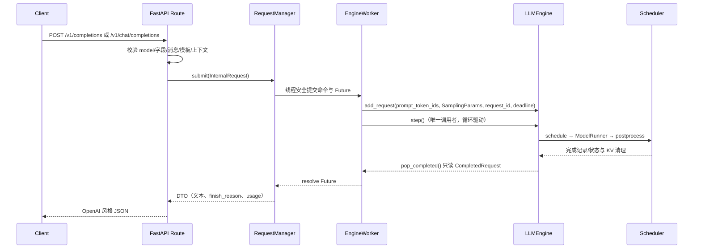

# Day 11–12 OpenAI 兼容 HTTP API 设计

> 本文合并 `plan.md` 阶段三 Day11 与 Day12，目标是在 Day10 请求控制与异常安全的基础上，增加可启动、可测试、可观测边界清晰的 OpenAI 风格 HTTP 服务。本文是开发设计文档，描述需求、接口契约、实现步骤、测试方案、验收方法和已知边界；**不代表 Day11–12 已经完成**。
>
> 当前基线：`dev` 与 `origin/dev` 同步于 Day10 合并提交 `7211dc5`；本设计分支：`feature/openai-api-day11-12`。
>
> 设计范围：`/v1/completions`、`/v1/chat/completions`、健康检查、模型信息、服务生命周期、统一请求表示和非流式完成结果。
>
> 重要边界：Day11–12 接受并校验 `stream` 字段，但只交付 `stream=false`。SSE 增量事件、客户端断连检测和断连后的取消回调属于 Day13；`stream=true` 在本阶段必须返回明确的 `501`，不能静默退化为非流式响应。

- **适用范围**：HTTP 请求校验、OpenAI 风格 JSON 响应、completion/chat 到统一内部请求的转换、单引擎串行驱动、健康与模型信息、优雅关闭、CPU stub 测试和 GPU 最小验收。
- **不在本任务范围**：SSE token 增量输出、`[DONE]`、客户端断连检测（Day13）、Prometheus 指标和结构化日志规范（Day14）、多模型路由、鉴权/配额、批量 prompt 数组、`n > 1`、工具调用、多模态 content、函数调用、CPU/NVMe swap 和新的调度策略。
- **复用基础**：[请求生命周期](./request-lifecycle.md)、[Day10 取消/超时/抢占](./request-cancellation-preemption.md)、[混合 Prefill/Decode](./mixed-prefill-decode.md)。
- **涉及代码**：新增 `nanoserve/` 服务包；适配 `nanovllm/engine/llm_engine.py` 的完成结果通道；配置依赖位于 `pyproject.toml`；测试位于 `tests/`，验收脚本位于 `scripts/`。

## 1. 需求背景与设计原则

### 1.1 为什么不能直接把 `generate()` 放进 HTTP handler

现有 `LLMEngine` 面向离线批量推理：`generate()` 一次性添加一组 prompt，同步循环调用 `step()`，最后统一返回完整文本。它有三个特点决定了服务层不能简单写成：

```python
@app.post("/v1/completions")
def completion(request):
    return engine.generate([request.prompt], params)[0]
```

1. `generate()` 会独占当前调用线程，多个 HTTP 请求直接调用会并发进入同一个 Engine，破坏 Scheduler/ModelRunner 的单引擎串行假设。
2. 服务需要让多个请求先进入 waiting，再由 continuous batching 统一调度；每个 HTTP handler 不应自行决定何时调用 `step()`。
3. Day10 的取消语义规定：模型 forward 期间只能置位取消信号，不能从网络线程直接清理 block、队列或 token。HTTP 层必须通过 Engine 的控制入口和安全点完成收尾。

因此，本任务采用“HTTP 协程 + 单一 Engine worker”的边界：请求处理器只做校验、入队和等待结果；后台 worker 是唯一直接调用 `engine.step()` 的执行者。

### 1.2 Day11 与 Day12 的合并原则

两天不各自维护一套请求对象或执行流程，而是分成三层：

```text
HTTP JSON
   ↓  schema 校验与 OpenAI 错误映射
统一 InternalRequest
   ↓  completion prompt / chat template → token prompt
RequestManager + EngineWorker
   ↓  add_request / step / 完成记录 / cancel_request
LLMEngine + Scheduler + ModelRunner
```

- Day11 负责普通 prompt 到统一请求的转换和 completion 响应。
- Day12 只增加 messages 校验、chat template 和 chat 响应包装。
- 两条路由共享采样参数、上下文长度检查、请求 ID、worker、错误处理和优雅关闭。
- API 层不操作 `Sequence.status`、`block_table`、`BlockManager` 或 Scheduler 队列；状态与资源仍由 Day10 的底层单一权威管理。

### 1.3 现有 Engine 与服务层的关键接口差距

当前 `LLMEngine.step()` 的公开返回值是 `[(seq_id, completion_token_ids), ...]`，而 `postprocess()` 完成请求后会从 Scheduler 活动索引中清理 `Sequence`。仅凭 `request_id -> Sequence` 查询无法在完成后可靠关联 HTTP 请求：

```text
step()
  ├─ postprocess(): Sequence -> FINISHED
  ├─ _finalize(): 从 requests 删除 Sequence
  └─ 返回内部 seq_id 和 token_ids

HTTP 层此时不能再依赖 get_request(request_id) 取回完成原因、prompt token 数或请求身份。
```

本设计要求增加一个**兼容旧同步 API 的完成记录通道**，而不是让服务层扫描或持有可写的 `Sequence`：

- `step()` 的既有返回格式保持不变，避免破坏 Day2–10 测试和离线 `generate()`。
- Engine 在 `postprocess()`/完成收尾前捕获只读 `CompletedRequest`，至少包含 `seq_id`、`request_id`、completion token IDs、prompt/completion token 数和 `finish_reason`。
- Engine 提供 `pop_completed()`（或等价的只读 drain API），服务 worker 在每次 step 后消费记录。
- 取消、超时和异常请求不伪装成正常 completion；它们通过状态/错误结果通道通知 RequestManager。
- 完成记录只属于 rank 0 控制面，不进入 TP 的模型 payload；记录消费具备幂等语义，不能重复完成同一个 handle。

这是服务化必须解决的生命周期关联问题，不是把 `Sequence` 暴露给 HTTP 层的理由。

## 2. 目标与非目标

### 2.1 必须达到的目标

1. 增加可配置的 FastAPI（或兼容 Starlette ASGI）应用，单个应用实例只拥有一个 Engine 生命周期。
2. 实现 `POST /v1/completions`，支持字符串 `prompt`、`max_tokens`、`temperature`、`top_p`、`stream` 和 `model` 核心字段。
3. 实现 `POST /v1/chat/completions`，支持非空 `messages`，允许 `system`、`user`、`assistant` 三种 role，并使用 Engine tokenizer 的 `apply_chat_template()`。
4. completion 与 chat 在进入 Engine 前统一为同一种内部请求：token prompt + `SamplingParams` + request ID + deadline。
5. 非流式请求返回稳定的 OpenAI 风格 ID、choice、finish reason 和 usage；最终文本只由服务层从完成 token 解码一次。
6. 参数错误、模型不匹配、上下文超限、模板失败、服务未就绪和 Engine 异常都返回可理解的 4xx/5xx JSON，而不是裸 traceback。
7. HTTP handler 不并发调用 `engine.step()`；Engine worker 串行驱动并能同时服务多个 waiting 请求，使 Scheduler 保留 continuous batching 能力。
8. 提供 `/health` 和 `/v1/models`，并实现启动失败、停止接收新请求、取消/收尾活动请求、调用 `engine.exit()` 的优雅关闭。
9. 通过不加载 GPU 模型的纯 CPU schema、worker、路由和生命周期测试；有 GPU/权重时再运行真实 HTTP 最小验收。
10. 文档明确 Day11–12 实际支持面和 Day13/14 尚未覆盖的能力，不能把 `stream=true` 或真实断连写成已完成。

### 2.2 明确不做的事情

- 不在本任务实现 SSE `data:` 事件、首 chunk、增量文本、finish chunk、`[DONE]` 或断连回调；这些属于 Day13。
- 不接受 `prompt` 数组、`n` 多候选、`best_of`、`stop`、`presence_penalty`、`frequency_penalty`、`logprobs` 等未映射到现有 `SamplingParams` 的字段；若接口 schema 暂不支持，应返回清晰错误而不是忽略。
- 不手写 ChatML 或假定固定模型格式；模板始终由 tokenizer 提供。
- 不在服务层复制或改写请求状态机，不直接释放 KV block，不在 GPU forward 中途取消。
- 不为多模型、多租户、API key、限流、优先级和持久化队列增加抽象。
- 不声称真实异步并发吞吐或 P95 性能提升；Day11–12 只验证正确性、生命周期和无资源泄漏。

## 3. API 外部契约

### 3.1 服务配置与模型身份

服务启动时使用一个模型路径和一个公开模型 ID。建议通过命令行或环境变量配置，不把路径硬编码在路由中：

```text
NANOSERVE_MODEL              必填，HuggingFace 本地模型目录或可加载标识
NANOSERVE_MODEL_ID           可选，默认取模型目录最后一段
NANOSERVE_HOST               默认 127.0.0.1
NANOSERVE_PORT               默认 8000
NANOSERVE_MAX_REQUEST_SECONDS 可选，单调时钟 deadline；默认无服务层 deadline
NANOSERVE_ENFORCE_EAGER      默认 true，便于最小服务验收
NANOSERVE_TENSOR_PARALLEL_SIZE 默认 1
```

Engine 参数仍由 `Config`/`LLMEngine` 负责，例如 `max_model_len`、`max_num_batched_tokens`、`chunk_size` 和 KV 容量。服务配置不能绕过 Config 的显式校验。

对外 `model` 字段必须与公开 `model_id` 相同；不支持请求内动态切换模型。模型不匹配返回 `404 model_not_found`（也可以在实现中选择 `400 invalid_request_error`，但整个服务必须统一）。

### 3.2 `POST /v1/completions`

Day11 MVP 请求模型：

```json
{
  "model": "Qwen3-0.6B",
  "prompt": "介绍一下分页 KV Cache。",
  "max_tokens": 64,
  "temperature": 0.0,
  "top_p": 1.0,
  "stream": false
}
```

字段契约：

| 字段 | 类型/默认值 | 约束 |
| --- | --- | --- |
| `model` | string，必填 | 必须匹配服务模型 ID |
| `prompt` | string，必填 | 只支持单个非空字符串；空白 prompt 需明确拒绝或按 tokenizer 结果拒绝 |
| `max_tokens` | positive int，默认 16/64（二者选一并固定） | 必须为正整数；不得使输入+最大输出超过上下文上限 |
| `temperature` | float，默认 1.0 | `>=0`，直接映射 `SamplingParams.temperature` |
| `top_p` | float，默认 1.0 | `(0, 1]`，直接映射 `SamplingParams.top_p` |
| `stream` | bool，默认 false | `false` 返回 JSON；`true` 返回 501，留给 Day13 |

实现时应选择并固定一个默认 `max_tokens`（建议 64，与当前 `SamplingParams` 默认值一致），文档、schema 和测试不能出现多个默认口径。`seed`、`ignore_eos` 若作为 NanoServe 扩展支持，必须显式标为扩展字段并在响应/文档中保持一致；第一版建议不暴露。

非流式成功响应示例：

```json
{
  "id": "cmpl-9f2c...",
  "object": "text_completion",
  "created": 1780000000,
  "model": "Qwen3-0.6B",
  "choices": [
    {
      "index": 0,
      "text": "分页 KV Cache 将序列的 KV 状态划分为固定大小的物理块。",
      "logprobs": null,
      "finish_reason": "length"
    }
  ],
  "usage": {
    "prompt_tokens": 12,
    "completion_tokens": 16,
    "total_tokens": 28
  }
}
```

`finish_reason` 只使用底层已有语义的公开映射：`stop`（EOS/正常停止）、`length`（达到 `max_tokens`）。`cancelled`、`timeout`、`engine_error` 不应伪装为成功 choice；分别映射为错误响应或服务内部失败结果。

### 3.3 `POST /v1/chat/completions`

Day12 MVP 请求模型：

```json
{
  "model": "Qwen3-0.6B",
  "messages": [
    {"role": "system", "content": "你是一个简洁的助手。"},
    {"role": "user", "content": "解释什么是 continuous batching。"}
  ],
  "max_tokens": 64,
  "temperature": 0.0,
  "top_p": 1.0,
  "stream": false
}
```

字段契约：

| 字段 | 类型/默认值 | 约束 |
| --- | --- | --- |
| `model` | string，必填 | 必须匹配服务模型 ID |
| `messages` | 非空数组，必填 | 至少一条；每项必须有 `role` 与非空字符串 `content` |
| `messages[].role` | string | 只允许 `system`、`user`、`assistant`；非法 role 返回 400 |
| `max_tokens` | positive int | 与 completion 使用同一校验和上下文预算 |
| `temperature`/`top_p` | 同 completion | 复用同一 `SamplingParams` 构造函数 |
| `stream` | bool | `false` 支持；`true` 返回 501 |

消息转换必须调用：

```python
tokenizer.apply_chat_template(
    messages,
    tokenize=True,
    add_generation_prompt=True,
)
```

具体调用参数以实际 tokenizer 兼容性为准，但不得手写角色分隔符。`tokenize=True` 得到的 token 列表应直接作为统一内部请求的 `prompt_token_ids`，避免模板字符串再次编码时出现不一致；若某 tokenizer 只能返回字符串，则使用同一个 Engine tokenizer 再编码，并在测试中固定该路径。

成功响应示例：

```json
{
  "id": "chatcmpl-9f2c...",
  "object": "chat.completion",
  "created": 1780000000,
  "model": "Qwen3-0.6B",
  "choices": [
    {
      "index": 0,
      "message": {
        "role": "assistant",
        "content": "Continuous batching 会在每轮调度中合并不同请求的工作。"
      },
      "finish_reason": "stop"
    }
  ],
  "usage": {
    "prompt_tokens": 31,
    "completion_tokens": 14,
    "total_tokens": 45
  }
}
```

### 3.4 健康检查与模型信息

#### `GET /health`

- Engine 尚未启动或启动失败：HTTP `503`，`status="not_ready"`。
- Engine 已加载且 worker 可接收请求：HTTP `200`，`status="ok"`。
- 正在优雅关闭：HTTP `503`，`status="draining"`。

建议响应：

```json
{
  "status": "ok",
  "model": "Qwen3-0.6B",
  "accepting_requests": true
}
```

健康检查只反映服务生命周期状态，不把某一个请求的完成状态当作 readiness。

#### `GET /v1/models`

返回当前单模型的 OpenAI 风格列表：

```json
{
  "object": "list",
  "data": [
    {
      "id": "Qwen3-0.6B",
      "object": "model",
      "created": 1780000000,
      "owned_by": "nanoserve"
    }
  ]
}
```

不提供动态模型加载和删除接口。

### 3.5 错误响应统一格式

所有由 API 主动返回的错误使用 OpenAI 风格结构，且附带可关联的 `x-request-id` 响应头：

```json
{
  "error": {
    "message": "messages must contain at least one item",
    "type": "invalid_request_error",
    "param": "messages",
    "code": "empty_messages"
  }
}
```

建议状态码和错误码：

| HTTP | code | 场景 |
| --- | --- | --- |
| 400 | `invalid_request_error` | JSON 类型、范围、非法 role、空 prompt、未支持字段 |
| 400 | `context_length_exceeded` | prompt token 数 + max_tokens 超出 `max_model_len` |
| 404 | `model_not_found` | model 字段与服务模型 ID 不匹配 |
| 501 | `stream_not_implemented` | Day11–12 收到 `stream=true` |
| 503 | `service_not_ready` / `service_draining` | 启动未完成或停止接收新请求 |
| 504 | `request_timeout` | 服务层 deadline 命中且请求尚未完成 |
| 500 | `engine_error` | ModelRunner/采样/调度发生不可恢复异常 |

FastAPI 默认的 Pydantic `422` 应由统一异常处理器转换成上述 `400` 格式，避免同类输入错误出现两种协议。错误消息可以帮助定位字段，但不得包含 prompt 明文、token 明文、block table 或内部堆栈。

## 4. 统一内部请求与生命周期

### 4.1 `InternalRequest` 数据结构

建议在服务包内定义不可变或只读的数据结构，不复用 HTTP Pydantic 对象直接进入 Engine：

```python
@dataclass(frozen=True, slots=True)
class InternalRequest:
    request_id: str
    kind: Literal["completion", "chat"]
    prompt_token_ids: tuple[int, ...]
    sampling_params: SamplingParams
    model_id: str
    created_at: float                 # perf_counter 单调时钟
    deadline: float | None
```

说明：

- `prompt_token_ids` 是 completion 字符串编码或 chat template 的唯一产物，Engine 收到后不再重复应用模板。
- `kind` 只用于选择响应包装，不参与 Scheduler 状态机。
- `request_id` 由服务层生成并传给 `LLMEngine.add_request()`；建议 completion 使用 `cmpl-<uuid>`，chat 使用 `chatcmpl-<uuid>`，不可在完成后重新生成。
- deadline 必须使用 `perf_counter()`，与 Day10 一致；HTTP 的 Unix `created` 只用于响应展示，不能参与超时判断。
- `InternalRequest` 不保存 `Sequence`、block table 或可变 token 列表引用。

### 4.2 请求处理时序



请求在 `add_request()` 成功前失败，不进入 Scheduler；进入 Engine 后的失败必须通过完成/错误通道收口，不能让 HTTP Future 永久等待。

### 4.3 Engine worker 串行驱动模型

建议 `EngineWorker` 使用一个专用线程，而不是在每个 HTTP handler 中使用 `asyncio.to_thread(engine.step)`：后者虽然可以把阻塞移出事件循环，但多个 handler 仍可能并发调用同一个 Engine。

worker 的职责：

1. 在 worker 线程中执行 `engine.add_request()`，确保 Engine 控制面和 `step()` 具有统一串行所有者。
2. 维护线程安全命令队列：`submit`、`cancel`、`shutdown`。
3. 有活动请求时调用 `engine.step()`；无活动请求时通过 `Condition/Event` 睡眠，不能 busy loop。
4. 每轮 step 后先消费 `engine.pop_completed()`，再将完成记录交给对应 `RequestHandle`。
5. 对 `CANCELLED`、`TIMEOUT` 记录完成失败 Future；对正常 `FINISHED` 记录解析为服务 DTO。
6. Engine 抛出异常时，标记 worker/服务不可用，失败所有尚未完成的 handle，并确保 Engine 的 Day10 异常清理已执行。
7. 停止时不再接受新命令，按顺序取消或等待活动请求、调用 `engine.exit()`，最后退出线程。

伪代码：

```text
worker_loop:
  while not stop_requested:
    command = drain_one_command()
    if command is submit:
      engine.add_request(...)
    if command is cancel:
      engine.cancel_request(...)
    if engine.has_active_requests():
      try:
        engine.step()
        for record in engine.pop_completed():
          manager.resolve(record)
      except BaseException as exc:
        manager.fail_all(exc)
        state = FAILED
        break
    else:
      wait_for_command()

  cancel_or_fail_remaining_handles()
  engine.exit()
  state = STOPPED
```

`has_active_requests()` 可通过 Engine/Scheduler 的只读查询实现；服务层不能直接把 Scheduler 对象作为公共 API 暴露。若 `step()` 返回空批次但仍有活动请求，必须遵循 Day10 的无进展错误语义，避免 worker 无界循环；错误应让等待中的 HTTP 请求得到明确失败。

### 4.4 完成记录契约

建议在 Engine 内部新增：

```python
@dataclass(frozen=True, slots=True)
class CompletedRequest:
    seq_id: int
    request_id: str
    token_ids: tuple[int, ...]       # prompt + completion，或明确只存 completion；全项目统一
    prompt_tokens: int
    completion_tokens: int
    finish_reason: Literal["stop", "length"]
    finished_at: float
```

推荐记录完整 `token_ids`，因为服务层可以用同一个 tokenizer 解码 `completion_token_ids`，但实现必须固定字段语义并测试。更节省拷贝的实现也可以只记录 completion token IDs；无论选择哪一种，都不能让服务层从已清理的 `Sequence` 猜测结果。

要求：

- 记录在 `FINISHED` 迁移与 `_finalize()` 之间捕获，保证 request ID、finish reason 和 usage 同源。
- `pop_completed()` 返回后从 Engine 的完成队列移除；重复调用不会重复返回。
- 完成记录必须在 Engine 异常前后保持一致：异常请求不能生成正常 completion 记录。
- 记录仅用于控制面，不改变 `step()` 现有 `(outputs, num_tokens)` 返回值。
- 服务层按 `request_id` 查找 Handle；未知/迟到记录记录错误并丢弃，不能完成另一个复用 ID 的请求。

### 4.5 取消、超时和退出语义

Day11–12 没有公开的取消 HTTP endpoint，也不实现断连检测，但服务层必须把控制边界设计好：

- `RequestManager.cancel(request_id)` 只调用 `engine.cancel_request()`，不直接改 `Sequence`。
- worker 正在 step 时，Engine 只置位 signal；下一安全点由 Day10 Scheduler 完成终态清理。
- 服务层配置了 `max_request_seconds` 时，deadline 以 `perf_counter()+seconds` 传给 `add_request()`；TIMEOUT 不返回正常 completion。
- 服务关闭先将 `accepting_requests=False`，新请求返回 503；然后给活动 handle 发送取消信号并等待一个有限 drain timeout。
- drain 超时后调用 Engine 的既有 `exit()` 兜底清理；不强杀 Python 线程、不在 GPU kernel 中途篡改 block table。
- Engine `exit()` 的异常不能吞掉；服务记录启动/关闭失败并让健康检查保持非 ready。

## 5. 模块调整方案

### 5.1 建议目录

```text
nanoserve/
├── __init__.py
├── app.py              # FastAPI app factory、lifespan、异常处理器
├── config.py           # ServerConfig，解析环境变量/CLI，不替代 engine.Config
├── schemas.py          # Pydantic 请求/响应和错误模型
├── api.py              # /health、/v1/models、两个 POST 路由
├── service.py          # InternalRequest、RequestManager、结果 DTO
├── worker.py           # EngineWorker，唯一调用 engine.step() 的线程
└── server.py           # python -m nanoserve.server、uvicorn 启动入口
```

不建议将 HTTP 代码塞入 `nanovllm/engine`：Engine 应继续可被离线 `LLM.generate()` 使用，服务生命周期也不应污染调度器核心。

### 5.2 `app.py` 与 lifespan

`create_app(engine_factory=None, server_config=None)` 用于生产启动和测试注入：

- 生产环境由 lifespan 调用 factory 创建一个真实 `LLMEngine` 和 tokenizer。
- 测试传入 fake factory，不访问 CUDA、NCCL、权重或 HuggingFace 网络。
- startup 顺序：解析配置 → 创建 Engine → 创建 RequestManager/Worker → worker ready → readiness=true。
- 任意初始化异常：记录不含 prompt 的错误摘要，readiness=false，并让启动失败可被 uvicorn 感知；不能返回一个表面 200 但内部没有 Engine 的服务。
- shutdown 顺序：停止接收 → 请求 worker drain/cancel → `engine.exit()` → join worker → 清理 lifespan 状态。
- app state 只保存服务对象和只读配置，不保存单个请求的 `Sequence` 引用。

### 5.3 `schemas.py`

Pydantic 模型需要：

- `extra="forbid"` 或显式 unsupported-field 检查，避免用户以为未支持字段生效。
- 对 `max_tokens`、temperature、top_p 使用与 `SamplingParams` 相同的边界；schema 层提供字段名，SamplingParams 仍是最终校验入口。
- 自定义 validator 检查空字符串、messages 非空、role 白名单、content 类型。
- 响应模型允许 `logprobs: null`（completion 兼容字段），chat 不添加 completion 专属字段。
- 错误模型永远不序列化 Python 异常堆栈。

### 5.4 `service.py`

建议职责分离：

- `build_sampling_params(request) -> SamplingParams`：唯一映射采样字段。
- `build_completion_request(request, tokenizer, config) -> InternalRequest`。
- `build_chat_request(request, tokenizer, config) -> InternalRequest`：模板调用和 token 长度检查。
- `RequestHandle`：保存 request_id、kind、created、Future 和最终结果，不保存可变 Sequence。
- `RequestManager.submit()`：生成 handle、排队到 worker、等待完成。
- `RequestManager.resolve(CompletedRequest)`：按 request ID 解码并生成只读结果。
- `RequestManager.fail()`：把底层取消/超时/Engine 异常转为服务异常。

文本解码必须使用与 Engine 编码相同的 tokenizer；不要创建第二个不同配置的 tokenizer。completion 响应使用 completion token IDs；chat 响应把同一文本放入 assistant message 的 content。

### 5.5 `worker.py`

Worker 对外只提供线程安全的高层方法：

```python
start() -> None
submit(request: InternalRequest) -> RequestHandle
cancel(request_id: str, reason: str = "client_cancelled") -> bool
begin_shutdown() -> None
join(timeout: float | None = None) -> None
```

禁止对外暴露：

- `engine.scheduler`
- `Sequence`
- `block_table`
- `model_runner`
- 可写状态枚举

Worker 内部的命令队列应保证：

1. 同一个 request ID 只绑定一个活动 handle。
2. submit 与 cancel 的线性化顺序可解释；已完成请求的迟到 cancel 返回 false。
3. worker 退出时每个 handle 恰好被 resolve、fail 或 cancel 一次。
4. stop/join 可重复调用，不重复调用 `engine.exit()` 或重复设置 Future。

### 5.6 `server.py`、依赖与启动入口

`pyproject.toml` 需要增加最小运行依赖：

```text
fastapi
uvicorn[standard]
```

测试依赖可单独放入 `test` optional extra：

```text
httpx
pytest
openai
```

若项目不希望把 OpenAI Python Client 作为运行依赖，应在测试/开发 extra 中声明，并在验收记录中注明安装命令。setuptools 包发现范围需从只包含 `nanovllm*` 扩展到同时包含 `nanoserve*`。

至少提供一种可重复入口：

```bash
python -m nanoserve.server --model /path/to/Qwen3-0.6B --host 127.0.0.1 --port 8000
```

可选增加：

```toml
[project.scripts]
nanoserve = "nanoserve.server:main"
```

启动入口应将 `--model`、`--tensor-parallel-size`、`--enforce-eager` 等参数传入 Engine，但不在 CLI 中复制 Config 逻辑。生产示例默认 `enforce_eager=True`，避免 Day11–12 的最小验证被 CUDA Graph 捕获路径混淆；性能实验另行配置。

## 6. 不变量与安全边界

服务层正确性不是“curl 能收到 JSON”这么简单，必须保持以下不变量：

1. **单 Engine 所有者**：一个 Engine 实例只有一个 worker 线程调用 `add_request()`、`step()` 和 `exit()`；HTTP 线程不直接调用这些方法。
2. **请求 ID 唯一**：活动期 `request_id` 在服务 Handle 和 Engine 活动索引中一一对应；终态后的 ID 复用不会被迟到完成记录误完成。
3. **状态单一权威**：WAITING/RUNNING/PREEMPTED/FINISHED/CANCELLED/TIMEOUT 只由 Sequence/Scheduler 修改；服务层只消费只读结果。
4. **完成关联可靠**：正常完成、finish reason、token 计数和 request ID 来自同一个 `CompletedRequest`，不从已清理 Sequence 反查。
5. **批处理不被 HTTP 拆散**：多个请求可以在 waiting 中合并到同一 Scheduler 轮；worker 不为每个请求调用 `generate()`。
6. **采样参数一致**：completion/chat 都通过同一个 `SamplingParams` 构造路径，temperature/top_p/max_tokens 的边界相同。
7. **上下文安全**：模板后的 prompt token 数与 `max_tokens` 之和不超过 `Config.max_model_len`；检查发生在分配 KV 之前。
8. **流式边界显式**：`stream=true` 不被忽略、不伪装成完整 JSON；本阶段返回稳定的 501 错误。
9. **取消安全**：取消只通过 Day10 signal/safe-point 接口；HTTP handler 不触碰 GPU 数据面。
10. **异常可收口**：Engine 异常会让所有等待中的 Future 得到明确错误，worker 不继续驱动损坏的 Engine；底层 `abort_all_active()` 负责释放 KV。
11. **关闭可收口**：停止接收新请求后，活动请求最终得到正常结果、取消/超时结果或关闭错误，不允许 Future 永久悬挂。
12. **隐私最小化**：响应错误、日志和完成记录不包含 prompt/token 明文、block table、权重路径以外的敏感内部对象。
13. **健康语义稳定**：只有 Engine 和 worker 都 ready 才返回 200；draining/failed/stopped 不报告健康。
14. **HTTP 语义稳定**：同一输入错误不因路由或 Pydantic 分支不同而产生不一致状态码和错误格式。

## 7. 实现步骤与交付物

采用“先固定协议，再接入 worker，最后真实 GPU”的顺序：

1. **冻结 API 范围**：确定默认 `max_tokens`、模型 ID、错误码、只支持字符串 prompt/字符串 content，以及 `stream=true` 返回 501 的契约。
2. **补充服务依赖与包入口**：扩展 `pyproject.toml` 的依赖、包发现和 `python -m nanoserve.server` 入口；不改变 Engine 的离线启动方式。
3. **实现 schemas 与错误处理**：完成 completion/chat 请求模型、响应模型、统一 `400/404/501/503/504/500` 错误转换和 `x-request-id`。
4. **实现 tokenizer 转换**：completion 使用 Engine tokenizer 编码；chat 使用 `apply_chat_template(tokenize=True, add_generation_prompt=True)`；在 Engine 前做 token 数和上下文上限检查。
5. **设计并实现完成记录通道**：增加只读 `CompletedRequest` 和 `pop_completed()`（或等价 callback/queue）；保持 `LLMEngine.step()` 和 `generate()` 现有兼容返回。
6. **实现 EngineWorker**：用单一专用线程串行驱动 step；无活动时休眠；异常时失败全部 handle；停止时调用 exit。
7. **实现 RequestManager 与路由**：统一 submit/resolve/fail，接入 `/health`、`/v1/models`、两个非流式 POST 路由。
8. **实现 lifespan 与 CLI**：startup 创建真实 Engine，shutdown 停止接收、收尾活动请求、join worker；测试可注入 fake Engine。
9. **先完成 CPU 测试**：使用 fake tokenizer、fake Engine、stub worker 证明 schema、template、完成映射、错误和生命周期，不加载 GPU/权重。
10. **执行底层回归**：运行 Day10 控制、mixed batch、KV 和全量 pytest，确保完成记录没有破坏既有 `step()`/`generate()`。
11. **运行 HTTP ASGI 验收**：用 TestClient/ASGI transport 验证 curl 等价请求、错误响应、健康状态和优雅关闭；用 OpenAI Python Client 做一次 completion 与 chat 调用。
12. **运行 GPU 最小验收（条件具备时）**：TP=1、`enforce_eager=True`、固定模型与采样参数，启动真实服务，完成非流式 completion/chat、上下文拒绝和 shutdown；记录显卡、模型、命令和结果。
13. **补齐文档索引与验收记录**：更新 `docs/README.md`，新增实施后的 `docs/day11-12-validation.md`，原始脚本输出放入 `docs/evidence/day11-12/`；未实测项目必须单列。

预期交付物：

- `nanoserve/` 服务包及启动入口。
- `pyproject.toml` 的服务/测试依赖和包发现调整。
- Engine 兼容完成记录通道及相关单元测试。
- `tests/test_service_schemas.py`、`tests/test_service_api.py`、`tests/test_engine_worker.py`、`tests/test_chat_template.py`（可按最终模块合并，但覆盖范围不能减少）。
- `scripts/validate_openai_api.py`，支持 CPU stub/ASGI 和 GPU 真实服务模式。
- 本设计文档与实施后的 `docs/day11-12-validation.md`。

## 8. 测试设计

### 8.1 测试约定

新增测试文件头部必须说明：覆盖 Day11–12 HTTP/统一请求/worker；CPU 路径不加载模型权重、不初始化 CUDA/NCCL；重复命令为：

```bash
python -m pytest tests/test_service_schemas.py tests/test_chat_template.py \
    tests/test_engine_worker.py tests/test_service_api.py -q
```

Fake Engine 必须模拟以下行为，而不是在测试中直接修改真实 Scheduler：

- `add_request(prompt_token_ids, sampling_params, request_id, deadline)` 返回 request ID。
- `step()` 可按预设顺序产生完成记录或抛出异常。
- `pop_completed()` 返回并清空只读完成记录。
- `cancel_request()` 记录 signal 调用并按 Day10 语义在安全点完成。
- `exit()` 可重复调用并记录次数。

### 8.2 Schema 与参数测试

至少覆盖：

- completion 最小有效请求使用默认采样值。
- chat 最小有效请求、system/user/assistant 混合消息和多个 user turn。
- 缺失 `prompt`、空 prompt、缺失 `messages`、空 messages、缺失 content。
- 非法 role、非字符串 content、非法 model。
- `max_tokens=0`、负数、float/bool；temperature 负数；top_p 为 0/大于 1。
- `stream` 默认 false；`stream=true` 被路由转换为 501 而不是被忽略。
- 未支持的数组 prompt、`n>1` 和未知字段返回稳定 400。
- Pydantic 422 被统一错误 handler 转换为 OpenAI 错误结构。

### 8.3 Chat template 与上下文测试

不加载模型，使用 fake tokenizer：

- `apply_chat_template` 收到原始有序 messages、`tokenize=True` 和 `add_generation_prompt=True`。
- 模板返回 token 列表时不重复编码；返回字符串时只调用同一 tokenizer 编码一次。
- 模板抛出异常时返回可理解的 400，不泄漏 traceback。
- system/user/assistant role 白名单严格生效。
- `prompt_tokens + max_tokens == max_model_len` 通过；大于上限被拒绝；检查发生在 `engine.add_request` 之前。
- completion 与 chat 的 `SamplingParams` 对相同字段产生相同值。
- chat 最终文本包装为 assistant message，completion 最终文本包装为 choice.text。

### 8.4 Worker 与 RequestManager 测试

- 多个请求同时 submit 时只有 worker 线程调用 `step()`，不发生并发调用；请求可以在同一 fake batch 中完成。
- 无活动请求时 worker 阻塞等待，不产生高频空 step。
- 一个 round 完成多个请求时，所有 handle 恰好 resolve 一次，结果按 request ID 正确关联。
- `pop_completed()` 返回后重复 drain 不重复完成；迟到/未知 ID 不会完成新请求。
- submit、cancel、完成之间的边界：已完成请求迟到 cancel 返回 false，运行中 cancel 只进入 Day10 控制入口。
- worker 在 `step()` 抛出异常时失败所有等待 Future、停止继续调度、调用 Engine 失败收尾/exit。
- shutdown 停止新 submit，活动请求得到正常结果或明确关闭错误；`join()` 和 `exit()` 重复调用没有 double cleanup。
- 一个请求的错误不会把另一个已完成请求的结果错误映射到它的 handle。

### 8.5 HTTP 路由与错误测试

使用 FastAPI `TestClient` 或 Starlette ASGI transport，注入 fake Engine factory：

- `GET /health` 在 startup、ready、draining、failed 状态返回正确状态码和 body。
- `GET /v1/models` 返回公开 model ID，未知 model 不被动态加载。
- completion 非流式返回 `object=text_completion`、稳定 id、model、choice、finish_reason 和 usage。
- chat 非流式返回 `object=chat.completion`、assistant message 和 usage。
- `x-request-id` 与 response `id` 的关联规则固定且可测试。
- 非法字段、非法 role、上下文超限、模型不匹配、模板错误分别返回预期 4xx。
- `stream=true` 的两个路由均返回 501 和 `stream_not_implemented`。
- Engine 未 ready 返回 503；Engine 异常返回 500 且不带内部堆栈。
- shutdown 后新请求返回 503，已有请求不会永久挂起。
- 错误 body 和测试捕获日志不包含 prompt/token 明文或 block table。

### 8.6 OpenAI Python Client 集成测试

在依赖可用时使用本地 ASGI/uvicorn 服务和 OpenAI Python Client：

```python
from openai import OpenAI

client = OpenAI(base_url="http://127.0.0.1:8000/v1", api_key="test")
client.completions.create(
    model="Qwen3-0.6B",
    prompt="hello",
    max_tokens=8,
    temperature=0,
)
client.chat.completions.create(
    model="Qwen3-0.6B",
    messages=[{"role": "user", "content": "hello"}],
    max_tokens=8,
    temperature=0,
)
```

CPU 测试可用 fake Engine 验证 HTTP 协议；这不能替代真实模型 GPU 结果。`stream=True` 的客户端行为留给 Day13，不在本任务写成通过。

### 8.7 底层回归命令

设计完成后、实现提交前必须实际运行：

```bash
python -m pytest tests/test_service_schemas.py tests/test_chat_template.py \
    tests/test_engine_worker.py tests/test_service_api.py -q
python -m pytest tests/test_request_control.py tests/test_mixed_batch.py \
    tests/test_kv_cache_lifecycle.py tests/test_block_manager.py -q
python -m pytest -q
python -O -m pytest -q
```

如果服务依赖在当前环境未安装，应先在允许的开发环境安装；不能把未执行的测试命令写成通过。底层已有 Day10 基线为 CPU `377 passed`，新增完成记录和服务测试的实际数字应写入验收记录，不在本设计阶段预填。

## 9. 验收方案

### 9.1 CPU/ASGI 验收脚本

新增 `scripts/validate_openai_api.py --mode cpu`，使用 fake Engine + ASGI transport，独立检查：

1. health 从 not-ready 到 ready 的状态变化。
2. `/v1/models` 的 model ID 与请求校验一致。
3. completion/chat 非流式成功响应的 OpenAI 字段、usage 和 finish reason。
4. chat template 调用参数、消息顺序和 generation prompt。
5. 相同采样参数在两条路由的 `SamplingParams` 映射一致。
6. 非法 role、空 messages、上下文超限、模型不匹配、`stream=true` 的状态码和 error code。
7. 多请求排队时 worker 只有一个 step 调用者，结果无交叉。
8. Engine 异常、取消、shutdown 后没有永久悬挂 handle。
9. 完成记录 drain 幂等、ID 复用隔离和错误不泄漏明文。
10. worker/Engine 退出调用可重复，活动 handle 最终全部收口。

脚本输出 JSONL，至少包含 `case`、`status`、`http_status`、`request_id`、`error_code`（如有）、`observed_at`；不得记录 prompt 明文。

### 9.2 GPU 最小验证

前提：NVIDIA GPU、兼容 FlashAttention-2、本地模型目录和可用依赖。建议先采用 Day10 已知环境：TP=1、`enforce_eager=True`、Qwen3-0.6B；实际环境不同必须据实记录。

启动：

```bash
python -m nanoserve.server \
  --model /root/huggingface/Qwen3-0.6B \
  --model-id Qwen3-0.6B \
  --host 127.0.0.1 --port 8000 \
  --tensor-parallel-size 1 --enforce-eager
```

基础请求：

```bash
curl -sS http://127.0.0.1:8000/health
curl -sS http://127.0.0.1:8000/v1/models
curl -sS http://127.0.0.1:8000/v1/completions \
  -H 'Content-Type: application/json' \
  -d '{"model":"Qwen3-0.6B","prompt":"介绍你自己","max_tokens":16,"temperature":0}'
curl -sS http://127.0.0.1:8000/v1/chat/completions \
  -H 'Content-Type: application/json' \
  -d '{"model":"Qwen3-0.6B","messages":[{"role":"user","content":"什么是 continuous batching？"}],"max_tokens":16,"temperature":0}'
```

必须观察并记录：

- 服务启动成功、health/model 信息可用。
- completion 与 chat 均返回非流式 JSON，`usage` 非负且总数守恒。
- `temperature=0` 下重复请求的确定性（若 seed/硬件允许）；不能把一次文本相同扩大为所有采样配置正确。
- 非法 role、超长上下文和 `stream=true` 的错误响应。
- 同时提交多个请求时服务不死锁，Engine worker 仍只有一个 step 驱动者。
- 发送 SIGTERM 或调用测试 shutdown 后，health 进入 draining/stopped，Engine 资源最终释放。

GPU 验收需记录 GPU 型号、驱动/CUDA、PyTorch、Transformers、模型路径、commit、TP、eager、block/chunk 配置、完整命令和原始 JSONL。若没有 GPU/模型，只能报告 CPU/ASGI 结果，不能用其替代真实模型服务验收。

### 9.3 验收清单

> 以下清单是本设计的需求标准。实施后应根据实际命令和证据更新；设计阶段不勾选“已通过”。`部分通过`或`未测`必须保留说明。

#### API 功能

- [x] `/v1/completions` 接受有效字符串 prompt 并返回非流式 OpenAI 风格响应。
- [x] `/v1/chat/completions` 接受有效 messages 并返回 assistant message。
- [x] `temperature`、`top_p`、`max_tokens` 在两条路由中映射并生效。
- [x] completion 与 chat 共享同一种内部 Request/采样/上下文校验路径。
- [x] chat 使用 tokenizer chat template，不手写模型格式。
- [x] response ID、model、created、finish_reason、usage 字段稳定且有测试。
- [x] `stream` 字段被解析；`stream=false` 可用，`stream=true` 明确返回 501，不伪装成功。

#### 错误与安全

- [x] 缺少/非法 prompt、messages、role、采样参数返回清晰 400。
- [x] 非法 model 返回统一 model-not-found 错误。
- [x] 超出上下文长度在分配 KV 前返回清晰错误。
- [x] 未 ready、draining、Engine 异常分别返回可理解的 503/500。
- [x] HTTP 层不直接修改 Sequence、Scheduler 队列或 KV block。
- [x] 错误响应和服务日志不包含 prompt/token 明文或内部堆栈。

#### 生命周期与工程质量

- [x] 一个 Engine 实例只有一个 worker 串行调用 `step()`。
- [x] 完成记录可靠关联 request ID，迟到记录和 ID 复用不会串请求。
- [x] 正常完成、取消、超时和 Engine 异常不会让 Future 永久悬挂（已覆盖可调度/异常/关闭路径；底层永久阻塞仍属未覆盖边界）。
- [x] startup/shutdown/lifespan 幂等，退出时活动资源通过 Day10 路径清理（正常路径与 CPU stub 已验证）。
- [x] `/health` 与 `/v1/models` 可用，启动失败不会报告虚假 ready。
- [x] `python -m nanoserve.server` 或 console script 可重复启动（TP=1 eager 实测）。
- [x] CPU 服务测试、底层全量回归和 `python -O` 回归实际执行并记录数字。
- [x] 有 OpenAI Python Client 指向本地服务的实际调用证据（CPU fake Engine + uvicorn 路径；GPU Client 未单独实测）。

#### 明确留给后续天数

- [ ] Day13 SSE 增量输出和 `[DONE]`（本任务不验收，留待 Day13）。
- [ ] Day13 客户端断连检测并触发 cancel（本任务不验收，留待 Day13）。
- [ ] Day14 `/metrics`、TTFT/TPOT、结构化日志（本任务不验收，留待 Day14）。

## 10. 风险、取舍与未覆盖边界

| 风险/边界 | 触发条件 | 影响 | 处理策略 | 本任务未覆盖 |
| --- | --- | --- | --- | --- |
| 同步 Engine 被并发调用 | 多个 handler 直接 `step()` | Scheduler/KV 竞争、死锁或账本破坏 | 单一 EngineWorker 所有者 | 多进程多 Engine 横向扩展 |
| 完成后 Sequence 已清理 | 只依赖 `get_request()` 反查 | request ID、usage、finish reason 丢失 | Engine 完成记录/只读 drain 通道 | 跨进程持久化结果队列 |
| forward 期间取消 | 网络线程直接清理 | GPU 使用中的 block 被修改 | signal-only，安全点收尾 | Day13 真实断连线程压力 |
| worker 空转 | 无活动请求仍连续 step | CPU 占用高、无意义日志 | Condition/Event 睡眠 | 分布式调度唤醒 |
| Engine 异常 | runner/采样/postprocess 抛错 | Future 永久等待、服务假健康 | fail all handles + Engine Day10 abort/exit | 自动重载新 Engine |
| shutdown 竞态 | 新请求与停止同时到达 | 请求被接收但无结果 | accepting 标志与命令线性化 | 跨进程 graceful handoff |
| chat template 不兼容 | 模型无模板或返回格式不同 | chat 无法编码 | 启动/请求时显式检查，返回清晰 400/启动错误 | 手写 fallback 模板 |
| 上下文长度误算 | 模板 token 未计入 | 运行期 OOM 或调度失败 | 模板后立即计算 token 数并预留 max_tokens | 自动截断策略 |
| OpenAI 字段差异 | 客户端发送未支持字段 | 用户误以为参数生效 | extra forbid/明确 400 | 完整 OpenAI API 覆盖 |
| 非流式延迟 | HTTP 等待完整生成 | 首 token 不可见 | 本任务只保证完整结果；Day13 做 SSE | 流式 TTFT |
| 线程与 asyncio Future | worker 线程直接触碰事件循环 | 竞态或跨线程异常 | concurrent Future + loop-safe resolve | 多事件循环部署 |
| GPU/模型不可用 | CPU CI 或权重缺失 | 不能真实运行 Engine | CPU fake/ASGI 只验协议，报告 GPU 未测 | 用 CPU 代替 GPU 结论 |
| TP/CUDA Graph | 多卡或默认 graph 路径 | 控制传播/捕获路径差异 | 首轮 TP=1 eager；单列未测 | TP>1 服务端到端 |

## 11. 与后续 Day 的衔接

- **Day13 SSE**：沿用 `RequestManager` 与 `EngineWorker`，将完成记录通道扩展为每轮增量 token 事件；客户端断连只调用 Day10 `cancel_request()`，不改变底层状态机。
- **Day14 可观测性**：在 Worker/RequestManager 的请求时间点增加 queue wait、TTFT、TPOT、latency、token 数、running requests 和 KV 利用率；指标读取不重新定义请求状态。
- **Day15–18 benchmark/压力**：复用统一 model ID、采样参数和启动配置，与 HuggingFace、nano-vLLM、vLLM 使用同一请求适配器；不要把 Day11–12 的单次 curl 当成性能基线。
- **未来多模型/多进程**：若引入模型池或横向副本，必须重新定义 request ID 路由、完成记录归属和 shutdown 语义，不能简单共享当前单 Engine worker。
- **长期 API 扩展**：数组 prompt、stop、n、多模态、工具调用和鉴权应作为独立需求增加 schema、测试和安全审查，不在本任务中隐式放开。
