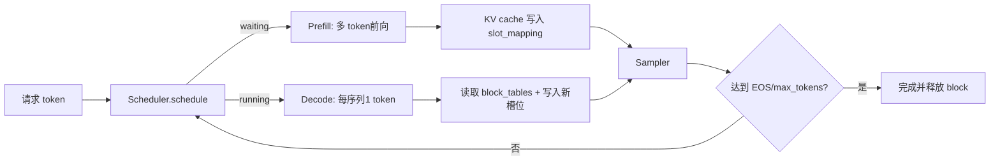

# Day 4：Prefill、Decode 与采样

## 阶段对比

| 阶段 | 输入 shape（batch 为 B） | KV cache | 主要瓶颈 |
|---|---|---|---|
| Prefill | `input_ids [T]`、`positions [T]`；`cu_seqlens_q/k [B+1]`，其中 T 为本轮 prompt token 数 | 按 `slot_mapping [T]` 写入所有新 token；prefix 命中时读取 `block_tables` | prompt 长度带来的矩阵乘、varlen attention 和 KV 写入带宽 |
| Decode | `input_ids [B]`、`positions [B]`；`context_lens [B]`、`block_tables [B, blocks]` | 每个序列写一个新槽位，同时读取完整历史 KV | 小 batch kernel launch、历史 KV 读取带宽和逐 token 同步 |

代码证据：`model_runner.py:129-170` 构造 Prefill 张量，`:172-188` 构造 Decode 张量，`:195-212` 在 Decode 小 batch 时可复用 CUDA Graph；`attention.py:64-74` 按 context 区分两类 attention。



## 本次代码改动完整记录

本次 Day 4 为了让采样参数真正进入模型执行链路，修改了以下文件：

### `nanovllm/sampling_params.py`

- 增加 `top_p: float = 1.0`。
- 增加 `seed: int | None = None`。
- 将原先禁止 greedy 的断言改为 `temperature=0` 合法，并定义为 greedy。
- 增加参数校验：
  - `temperature >= 0`
  - `0 < top_p <= 1`
  - `max_tokens >= 1`
  - `seed` 不能为负数
- 增加 `is_greedy` 属性，让调用方能够用名称表达 greedy 语义，而不必重复阈值判断。

### `nanovllm/engine/sequence.py`

`Sequence` 创建时除了保存 `temperature`、`max_tokens` 和 `ignore_eos`，现在还保存 `top_p` 和 `seed`。这一步很关键：参数先属于请求，之后才能随 Sequence 一路传到每一轮 ModelRunner。

### `nanovllm/layers/sampler.py`

原实现只有“温度缩放 + 随机抽样”。现在 `Sampler.sample()` 明确分为：

1. `temperature <= 1e-10`：直接 `argmax`，即 greedy。
2. `temperature > 0`：logits 除以温度后 softmax。
3. 对每行排序，按累计概率执行 top-p 截断。
4. 强制保留最高概率 token，避免极小 top-p 产生空候选集。
5. 使用 `torch.multinomial` 抽样，并支持传入每个请求自己的 `torch.Generator`。

`forward()` 保留为模块入口，兼容原来的 `self.sampler(...)` 调用习惯；新增参数均为可选，因此不传 `top_ps` 时仍相当于 `top_p=1`。

### `nanovllm/engine/model_runner.py`

- 初始化 `self.generators`，按 `seq_id` 保存请求级随机数生成器。
- `prepare_sample()` 现在同时准备温度 tensor、top-p tensor 和 generator 列表。
- 有 seed 的 Sequence 首次出现时创建 CUDA generator，之后复用同一个 generator，保证多轮 decode 消耗同一条随机数流。
- `run()` 将 `temperatures, top_ps, generators` 一起传给 Sampler。

这条链路现在是：

```text
SamplingParams
  -> Sequence
  -> ModelRunner.prepare_sample()
  -> Sampler.forward()
  -> token id
  -> Scheduler.postprocess()
```

## 采样语义

- `temperature=0` 为 greedy，直接取最大 logit。
- `temperature>0` 先缩放 logits；`top_p<1` 保留累计概率达到阈值的最小 nucleus，再随机抽样。
- `max_tokens` 是每个请求允许生成的上限，仍由 `Scheduler.postprocess` 负责完成判断。
- `seed` 在请求级建立 CUDA generator，使同一请求可复现；不同 seed 不保证必然不同，但随机序列独立。

更完整的逐行代码解释见 [`sampler.md`](./sampler.md)。

## 采样实验：通俗解释

可以把模型想成“每一步都给词表里的词打分”，采样器就是“根据分数决定这一步真正写下哪个词”。Day 4 实验没有一上来依赖大模型，而是先用一组固定 logits 做小实验：这样结果容易看懂，也不会因为没有 GPU 或模型权重而无法验证采样规则。

`experiments/day4_prefill_decode.py` 做了四件事：

1. 准备 5 个固定 prompt，并固定总 seed `2026`。
2. 用 `temperature=0` 连续选两次。因为 greedy 不掷骰子，所以两次 token ids 应完全相同；脚本把两次结果和 `greedy_reproducible` 写入 JSON。
3. 用 `temperature=1`、`top_p=0.8` 和每个 prompt 独立的 seed 做一次随机采样，观察它与 greedy 是不同的“选择规则”。
4. 创建 `SamplingParams(max_tokens=8)`，把 max_tokens 参数也写入实验结果，确认参数对象可以表达生成上限。

运行：

```bash
python experiments/day4_prefill_decode.py
```

结果保存到 `experiments/day4_results.json`。如果传入 `--model /path/to/model`，脚本会进一步调用真实 `LLM.generate()` 做 5 个 prompt 的 greedy 推理；模型/GPU 不可用时只记录错误，不伪造模型输出。

## 测试逻辑：通俗解释

`tests/test_sampler.py` 是“拆开零件逐个检查”，不需要加载模型：

- **greedy 测试**：故意给第二个 token 最高分，检查结果是不是第二个 token。
- **固定 seed 测试**：准备两个完全相同的随机数发生器，检查它们抽样结果相同，说明 seed 确实生效。
- **top-p 测试**：把第三个 token 的分数压得极低，并设置较小 top-p，检查抽出的 token 只能来自前面的 nucleus 候选。
- **参数校验测试**：检查 `temperature=0` 能开启 greedy，同时 `top_p=0`、`max_tokens=0` 会被拒绝。

实验与单测各自解决不同问题：单测检查“公式和边界是否正确”，实验脚本检查“读者能否按固定命令复现并看到完整记录”。

运行：

```bash
python -m pytest tests/test_sampler.py -q
```

## 采样在执行链路中的位置

Sampler 不负责生成完整文本，也不负责决定请求何时结束。它只在每一轮模型前向之后选出一个 token；Scheduler 随后追加 token、检查 EOS/max_tokens，并决定下一轮是否继续。Prefill 阶段通常完成 prompt 的批量前向，Decode 阶段每个序列每轮产生一个新 token，Sampler 在这两种阶段之后都可能被调用，但真正的自回归循环主要发生在 Decode 阶段。
