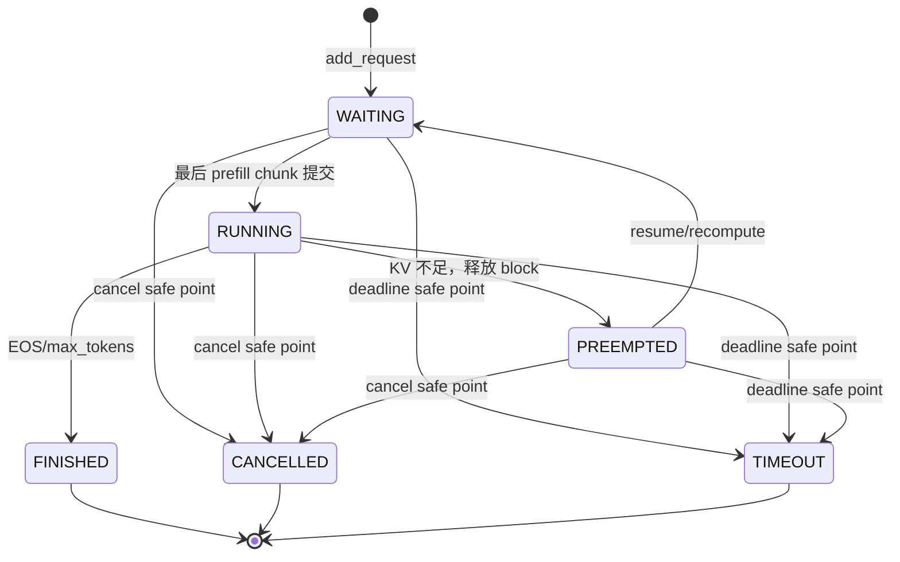

# Day 10 取消、超时、抢占与恢复设计

> 本文对应 `plan.md` 阶段二 Day 10，目标是把 Day 6–9 已建立的请求状态机、KV Cache 账本、Chunked Prefill 和混合 Prefill/Decode 调度，扩展为可在资源压力和异常路径下安全收尾的请求生命周期。本文是开发设计文档，描述目标行为、接口约定、实现步骤、测试方案和验收标准；**不代表 Day10 已经完成**。
>
> 当前基线：`dev=36ae91c`（Day9 混合 Prefill/Decode 已合并）；本设计分支：`feature/request-cancellation-preemption`。

- **适用范围**：调度器内部的取消信号、deadline 检查、等待/运行/暂停请求清理、KV 不足时的抢占与 recompute 恢复、模型执行异常的批次回滚和 Engine 收尾、CPU/GPU 验收。
- **不在本日范围**：FastAPI/Starlette 与 OpenAI HTTP API（Day11）、SSE 和 HTTP 客户端断连检测（Day13；本日只提供可被上层调用的取消控制面）、Prometheus 指标（Day14）、CPU swap/offload、Prefix Cache 淘汰策略、优先级调度、投机解码、量化和 PD 分离。
- **相关设计**：[请求生命周期](./request-lifecycle.md)、[每轮 Token Budget](./token-budget.md)、[Chunked Prefill](./chunked-prefill.md)、[混合 Prefill 与 Decode](./mixed-prefill-decode.md)。
- **涉及代码**：`nanovllm/engine/sequence.py`、`nanovllm/engine/scheduler.py`、`nanovllm/engine/block_manager.py`、`nanovllm/engine/llm_engine.py`、`nanovllm/engine/model_runner.py`；测试位于 `tests/`，验收脚本建议位于 `scripts/`。

## 1. 需求背景与当前差距

### 1.1 Day9 已有的生命周期骨架

Day6–9 已经提供以下基础能力：

- `SequenceStatus` 已包含 `WAITING`、`RUNNING`、`PREEMPTED`、`FINISHED`、`CANCELLED`、`TIMEOUT` 六种状态，合法迁移集中在 `Sequence.VALID_TRANSITIONS`/`VALID_TRANSITIONS`。
- `Sequence` 已保存 `deadline`、`cancel_requested`、`cancel_reason`、`prefill_offset`、已生成 `token_ids` 和 `block_table`。
- `Scheduler.cancel()`、`timeout()`、`check_deadlines()`、`preempt()`、`resume()` 和 `_finalize()` 已形成初步控制入口；`_finalize()` 负责队列移除、KV 释放、活动索引删除和预算统计收尾。
- Day9 的 `BatchItem`、`round_id` 和 `postprocess()` 安全边界，已经能在模型执行返回后丢弃取消/超时 item，且不影响同一混合轮的其他 item。
- KV 不足时，decode 侧已有“队尾 victim + 释放后重新进入 waiting”的 recompute 雏形；`BlockManager.deallocate()` 释放物理块，并把有效 KV 进度 `prefill_offset` 归零，恢复时按 prefix 命中重新建立有效 KV。

这些代码是 Day10 的复用基础，而不是 Day10 的完成证明。

### 1.2 必须收口的缺口

1. **取消入口的安全边界不够明确**：当前 `LLMEngine.cancel_request()` 直接调用调度收尾；若未来服务线程在模型 forward 期间调用它，可能与正在使用的 `block_table` 发生并发修改。必须区分“只设置取消信号”和“安全点执行终态清理”。
2. **超时、取消、正常提交的优先级需要统一**：请求可能在 `schedule()` 后、模型执行期间或 `postprocess()` 前跨过 deadline，也可能同时收到取消信号。若只在下一轮检查，会把已超时请求误记为正常完成。
3. **抢占的观察点和恢复语义需要固定**：释放 KV 后必须保持 prompt 与已生成 token 的逻辑进度；恢复允许重新 prefill，但不能重复追加 completion token、丢失采样进度或破坏 prefix 账本。
4. **模型异常路径没有批次级清理契约**：当前 Engine 在 ModelRunner 异常后锁定自身，但需要明确如何清除本轮 `num_scheduled_tokens`、临时分配的 block、running/waiting 索引和活动请求，避免后续调度卡死或 free block 持续减少。
5. **100 请求连续运行缺少独立资源验算**：必须以 BlockManager 的 `free/used/ref_count` 和 Scheduler 的活动索引为证据，而不是只观察请求最终返回。

## 2. Day10 目标与非目标

### 2.1 必须达到的目标

1. **取消信号**：为请求提供可重复调用、原因不被覆盖的取消信号；覆盖 waiting、running、PREEMPTED 三类活动请求。取消在模型执行期间只置位，不能中途修改 block table 或 token；在调度边界或 postprocess 安全点完成 `CANCELLED` 迁移和资源释放。
2. **deadline/timeout**：使用单调时钟的绝对 deadline；在每轮调度开始和模型返回后的安全点检查。取消优先于超时，超时优先于正常 token 提交；命中后不得追加本轮采样 token。
3. **抢占**：KV 容量不足时，从合法的 `RUNNING` 候选中选择 victim，执行 `RUNNING -> PREEMPTED`、释放其可回收 block，并保留逻辑 token 进度。抢占不得选择已终态、当前不在 running 的请求或同一轮已被接纳的 decode item。
4. **恢复**：只允许 `PREEMPTED -> WAITING`，恢复请求重新进入 prefill 扫描，通过 prefix 命中或 recompute 重建 KV；`prompt_token_ids`、已有 completion token、`num_completion_tokens` 和采样参数保持不变。
5. **异常安全**：模型 forward、采样、postprocess 或资源记账发生异常时，必须执行幂等的批次清理；Engine 进入不可重试的失败态时不得留下活动请求、队列成员或持有 block。
6. **混合轮兼容**：Day9 的 decode-first、混合预算、`BatchItem` 顺序、round_id、逐 item 提交和同轮隔离规则全部保持；一个 item 被取消、超时或收尾，不得跳过其他 item 的正常提交。
7. **资源稳定性**：连续至少 100 个请求（包含取消、超时、抢占恢复混合场景）后，活动索引为空、队列为空、`used_block_ids` 与 `ref_count` 账本平衡，KV 使用率回到稳定范围而非持续增长。

### 2.2 明确不做的事情

- 不增加 `FAILED` 状态；不可恢复的 Engine 执行异常使用已有终态 `CANCELLED` 配合 `finish_reason="engine_error"` 收尾，并通过异常向上层报告。
- 不在 GPU kernel 执行中途强制终止模型，不修改正在执行批次的 `token_ids`、`block_table` 或 `prefill_offset`。
- 不做 CPU/NVMe swap；抢占采用“释放物理 KV、恢复时 recompute”的简单方案。
- 不承诺真实 HTTP 客户端断连检测；Day10 只定义可被 Day11/13 调用的 `request_cancel`/`cancel_request` 语义。
- 不引入抢占公平性、请求优先级或自适应 victim 评分；先固定可解释、可测试的队尾策略。
- 不把一次 GPU 压测结果写成性能提升承诺；Day10 的性能验收重点是无死锁、无泄漏和资源平衡。

## 3. 术语、状态模型与控制语义

### 3.1 三种“进度”必须分开

| 名称 | 定义 | 抢占后的处理 |
| --- | --- | --- |
| **逻辑 token 进度** | `Sequence.token_ids` 中的 prompt 与已生成 completion；`num_completion_tokens` 由其派生 | 必须保留，不回滚、不重复追加 |
| **有效 KV 进度** | 已写入当前 `block_table`、可直接供下一次模型执行使用的 `prefill_offset` | 释放 block 后可归零；恢复时通过 prefix/recompute 重建 |
| **本轮计划进度** | `num_scheduled_tokens` 与 `BatchItem` 中的 `scheduled_tokens` | 异常/取消/超时未提交时清零，不得伪造为已执行 |

因此“抢占不丢进度”不是保留已释放的物理 block，而是保留逻辑 token 序列和生成计数，并允许有效 KV 进度回退到重新计算起点。

### 3.2 状态、队列与资源约定

| 状态 | 队列位置 | 是否终态 | KV 约定 | Day10 控制动作 |
| --- | --- | --- | --- | --- |
| `WAITING` | `waiting` | 否 | 新请求可无 block；chunk 中请求可保留已有 block | 可取消、可超时、可被调度 |
| `RUNNING` | `running` | 否 | 当前 `block_table` 有效 | 可取消、可超时、可抢占 |
| `PREEMPTED` | 不在工作队列，但在 `requests` | 否 | 可回收 block 已释放 | 可取消、可超时、可恢复 |
| `FINISHED` | 不在队列和活动索引 | 是 | 必须释放 | 只允许幂等收尾 |
| `CANCELLED` | 不在队列和活动索引 | 是 | 必须释放 | 只允许幂等收尾 |
| `TIMEOUT` | 不在队列和活动索引 | 是 | 必须释放 | 只允许幂等收尾 |

### 3.3 状态迁移图



规则：

- 所有迁移仍经 `Sequence.transition_to()`；终态不能迁出。
- `cancel`/`timeout`/`preempt`/`resume` 的重复调用必须无副作用地返回 `False` 或显式拒绝，不得重复入队或增加 free block。
- `CANCELLED` 与 `TIMEOUT` 的首次原因必须保留；后续重复取消不得覆盖 `cancel_reason`/`finish_reason`。
- 调度器的自动抢占可以在同一调度调用内执行 `RUNNING -> PREEMPTED -> WAITING`，但内部必须先完成释放再恢复，事件中保留一次抢占记录；显式 `preempt()` 则停留在 `PREEMPTED`，由 `resume()` 负责恢复。

### 3.4 控制信号与安全点

取消分为两个层次：

```python
Scheduler.request_cancel(seq_id: int, reason: str = "client_cancelled") -> bool
Scheduler.cancel(seq_id: int, reason: str = "client_cancelled", now: float | None = None) -> bool
```

- `request_cancel()` 是**控制面信号**：只在锁保护下设置 `cancel_requested` 和首次 `cancel_reason`，允许在 ModelRunner forward 期间调用，不触碰 block、队列和 token。
- `cancel()` 是**安全点收尾**：要求调度器不在执行当前模型批次，执行状态迁移、队列移除、KV 释放和活动索引删除。现有内部调用可继续使用，但 Engine 对外取消入口应优先调用 `request_cancel()`。

安全点固定为：

1. `schedule()` 开始：先清理外部已置位取消、终态兜底，再检查 deadline。
2. ModelRunner 调用前：确认 item 仍活动且计划未被取消；取消不改变已冻结的 batch。
3. ModelRunner 返回后、`postprocess()` 逐 item 提交前：取消 > timeout > 正常提交。
4. Engine 异常收尾：禁止重试前，清除本轮和剩余活动资源。

控制锁只保护控制面状态和账本变更，**不跨越 GPU forward 持有**。这样外部取消不会阻塞在 kernel 上，也不会在 kernel 使用对象期间清空 block table。

## 4. 端到端执行契约与模块调整

### 4.1 `Sequence`：保留逻辑进度，补充控制面语义

现有字段继续作为单一事实源：

```python
request_id: str
status: SequenceStatus
deadline: float | None             # perf_counter 绝对时间
cancel_requested: bool
cancel_reason: str | None
finish_reason: str | None
prefill_offset: int                # 当前有效 KV 进度
token_ids: list[int]               # prompt + 已生成 token
num_preempts: int
```

Day10 实现要求：

- 构造入口验证 `deadline is None or deadline >= created_at`；deadline 使用 `perf_counter()`，不接受 wall-clock 时间作为内部比较值。
- `request_cancel()` 只设置标记；重复调用返回成功但保持首次原因，终态调用返回 `False`。
- `transition_to()`、`mark_cancelled()`、`mark_timeout()` 保持幂等/非法迁移规则；终态原因写入 `finish_reason`。
- TP pickle 继续版本化。rank 0 是控制面权威，至少传递 `status`、`cancel_requested`、`is_prefill`、生成进度和 `prefill_offset`；`deadline`/时间戳可在 worker 侧使用默认值，但不得导致反序列化异常。新增字段若改变 payload，版本必须递增并提供旧 v1/v2/v3 读取兼容测试。

### 4.2 `Scheduler`：控制队列、抢占和资源事务

#### 4.2.1 取消/超时入口

建议保留现有内部方法并新增安全控制入口：

```python
request_cancel(seq_id, reason="client_cancelled") -> bool
cancel(seq_id, reason="client_cancelled", now=None) -> bool
timeout(seq_id, now=None, reason="deadline_exceeded") -> bool
check_deadlines(now=None) -> list[Sequence]
```

控制流程：

```text
request_cancel(seq_id)
  └─ 获取控制锁
     ├─ 找不到活动请求：返回 False
     ├─ 已终态：返回 False
     └─ 只设置 cancel_requested/cancel_reason，返回 True

schedule()/postprocess() 安全点
  └─ cancel_requested 优先于 deadline
     └─ mark_cancelled/mark_timeout
        └─ _finalize（移队列、释放 block、删索引）
```

`check_deadlines()` 扫描 `requests` 而不是只扫描 waiting/running，因此覆盖 PREEMPTED。扫描使用注入的 `now`，同一轮只取一次时钟，便于确定性测试。

#### 4.2.2 抢占 victim 选择

固定策略：

1. 只从当前 `running` 中选择；排除本轮 `BatchItem` 已接纳对象、终态对象和 `num_scheduled_tokens > 0` 的当前执行对象。
2. 默认选择 `running` 队尾，即 FCFS 中最后被服务的请求；若队尾不满足释放条件，向队首反向搜索。
3. 调用 `preempt(victim)`：先迁移 `RUNNING -> PREEMPTED`，再移出队列、释放 block、清零本轮计划，并记录 `num_preempts/last_preempted_at`。
4. 自动调度需要继续推进时调用 `resume(victim)`，执行 `PREEMPTED -> WAITING` 并置于 waiting 队首；显式控制调用不自动 resume。
5. 抢占释放后重新查询 `can_append`/`can_allocate`；若仍不足，继续按有限次数选择候选，不能无界循环。没有合法 victim 时记录 `kv_capacity` 并返回 idle/延后，不得破坏队列。

抢占不修改 `token_ids`、`num_prompt_tokens`、completion token 数或采样参数。物理 block 释放导致 `prefill_offset` 清零是设计内的 recompute 行为；恢复后必须重新完成 `[0, prefill_target)` 的有效 KV 写入。

#### 4.2.3 资源释放单一入口

所有终态路径调用 `_finalize(seq, now)`；所有批次异常路径调用 `abort_round(items, reason)`（名称可按实现调整）。二者均须具备对象所有权保护：旧批次迟到收尾不能删除新请求复用的 `request_id`。

`abort_round()` 的契约：

- 对当前 item：若仍活动，取消其本轮计划并进入 `CANCELLED`，`finish_reason` 使用 `engine_error`/`execution_error`；释放其全部 block。
- 对同一 Engine 中未进入本轮但仍活动的请求：由 Engine 异常收尾策略统一清理，不能留下“看似可继续但 Engine 已不可重试”的活动对象。
- 对已终态对象：只执行幂等 `_finalize`，不覆盖既有原因。
- 返回资源快照（活动请求数、waiting/running 数、free/used block 数）供错误日志和测试核对。

### 4.3 `LLMEngine`：对外控制与 step 事务

接口建议：

```python
add_request(prompt, sampling_params, request_id=None,
            deadline=None) -> str
cancel_request(request_id, reason="client_cancelled") -> bool
get_request(request_id) -> Sequence | None
step() -> tuple[list[tuple[int, list[int]]], int]
```

`cancel_request()` 的新语义：

- 请求 ID 不存在或已经终态：返回 `False`。
- Engine 空闲时可立即在安全点收尾；Engine 正在 `step()` 时只置位信号，当前 forward 返回后由 `postprocess()`/边界扫描收尾。
- 不在 API 层创建线程强杀 GPU；Day13 的断连回调只需调用该方法。

`step()` 事务顺序：

```text
1. 检查 Engine 是否已失败
2. scheduler.schedule()：清理取消/超时/终态，生成 BatchItem + round_id
3. 保存 batch snapshot：seq identity、status、block_table、offset、计划 token
4. try:
     ModelRunner.call("run", items)
     scheduler.postprocess(items, token_ids)
   except BaseException:
     scheduler.abort_round(items, reason="engine_error")
     scheduler.abort_all_active(reason="engine_error")
     self._execution_failed = True
     记录 error 事件（executed_tokens=null）
     raise
   finally:
     清除本轮临时计划；清理 _current_round_id；保证控制锁释放
5. 仅返回 FINISHED 的正常 outputs；取消/超时不伪装为正常 completion
```

这里的“全活动请求收尾”是因为当前 Engine 在模型执行异常后明确不可重试；继续保留 waiting 请求会让调用方误以为可以继续驱动，且容易遗留资源。异常收尾不新增状态，使用 `CANCELLED + finish_reason="engine_error"`，原始 Python 异常仍向调用方传播。

### 4.4 `postprocess()` 的取消/超时优先级

Day9 的逐 item 契约继续有效，安全检查顺序固定为：

```text
终态兜底
  > cancel_requested
  > now >= deadline
  > 正常 hash_blocks / offset 推进 / append_token
```

命中取消或超时：

- 不调用 `hash_blocks()`；
- 不推进 `prefill_offset`；
- 不追加 `token_id`，但消耗该 item 在采样结果中的占位，保持后续 item 对齐；
- 迁移终态并调用 `_finalize()`；
- 同轮其他 item 继续按其自身快照提交。

如果正常完成与取消同时竞争，控制锁决定线性化顺序：已进入 postprocess 原子提交区并完成 token 追加的请求可正常结束；尚未进入提交区的请求按取消收尾。测试必须固定并验证这一边界，而不是声称取消能撤销已提交 token。

### 4.5 `BlockManager`：账本和恢复契约

保持现有 `allocate`/`may_append`/`deallocate`/`hash_blocks` 的单一记账入口，并补充 CPU 可核对的账本检查：

```python
assert set(free_block_ids).isdisjoint(used_block_ids)
assert len(free_block_ids) + len(used_block_ids) == len(blocks)
assert all(block.ref_count > 0 for used blocks)
```

取消、超时、正常完成和异常收尾都必须通过 `deallocate(seq)`，不能直接修改 `free_block_ids`。抢占释放后允许 prefix hash 元数据暂留，但被释放 block 必须回到 free 集合；后续分配若复用该 block，应由 `_allocate_block()` 正确清除旧 hash 映射。

### 4.6 `ModelRunner`：执行期间不响应破坏性控制

`ModelRunner.run(items)` 的 Day9 两子批顺序不变：decode 子批在前、prefill 子批在后。取消/超时只在 Engine/Scheduler 安全边界处理；ModelRunner 不在 CUDA kernel 中检查并修改 Sequence。

如果 decode 子批成功、prefill 子批失败，整个 Engine 按异常策略收尾，不能只释放失败子批而让已写入的 decode KV 留在活动请求中。事件的 `executed_tokens` 使用 `null`，不把部分执行计作成功轮次。

## 5. 时序示例与资源不变量

### 5.1 运行中取消与同轮隔离

配置 `B=8`，当前 batch 为 `[A(decode), B(decode), C(prefill)]`：

```text
1. schedule 冻结三项与 round_id=10；num_scheduled_tokens 已登记。
2. ModelRunner forward 期间外部调用 cancel_request(C)：只设置 C.cancel_requested。
3. forward 返回，postprocess 依次处理 A、B、C。
4. A/B 按正常路径提交；C 命中 cancel_requested，不 hash、不推进 offset、不追加 token。
5. C -> CANCELLED，释放 C 的 block；A/B 的结果不受影响。
6. 下一轮活动索引只保留仍未完成的 A/B。
```

### 5.2 deadline 跨过模型执行

```text
schedule(now=t0) -> X 被接纳
forward 开始 -> deadline=t1
postprocess(now=t2, t2>=deadline)
  -> X -> TIMEOUT
  -> 丢弃本轮采样，不追加 completion
  -> 释放 block，活动索引删除
```

取消信号和 deadline 同时存在时，`CANCELLED` 优先，`finish_reason` 不被改写为 `deadline_exceeded`。

### 5.3 KV 不足抢占与恢复

```text
1. running=[A, B]，waiting 队首 C 需要新 block，但 free block 不足。
2. 选择 B（队尾）作为 victim；B: RUNNING -> PREEMPTED。
3. 释放 B 的 block；B.token_ids、prompt_token_ids、completion_token_ids 不变。
4. 自动恢复路径：B: PREEMPTED -> WAITING，插入 waiting 队首；C 重新查询容量并继续调度。
5. 后续轮次 B 重新 prefill；prefix 命中块从命中偏移开始，未命中区间 recompute。
6. B 的下一个 decode 只能在恢复 prefill 最后 chunk 提交后发生；不得重复追加抢占前的 token。
```

### 5.4 模型异常

```text
schedule -> items=[A, B]
ModelRunner.run 抛出异常
  -> abort_round(items): 清除计划并收尾本轮对象
  -> abort_all_active(): 清理其余 waiting/running/PREEMPTED 对象
  -> 每个活动请求 CANCELLED(engine_error)，所有 block 释放
  -> _execution_failed=True，记录 error，原异常继续抛出
  -> 后续 step 立即拒绝，避免在不完整 KV 上重试
```

### 5.5 Day10 不变量

1. **状态-队列一致**：`WAITING` 只在 waiting，`RUNNING` 只在 running，`PREEMPTED` 不在工作队列；终态不在任一队列或活动索引。
2. **身份所有权**：活动期间 `seq_id` 和 `request_id` 唯一；旧批次收尾不能删除 ID 复用后的新对象。
3. **取消安全性**：模型执行期间取消只置位；所有破坏性资源操作发生在安全点。
4. **优先级唯一**：取消 > 超时 > 正常提交；首次终态原因不被后续入口覆盖。
5. **抢占不丢逻辑进度**：抢占前后 prompt token、已生成 token、completion 计数和采样参数一致；有效 KV 回退只通过 recompute 恢复。
6. **计划原子性**：取消/超时/异常未成功提交时，`num_scheduled_tokens` 清零，`prefill_offset` 不前进。
7. **批次隔离**：同一混合轮单 item 终止不影响其他 item 的合法提交；批次内 `seq_id` 不重复。
8. **KV 账本守恒**：free/used 集合互斥且总数恒定；每个 block 的 `ref_count` 与持有者一致；重复释放不改变账本。
9. **异常终止可重入**：异常清理可重复调用，不 double free、不重复删除索引；Engine 失败后不允许隐式重试。
10. **资源最终稳定**：全部请求终态后 `requests`、waiting、running 为空，所有非 prefix 持有 block 回到 free 集合。
11. **时间统一**：deadline、`created_at`、`finished_at` 和测试注入时间都使用同一单调时钟语义。
12. **round 关联**：迟到/重复 postprocess 不得借新计划推进 token；`round_id` 和计划计数双重校验继续生效。

## 6. 接口、配置与事件设计

### 6.1 接口变更表

| 模块 | 当前 Day9 | Day10 设计 | 兼容影响 |
| --- | --- | --- | --- |
| `Sequence` | 已有 deadline/取消标记 | 明确 deadline 校验、取消信号与逻辑进度保留 | 构造参数向后兼容；pickle 必须版本化 |
| `Scheduler` | `cancel()` 直接收尾 | 新增/强化 `request_cancel()`；安全点调用 `cancel()`/`timeout()` | 旧同步调用仍可用，Engine 对外改用 signal 语义 |
| `Scheduler` | `preempt()`/`resume()` 雏形 | 固定 victim、释放顺序、有限重试和恢复契约 | 不改六态状态机 |
| `Scheduler` | `_finalize()` | 增加批次异常 `abort_round()`、全活动收尾入口 | 幂等；不暴露 block 细节给服务层 |
| `LLMEngine` | `cancel_request()` | 取消时区分运行中 signal 与空闲 safe point | 返回值保持 `bool` |
| `LLMEngine.step()` | ModelRunner 异常后锁定但可能残留资源 | `try/except/finally` 统一清理并锁定 | 正常返回协议不变 |
| `BlockManager` | 正常路径记账 | 增加账本校验/测试辅助 | 不改变 prefix cache 算法 |

### 6.2 请求输入约束

- `deadline=None` 表示无时限；否则必须是单调时钟绝对时间，且不早于请求创建时刻（测试可注入固定时钟）。
- `request_id` 在活动期唯一；请求终态收尾后允许复用，旧对象不能误删新对象。
- 空 prompt、非正 `max_tokens` 等既有输入校验不因 Day10 放宽。

### 6.3 Day10 事件字段

事件只记录 ID、状态、计数和时间，不记录 prompt/token 明文。建议新增或扩展：

```json
{
  "event": "request_control",
  "round_id": 10,
  "seq_id": 7,
  "request_id": "req-7",
  "action": "cancel|timeout|preempt|resume|abort",
  "from_status": "RUNNING",
  "to_status": "CANCELLED",
  "reason": "client_cancelled",
  "released_blocks": 3,
  "free_blocks_before": 117,
  "used_blocks_before": 11,
  "free_blocks": 120,
  "used_blocks": 8,
  "observed_at": 123.456
}
```

字段要求：

- `action`、`reason`、状态值使用白名单；`released_blocks` 为实际账本差值，不由计划猜测。
- 抢占事件要能区分 `PREEMPTED` 暂停与同轮自动 `resume`；恢复事件关联同一 `seq_id` 和 `num_preempts`。
- `engine_round` 异常事件保留 Day9 字段，`outcome="error"`、`executed_tokens=null`；清理摘要可单独记录，不覆盖原异常。
- 验收脚本可由事件重算终态次数、抢占次数、释放 block 总量和 round 关联；不把事件本身当作资源账本唯一来源。

## 7. 实现步骤与交付物

采用“契约测试先行、资源账本后实现、真实 GPU 最后验证”的顺序：

1. **补齐测试桩与固定时钟**：新增 `tests/test_request_control.py`，提供无模型的 Config/Sequence/Scheduler 构造助手和可注入 `now`。
2. **明确控制锁/执行边界**：在 Scheduler/Engine 中区分 signal-only 与 safe-point cleanup；补充并发调用的确定性测试，不在模型执行期间修改 block。
3. **实现取消/超时契约**：强化 `request_cancel`、`check_deadlines`、postprocess 优先级、终态原因和幂等释放。
4. **实现抢占恢复事务**：固定 victim 选择、释放顺序、有限尝试、PREEMPTED 观察点和 recompute 恢复；记录控制事件。
5. **实现异常回滚**：加入 `abort_round`/`abort_all_active`，在 `LLMEngine.step()` 的 `try/except/finally` 中统一调用；验证 forward、采样和 postprocess 异常都不泄漏资源。
6. **补齐序列化兼容**：若新增控制字段，升级 pickle 版本并覆盖 v1/v2/v3 读取、当前版本往返和控制字段默认值。
7. **适配 Day9 测试**：保持 `BatchItem` 顺序、混合预算、round_id、同轮隔离和 decode-first 断言不变。
8. **增加资源压力/100 请求脚本**：新增 `scripts/validate_request_control.py`，CPU 模式独立重算状态迁移和账本；GPU 模式注入取消、deadline、KV 压力和恢复序列。
9. **CPU 回归**：运行 Day10 新测试、生命周期/KV/混合调度相关测试、全量回归和 `python -O` 回归。
10. **GPU 最小验证**：在已有本地模型和 `TP=1, enforce_eager=True` 条件下运行短请求取消/超时、可控 KV 抢占恢复及 100 请求压力。
11. **记录证据**：原始 JSONL 放入 `docs/evidence/day10/`；验收记录写入 `docs/day10-validation.md`，注明 GPU/模型可用性、实际命令、数字结果和未覆盖边界。
12. **实施后补齐交付**：必要时新增 `docs/day10-review.md` 与教程，并更新 `docs/README.md`；设计文档本身的验收清单不因测试结果修改标准。

预期交付物：

- 运行时代码：Sequence/Scheduler/Engine/BlockManager 的 Day10 实现与兼容适配。
- `tests/test_request_control.py` 及相关回归测试。
- `scripts/validate_request_control.py` 与 `docs/evidence/day10/` 原始证据。
- `docs/day10-validation.md`（实施后）和本设计文档。

## 8. 风险与取舍

| 风险/边界 | 触发条件 | 影响 | 处理策略 | 未覆盖内容 |
| --- | --- | --- | --- | --- |
| forward 期间并发取消 | 外部线程在 GPU kernel 期间调用取消 | 清理与 block 使用竞争 | signal-only；postprocess 安全点线性化 | 真正多线程/异步服务端尚未实现 |
| deadline 过期边界 | forward 返回恰好跨过 deadline | 误追加一个 token | postprocess 用统一 `now`，timeout 优先正常提交 | kernel 内部不可中止 |
| recompute 成本 | 抢占释放有效 KV | 恢复请求需要重新 prefill，TTFT 变长 | 保留逻辑 token；prefix 命中优先；只验正确性不承诺性能 |
| victim 反复被抢占 | KV 池极小、多个长请求竞争 | 饥饿或吞吐退化 | 队尾固定策略、抢占次数计数、压力测试记录 | 公平/优先级策略留后续 |
| 子批部分执行失败 | mixed 轮 decode 成功、prefill 失败 | 不能只清理一半状态 | 整个 Engine 视为不可重试，全活动收尾 | 可恢复模型异常不在范围 |
| 异常中的 prefix 引用 | 共享 prefix block 有 ref_count | 误 double free 或删除他人引用 | 只调用 BlockManager.deallocate，按 ref_count 释放 | 更复杂 prefix 淘汰策略 |
| ID 复用与迟到批次 | 旧 round 结束后新请求复用 request_id | 旧收尾误删新请求 | seq/object 所有权检查 + round_id 双校验 | 跨进程任意版本混跑 |
| TP 控制面传播 | rank 0 与 worker 的取消状态不同步 | worker 继续执行过期 batch | rank 0 单写、pickle/广播只传快照；先 CPU 协议测试 | TP>1 端到端未必可用 |
| 同步 `generate()` 与暂停 | 显式抢占后没有外部 resume | 无进展忙循环或永久阻塞 | 保持 Day9 的显式错误；服务层后续负责恢复 | 自动异步 future 不在本日 |
| 资源稳定范围定义 | prefix 元数据短时变化 | 只看单轮 free 数误报泄漏 | 以终态后账本守恒和最后窗口趋势双重判断 | 长时间多进程显存碎片分析 |

## 9. 测试设计

### 9.1 `tests/test_request_control.py`（纯 CPU、无模型权重）

文件头必须注明：覆盖 Day10 取消/超时/抢占/恢复/异常清理；不依赖 GPU/模型；重复命令为 `python -m pytest tests/test_request_control.py -q`。建议覆盖：

| 类别 | 场景 | 必须断言 |
| --- | --- | --- |
| 控制信号 | waiting/running/PREEMPTED 请求取消；重复取消；自定义 reason | 首次原因保留、状态终态、返回值正确、无重复释放 |
| deadline | deadline 恰好等于 now、now 早/晚 1 tick；waiting/running/paused | 只在 `now>=deadline` 超时；活动索引与队列清空 |
| 优先级 | cancel 与 timeout 同时命中；postprocess 前设置取消 | `CANCELLED` 优先；不追加 token、不推进 offset |
| 混合轮 | decode/pre-fill 中一个 item 取消/超时，其他 item 正常 | token 对齐、其他 item 提交、同轮隔离 |
| 抢占状态机 | RUNNING→PREEMPTED；重复 preempt；终态/WAITING 非法 preempt | 合法迁移、非法迁移显式异常、无资源副作用 |
| 恢复进度 | 抢占前后 prompt/completion token、计数、采样参数 | 逻辑 token 不变；恢复重新 prefill 后不重复 completion |
| victim | 队尾优先；候选不足；无合法 victim | 只抢占合法 running；有限尝试；KV 不足正确归因 |
| KV 账本 | cancel/timeout/finish/preempt/resume 重复组合 | free/used 互斥、总数守恒、ref_count 不为负、无 double free |
| 异常清理 | runner 抛错、postprocess 抛错、异常重复清理 | 所有活动请求收尾、队列/索引为空、Engine 禁止重试 |
| ID/迟到 | 终态后复用 request_id；旧 item 迟到 postprocess | 新对象不被旧对象误删；round_id/所有权保护生效 |
| 序列化 | v1/v2/v3 读取、当前版本往返、取消/状态字段 | 旧格式可读；默认字段齐全；控制状态不静默丢失 |
| 无进展 | 只有 PREEMPTED 或 KV 无法接纳 | `generate()` 不忙循环，返回明确错误/等待外部恢复 |

测试中不得通过真实模型输出判断取消 token；采样 token 直接注入，`Sequence.block_size` 与小型 BlockManager 手动对齐。

### 9.2 既有回归命令

```bash
python -m pytest tests/test_request_control.py -q
python -m pytest tests/test_request_lifecycle.py tests/test_kv_cache_lifecycle.py \
    tests/test_block_manager.py tests/test_mixed_batch.py -q
python -m pytest -q
python -O -m pytest tests/test_request_control.py -q
python -O -m pytest -q
```

实际结果在实施后的 `docs/day10-validation.md` 填写；设计阶段不预填通过数字。

### 9.3 CPU 验收脚本

`scripts/validate_request_control.py --mode cpu` 应独立完成：

- 从事件/测试轨迹重算合法状态迁移；
- 检查取消优先级、deadline 单调语义、抢占恢复配对；
- 检查每个活动 `seq_id/request_id` 唯一；
- 重算每次控制动作前后的 free/used/ref_count 守恒；
- 检查异常后没有活动请求、队列成员或未释放 block；
- 检查 100 请求窗口的最终资源稳定性；
- 校验事件字段白名单、`round_id` 关联、无 prompt/token 明文。

脚本不得仅解析日志中的“成功”字段；至少要用 BlockManager/Scheduler 的独立快照交叉核对。

### 9.4 GPU 最小验证与压力矩阵

前提：GPU 与本地模型可用；记录 GPU 型号、显存、torch/CUDA、模型路径、TP、`enforce_eager`、block size、KV 池大小。若任一前提不具备，报告 CPU 结果并明确 GPU 未测，不以 CPU 替代 GPU 结论。

| 组 | 负载 | 目的 |
| --- | --- | --- |
| cancel-waiting | 多请求排队，取消未接纳请求 | waiting 清理与 KV 零分配 |
| cancel-running | mixed batch 执行期间发出取消信号 | 安全点丢弃 token，同轮隔离 |
| timeout | 极短 deadline，覆盖 prefill/decode/paused | timeout 状态与资源回收 |
| preempt-resume | 小 KV 池、至少两个长请求交错 | victim、释放、recompute、输出进度 |
| exception-cleanup | 注入 runner/提交异常 | Engine 锁定且资源归零 |
| 100-request | 至少 100 个请求，混合正常/取消/超时/抢占 | 无持续 KV 增长、无死锁、无请求泄漏 |

GPU 结果至少记录：每个请求的终态和 reason、抢占/恢复次数、总轮数、控制事件计数、step wall time、`free/used` 轨迹、`torch.cuda.memory_allocated/reserved` 起止与峰值、最终账本快照。性能数字只作观测，不设改善阈值。

### 9.5 明确未强制实测项

除非环境另有证据，以下项目不得在验收记录中写成通过：TP>1 端到端控制传播、CUDA Graph 捕获路径、真实 HTTP/SSE 客户端断连、真正并行服务线程压力、CPU/NVMe swap。对应语义由 CPU 单测或设计边界覆盖，并在验收记录中单列。

## 10. 最终验收清单（实施时逐项核对）

> 本任务已完成实现审查。以下复选框仅根据实际 CPU/GPU 证据和审查结论更新；`部分通过`/`未测`不视为无条件通过。详细问题、修复和边界见 [Day10 实现审查](./day10-review.md) 与 [Day10 验收记录](./day10-validation.md)。

### 功能与生命周期

- [x] waiting、running、PREEMPTED 请求均可取消，重复取消幂等且首次原因保留。
- [x] deadline 使用单调时钟；调度边界和 postprocess 均能终止超时请求。
- [x] 取消优先于超时，二者均优先于正常 token 提交；命中后不追加 token、不推进 KV。
- [x] KV 不足时只选择合法 running victim；抢占释放 block 后可恢复并重新 prefill。
- [x] 抢占恢复后 prompt token、已生成 token、completion 计数和最终生成序列不丢失或重复。
- [x] 混合轮一个 item 取消/超时/完成不会影响其他 item 的提交和采样对齐。

### 异常与资源正确性

- [x] 模型、采样、postprocess 异常均经过 `finally`/统一收尾路径，Engine 不会在半完成状态下重试。
- [x] 异常后活动请求、waiting/running/PREEMPTED 索引和本轮计划均被清理。
- [x] 正常完成、取消、超时、抢占、异常重复调用不会 double free、重复入队或产生负 ref_count。
- [x] free/used block 集合互斥且总数守恒；所有活动结束后资源回到稳定范围。
- [x] 连续至少 100 个请求后无死锁、请求泄漏或 KV 使用率持续增长（CPU 实测；GPU 100 请求整体平衡，自动高压抢占由独立小池组覆盖）。

### 兼容性与交付

- [x] Day9 的 `BatchItem`、混合预算、decode-first、round_id 和逐 item postprocess 回归通过。
- [x] Sequence pickle 旧版本读取与当前版本往返测试通过；rank 0 控制面语义明确（CPU v1/v2/v3 协议和 rank 0/worker 采样职责契约测试通过；TP>1 NCCL/shared-memory 端到端未测，详见 review 的未覆盖边界）。
- [x] `python -m pytest -q` 与 `python -O -m pytest -q` 的实际结果已记录（377 passed）。
- [x] CPU 验收脚本和 GPU 原始 JSONL 证据已归档；GPU 证据沿用本轮已有实测，未在本次修复后重跑。
- [x] `docs/day10-validation.md` 注明 GPU/模型可用性、实际命令、结果和未覆盖边界；文档索引已更新。
- [x] 事件无 prompt/token 明文，控制动作、round_id、资源快照可独立核对（字段白名单、明文扫描、per-request 历史/身份/抢占栈和资源前后差值校验均通过；轮外控制允许 `round_id=null`，该值表示轮外动作）。

## 11. 与后续 Day 的衔接

- **Day11 服务化**：直接复用 `add_request(deadline=...)`、`cancel_request()`、终态 `finish_reason` 和资源安全收尾；HTTP 层不应自行操作 block 或状态枚举。
- **Day13 SSE/客户端断连**：断连回调调用 Day10 的 signal-only 取消入口；Engine 在安全点完成清理，避免网络线程触碰 GPU 数据面。
- **Day14 可观测性**：`request_control` 事件可映射为取消/超时/抢占/恢复计数和资源水位指标；指标层不重新定义状态语义。
- **Day15+ 性能与稳定性**：可在本日 100 请求账本和抢占事件证据之上扩展压力矩阵；若引入 CPU swap、优先级或公平策略，必须重新审查状态-队列-KV 不变量。
- **长期执行优化**：若未来实现 fused mixed attention、CUDA Graph 或 TP 并发控制，必须保持本日的安全点、round 关联、逻辑进度与物理 KV 进度分离规则。
