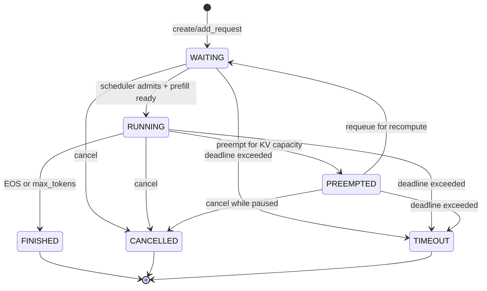

# Day 6 请求生命周期与状态机设计

> 本文对应 `plan.md` 阶段二 Day 6，目标是为 NanoServe 建立统一、可验证的请求状态机。本文是开发设计文档，描述目标行为、接口约定、实现步骤和验收标准；其中“当前实现”指编写文档时仓库中的实际代码，不代表 Day6 已经完成。

- 适用范围：调度器内部的单请求生命周期、状态迁移、取消/完成保护和 KV Cache 清理
- 不在本日范围：每轮 token budget（Day7）、Chunked Prefill（Day8）、混合 Prefill/Decode（Day9）、超时与抢占完整策略（Day10）、HTTP/SSE（Day11–13）
- 相关代码：`nanovllm/engine/sequence.py`、`nanovllm/engine/scheduler.py`、`nanovllm/engine/llm_engine.py`、`nanovllm/engine/block_manager.py`

## 1. 需求背景：为什么现在要做状态机

NanoServe 的一次推理请求并不是“进来、立刻返回”这么简单。它可能先在等待队列中排队，获得 GPU 资源后运行；显存紧张时可能暂时让出 KV Cache，之后再恢复；客户端取消、达到最大输出长度或遇到 EOS 时，需要停止生成并释放资源。后续服务化后，HTTP 层还要把这些状态映射成流式输出、取消响应和指标。

因此，状态机是调度器和服务层之间的共同语言：

- **对调度器**：明确哪些请求可以被选中，哪些请求必须跳过。
- **对 KV Cache**：明确什么时候申请、保留、释放或重新申请物理块。
- **对 API 层**：明确请求是正常完成、被取消、超时还是异常失败。
- **对测试和排障**：非法迁移会立即报错，而不是悄悄把队列和资源弄乱。

当前 `SequenceStatus` 只有 `WAITING`、`RUNNING`、`FINISHED` 三种状态，`Scheduler` 在多个位置直接赋值。已有实现包含“抢占后回到 waiting”和“完成后释放 block”的雏形，但没有独立的 `PREEMPTED`、`CANCELLED`、`TIMEOUT` 状态，也没有统一的迁移校验。Day6 的重点不是增加业务功能，而是把这些隐含规则显式化，为 Day7–10 和后续 HTTP 服务打地基。

## 2. Day6 目标与非目标

### 2.1 必须达到的目标

1. 为请求对象补齐稳定的身份、输入、生成进度、时间信息和取消标记。
2. 定义六种业务状态：`WAITING`、`RUNNING`、`PREEMPTED`、`FINISHED`、`CANCELLED`、`TIMEOUT`。
3. 规定每种状态的合法迁移、队列位置和资源动作。
4. 所有迁移经过统一入口，非法迁移抛出显式异常（建议自定义 `InvalidStateTransition`）。
5. 完成、取消、超时、抢占等终态或中间态操作具备幂等保护，不重复释放 KV block。
6. 在不加载 GPU 模型的情况下，通过单元测试覆盖正常路径和异常路径。

### 2.2 明确不做的事情

- 不在本日实现新的 token budget 或改变 FCFS 批组织策略。
- 不在本日实现 swap-to-CPU；抢占仍可采用释放 block、恢复时重新 prefill 的 recompute 方案。
- 不承诺 HTTP 请求取消、客户端断开检测；只提供调度层可调用的取消入口。
- 不改变模型输出算法和采样参数语义。

## 3. 目标状态模型

### 3.1 状态含义

| 状态 | 通俗解释 | 是否终态 | KV Cache 约定 |
| --- | --- | --- | --- |
| `WAITING` | 已接收但尚未完成首轮 prefill，或等待恢复 | 否 | 可以没有 block；若是 chunked prefill 的中间进度，可暂时保留 block |
| `RUNNING` | 当前由调度器管理，可能参加下一轮执行 | 否 | 已分配并由该请求持有的 block 有效 |
| `PREEMPTED` | 因资源不足主动暂停，等待以后恢复 | 否 | 进入该状态时释放可回收 block；恢复前不可直接 decode |
| `FINISHED` | 正常生成结束（EOS 或达到 `max_tokens`） | 是 | 必须释放请求持有的 block；prefix hash 是否保留由 BlockManager 决定 |
| `CANCELLED` | 用户或客户端主动取消 | 是 | 必须释放请求持有的 block |
| `TIMEOUT` | 超过 deadline，系统主动终止 | 是 | 必须释放请求持有的 block |

`PREEMPTED` 与 `WAITING` 的区别是“原因和恢复意图”不同：`PREEMPTED` 用于记录资源抢占事件，恢复时再显式迁移到 `WAITING`；普通新请求直接进入 `WAITING`。这样日志和指标可以区分排队等待与资源不足造成的等待。

### 3.2 状态迁移图



任何终态（`FINISHED`、`CANCELLED`、`TIMEOUT`）都不能再迁移。重复调用完成或取消不应再次操作队列和 block；建议返回 `False` 表示“请求已经结束”，而不是重复执行清理。对明显的非法迁移（例如 `FINISHED -> RUNNING`、`WAITING -> FINISHED`）应抛出 `InvalidStateTransition`，避免调用方掩盖 bug。

## 4. 设计方案与模块调整

### 4.1 `Sequence`：从数据容器升级为请求状态对象

建议继续复用 `Sequence`，避免新增一套与模型执行不兼容的 Request 类。它已经承载 token、采样参数、block table 和 prefill 进度，只需补充生命周期字段和行为方法。

建议字段：

```python
request_id: str                 # 对外可串联日志；保留 seq_id 兼容内部排序
status: SequenceStatus
created_at: float
started_at: float | None
finished_at: float | None
deadline: float | None
cancel_requested: bool
cancel_reason: str | None
finish_reason: str | None        # stop/length/cancelled/timeout/preempted 等
```

建议方法（名称可按现有代码风格调整）：

```python
transition_to(new_status, *, reason=None, now=None) -> None
request_cancel(reason="client_cancelled") -> bool
mark_finished(reason="stop") -> bool
mark_timeout(reason="deadline_exceeded") -> bool
```

状态迁移表应集中定义在 `Sequence` 或独立的 `request_state.py` 中，而不是散落在 `Scheduler` 的条件分支里。`is_finished` 应覆盖三个终态；另增 `is_terminal`、`is_active` 等只读属性，减少调用方重复判断。

兼容性注意：现有 `Sequence.__getstate__`/`__setstate__` 用于张量并行进程间传输。新增的时间戳、取消标记等控制面字段必须决定是否同步：至少要同步 `status`、`cancel_requested` 和生成进度；时间戳可只在 rank 0 保留，但不能让子进程因缺少字段而反序列化失败。建议采用带字段名的版本化状态结构，或在 `__setstate__` 中兼容旧 tuple。

### 4.2 `Scheduler`：统一迁移与队列一致性

`Scheduler` 继续拥有 `waiting`、`running` 两个工作队列，但新增以下内部职责：

- `_enqueue_waiting(seq)`：只接纳 `WAITING` 请求，避免重复入队。
- `_enqueue_running(seq)`：只接纳 `RUNNING` 请求，避免同一对象重复出现。
- `_remove_from_queues(seq)`：从任意队列移除，允许对象已不在队列时安全返回。
- `_release_sequence(seq)`：统一调用 `block_manager.deallocate(seq)`，并清空调度中的临时计数；要求幂等。
- `cancel(seq_id, reason=...)` / `timeout(seq_id, now=...)`：查找请求、设置终态、移除队列并释放资源。
- `resume(seq)`：只允许 `PREEMPTED -> WAITING`，恢复采用重新 prefill。

现有 `schedule()` 的直接赋值应改成状态方法调用：新请求仍由 `WAITING` 开始；prefill 完成时调用 `transition_to(RUNNING)`；抢占时调用 `RUNNING -> PREEMPTED`，释放 block 后再由 `resume()` 转为 `WAITING`；`postprocess()` 根据 EOS/长度调用 `mark_finished()`。

建议额外维护 `requests: dict[str, Sequence]`（或按 `seq_id` 索引），使取消和超时不必遍历两个队列；请求终态后保留短期记录或从字典删除的策略需在后续服务层确定。Day6 至少要保证同一 `seq_id` 不会创建两个活动对象。

### 4.3 `LLMEngine`：保留同步接口，暴露控制入口

`add_request()` 应返回 `request_id` 或 `Sequence`，而不是当前无返回值，便于未来 HTTP 层取消请求和关联结果。建议增加：

```python
cancel_request(request_id) -> bool
get_request(request_id) -> Sequence | None
```

`generate()` 的现有行为保持不变：它仍通过 `step()` 驱动请求直到全部终态，再按 `seq_id` 排序返回。Day6 不要求改变返回格式，但应避免把 `CANCELLED`/`TIMEOUT` 请求误当成正常 completion；后续 API 层可据 `finish_reason` 决定响应。

## 5. 资源与不变量

状态机正确的关键不是枚举值，而是“状态、队列、KV Cache 三者永远一致”。实现时必须满足：

1. **队列唯一性**：一个请求最多出现在一个队列中；终态请求不在 `waiting` 或 `running`。
2. **运行一致性**：`RUNNING` 请求必须在 `running` 中，且其 `block_table` 表示当前有效资源。
3. **等待一致性**：普通 `WAITING` 请求可以没有 block；若保留 chunked prefill block，必须在后续 Day8 继续沿用并明确释放时机。
4. **抢占一致性**：进入 `PREEMPTED` 后不可参加 decode；释放 block 后才允许 `resume()`。
5. **终态清理**：`FINISHED`、`CANCELLED`、`TIMEOUT` 都必须最终释放 block；重复清理不能使空闲块计数增加两次。
6. **进度不丢失**：抢占只释放物理 block，不回滚 `token_ids`、`num_prompt_tokens` 或已生成 token；恢复通过重新 prefill 重建 KV。
7. **状态与异常原子性**：若迁移前置条件不满足，应在改变队列或资源前报错；不能出现“已从队列删除但状态仍为 RUNNING”的半完成操作。
8. **时间语义统一**：使用单调时钟（`perf_counter` 或 `monotonic`），不要用可回拨的 wall clock 判断 deadline。

## 6. 实现步骤

1. 在 `sequence.py` 扩展枚举、字段、迁移规则和终态属性；为默认时间字段使用 `None`，避免共享可变默认值。
2. 增加 `InvalidStateTransition`（可放在 `sequence.py` 或 `engine/exceptions.py`），错误信息包含请求 ID、原状态、目标状态和原因。
3. 在 Scheduler 中封装队列操作与幂等资源释放，逐步替换直接 `status = ...` 的代码。
4. 让 `preempt()` 产生 `PREEMPTED`，再由明确的恢复路径进入 `WAITING`；保留当前“释放后 recompute”的实现取舍。
5. 为 `postprocess()` 增加取消/超时优先检查：若模型返回期间请求已被标记终止，不应追加 token，应清理并从 running 移除。
6. 让 `add_request()` 返回可追踪 ID，并补充 Engine 的取消代理方法。
7. 更新已有 KV Cache 生命周期测试中的状态断言：抢占断言改为 `PREEMPTED`（若恢复已在同一调用内完成，则同时断言恢复后的 `WAITING`）。
8. 完成纯 CPU 单元测试后，再运行原有全量测试，确保不破坏 Day2–5 行为。

## 7. 风险点与注意事项

### 7.1 与现有测试/调用的兼容

现有测试直接断言抢占后状态为 `WAITING`。引入 `PREEMPTED` 后要先明确 `preempt()` 的观察点：建议 `preempt()` 只完成抢占，`resume()` 负责重新入队；若调度器为了兼容现有流程立即 resume，则测试应断言迁移历史或增加 `last_preempted_at`，不能让状态语义再次模糊。

### 7.2 重复释放与 prefix cache

`BlockManager.deallocate()` 会影响空闲块、引用计数和 prefix hash 相关记账。完成、取消、超时可能从多个入口触发，必须通过统一幂等清理避免 double free。已完成块的 prefix hash 是否保留不能因取消路径被误删；应遵循现有 BlockManager 的缓存策略。

### 7.3 竞态与执行边界

当前引擎是同步 `step()`，但未来 HTTP/SSE 会有异步取消。Day6 的控制方法应假设可能在一次模型执行前后被调用：在 `schedule()`、`model_runner.call()` 返回后和 `postprocess()` 开头都检查终态/取消标记。不要在 GPU kernel 执行中途强行修改 `Sequence` 的 token 或 block table。

### 7.4 超时语义

Day6 只定义状态和字段，不需要完整的超时线程。deadline 判断应在调度边界执行；超时请求即使尚未运行也要从 waiting 清除，运行中请求则在安全边界停止并释放资源。必须区分“超时被系统终止”和“客户端主动取消”，便于指标统计。

### 7.5 张量并行序列化

新增字段若破坏 `Sequence` 的 pickle 协议，会导致 TP>1 只在多卡环境失败。修改 `__getstate__` 后至少运行序列化单测，并验证旧状态 tuple 能被安全恢复；控制面状态以 rank 0 为权威，避免各进程独自迁移。

### 7.6 异常路径

任何 `finally` 清理都要先确认对象是否已完成释放，不要用“无条件增加 free block”代替 BlockManager 的真实所有权判断。非法迁移是编程错误，应保留上下文并尽早失败；用户输入错误则应由上层转换为可理解的 4xx（属于 Day11）。

## 8. 测试设计

### 8.1 状态机单元测试（不依赖 GPU）

建议新增 `tests/test_request_lifecycle.py`，至少覆盖：

- 初始状态为 `WAITING`，字段和时间戳初始化正确。
- `WAITING -> RUNNING` 合法，`started_at` 只设置一次。
- `RUNNING -> FINISHED`、`RUNNING -> CANCELLED`、`RUNNING -> TIMEOUT` 合法，并记录 `finish_reason`。
- `RUNNING -> PREEMPTED -> WAITING` 合法，生成 token 和进度保持不变。
- `WAITING/PREEMPTED -> CANCELLED/TIMEOUT` 合法。
- 终态重复完成、重复取消、重复超时是幂等的，不重复释放资源。
- `FINISHED -> RUNNING`、`CANCELLED -> WAITING`、`TIMEOUT -> PREEMPTED` 等非法迁移抛出 `InvalidStateTransition`。
- 取消标记可被读取，原因不会被后续重复取消覆盖。

### 8.2 Scheduler 集成测试

使用现有 `SimpleNamespace` 配置和小 block size，避免加载模型：

- 空队列不会调度；单请求 prefill 后进入 `RUNNING`。
- 正常 EOS 和 `max_tokens` 完成后从 running 移除、block 全部释放。
- waiting 中取消请求不会进入模型执行。
- running 中取消请求在 postprocess 前后都能清理，且不追加取消之后的 token。
- block 不足时只抢占合法的 running 请求；被抢占请求不再参与当前 decode。
- 恢复后 token 序列、`num_completion_tokens` 和最终输出不丢失。
- 多次调用 cancel/timeout/preempt 不造成队列重复或 free block 数量异常。
- 所有活动请求结束后 `scheduler.is_finished()` 为真，且没有残留队列成员。

### 8.3 回归与命令

```bash
python -m pytest tests/test_request_lifecycle.py -q
python -m pytest tests/test_kv_cache_lifecycle.py tests/test_block_manager.py tests/test_sampler.py -q
python -m pytest -q
```

无 GPU 或模型权重时，只报告 CPU 状态机、KV Cache 账本和采样测试结果；不能把未执行的真实模型路径写成通过。若有 GPU，再补充最小 `LLMEngine` 运行验证，确认 `generate()` 的既有输出格式不变。

## 9. 最终验收清单

> 2026-09-10 Day6 收尾：第三轮独立复核确认技术验收通过，正式回归 **99 passed**，真实 GPU 11 组检查通过。按本次收尾与提交要求同步清单为 **16/16 项通过**，验收标准原文不变；提交说明随本次 `feat(engine): complete Day6 request lifecycle state machine` 提交一并交付。协议兼容项按 CPU 验证范围通过，TP>1、CUDA Graph、真实并发仍未实测。详细证据与三轮历史见 [验收记录](./day6-validation.md) 和 [审查报告](./day6-review.md)。

### 功能验收

- [x] `SequenceStatus` 包含六种计划要求的状态。
- [x] 状态迁移图、合法迁移表和代码规则一致。
- [x] 非法迁移有显式异常，错误信息可定位请求。
- [x] 取消、超时、抢占、恢复和正常完成均有统一入口。
- [x] 终态请求不再被调度，且 KV block 已释放。
- [x] 抢占恢复不丢失 prompt 进度和已生成 token。
- [x] 重复完成/取消/清理不会 double free 或重复入队。

核对依据：六态与集中迁移规则、取消/超时安全边界、终态兜底、抢占恢复和幂等资源清理均通过验证。旧对象重复收尾按活动记录所有权处理，不影响复用 ID 的新请求。重复 preempt/resume 显式拒绝非法迁移且无资源副作用；同步 generate 对健康暂停的无进展状态显式报错，不再忙循环。

### 代码与兼容性验收

- [x] Scheduler 不再散落直接修改状态的代码，或每处都有明确理由。
- [x] `LLMEngine.add_request()` 能返回可追踪 request ID。
- [x] `Sequence` 的序列化/反序列化兼容张量并行路径。
- [x] Day2–5 既有测试全部通过。
- [x] 文档中的状态语义与测试断言、日志字段一致。

核对依据：生命周期测试 79 passed，既有测试 20 passed。活动 ID 查重及旧批次重复后处理组合保持唯一性；版本校验、v1 prefill/decode 读取与 v2 pickle 往返通过。TP>1 真机未实测，兼容性不扩展为任意混版本双向部署。

### 交付物验收

- [x] `docs/request-lifecycle.md` 已加入 `docs/README.md` 索引。
- [x] 新增状态机测试文件及可重复执行命令。
- [x] 测试记录注明 GPU/模型是否可用和未覆盖的边界。
- [x] 提交说明包含状态迁移、资源清理和兼容性变更。

核对依据：文档索引、正式测试、CPU/GPU 实测与未覆盖边界齐备。用户已授权在当前 feature 分支提交；本次提交说明覆盖状态迁移、资源与身份所有权、协议兼容、99 项正式测试及 GPU 范围。


## 10. 后续 Day7–10 的衔接

Day6 完成后，后续工作应建立在本状态机之上，而不是再次发明状态：Day7 在 `WAITING/RUNNING` 之间加入预算约束；Day8 在 `WAITING` 中保存 prefill chunk 进度；Day9 让同一轮同时容纳 prefill 与 decode；Day10 使用 `PREEMPTED`、`CANCELLED`、`TIMEOUT` 完成真正的资源管理。这样每次扩展只增加调度策略，不改变请求状态的基本语义。
