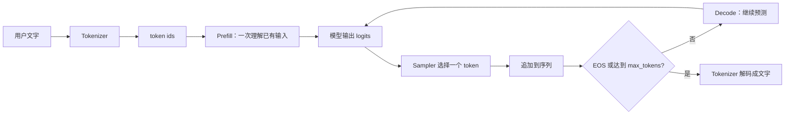

# Sampler：从“模型打分”到“选出下一个词”

这篇文档面向第一次接触大模型推理的读者。重点回答一个问题：**模型已经算出结果了吗，为什么还需要 Sampler？**

一句话答案是：模型每次只负责给“词表里的所有候选 token”打分，Sampler 再根据这些分数选出一个真正要输出的 token。这个 token 被接回输入，模型继续预测下一个 token，如此循环，才形成完整回答。

---

## 1. 先理解几个最基本的词

### 1.1 什么是 token？

大模型通常不直接以“字”或“词”为单位工作，而是以 **token** 为单位。token 可以是一个汉字、一个英文单词、单词的一部分、标点符号，甚至是空格。

例如，下面这句话经过 tokenizer（分词器）后，可能被拆成类似这样的 token：

```text
原句：我喜欢机器学习。

token： ["我", "喜欢", "机器", "学习", "。"]
```

英文单词较长时也可能被拆开：

```text
"unbelievable" -> ["un", "believ", "able"]
```

实际切分方式由具体模型的 tokenizer 决定，因此 token 不一定等于我们平时理解的“一个词”。模型接收和输出的其实是 token id，例如：

```text
[2187, 10342, 791, 13]
```

数字只是词表中的编号。tokenizer 负责在“文字”和“token id”之间转换；模型和 Sampler 处理的是 token id。

### 1.2 什么是词表（vocabulary）？

词表就是模型认识的所有 token 的清单。假设词表里有 50,000 个 token，那么模型每生成一步，就要在这 50,000 个候选项中选择一个。

词表中的 token 可能包括：

- 常见汉字或汉字片段
- 英文单词或单词片段
- 数字和标点
- 空格、换行
- EOS（End Of Sequence，表示回答结束的特殊 token）

### 1.3 什么是 logits？

模型前向计算后，通常不会直接说“下一个 token 是‘猫’”。它会先为词表里的每个 token 产生一个分数，这些尚未转换成概率的分数叫 **logits**。

可以把 logits 想成评委给候选答案打的原始分数：

| token | 原始分数（logit） |
|---|---:|
| “猫” | 4.2 |
| “狗” | 3.1 |
| “车” | 0.7 |
| “飞机” | -1.5 |

分数越高，表示模型越倾向于选择它。但 logits 不是百分比，可能是负数，也不要求总和等于 1，所以不能直接把它当作概率。

在本项目中，`ModelRunner.run_model()` 返回模型输出，随后 `ModelRunner.run()` 把它交给 `Sampler`（见 `nanovllm/engine/model_runner.py:214-220`）。

### 1.4 什么是概率？softmax 做了什么？

为了方便抽样，需要把原始分数转换成总和为 1 的概率。这个转换由 **softmax** 完成。

例如，logits：

```text
[4.2, 3.1, 0.7, -1.5]
```

经过 softmax 后可能变成：

```text
[0.70, 0.23, 0.06, 0.01]
```

这表示：

- 第一个 token 被选中的机会约为 70%
- 第二个 token 约为 23%
- 第三个 token 约为 6%
- 第四个 token 约为 1%

softmax 不负责最终选择，它只是把“分数”变成“概率”。最终选谁，是 Sampler 的工作。

### 1.5 什么是自回归生成？

大模型通常一次只生成一个新 token，然后把这个新 token 接到已有内容后面，再预测下一个 token。这种“生成一个、接回去、再生成一个”的过程叫 **自回归（autoregressive）生成**。

例如：

```text
输入：北京是中国的
第 1 轮选出：“首都”
输入变成：北京是中国的首都
第 2 轮选出：“。”
输入变成：北京是中国的首都。
```

所以 Sampler 在每一轮都会被调用一次（或对一个 batch 中的每个请求各调用一次）。它不是只在回答最后调用一次。

---

## 2. Sampler 在完整推理链路中的位置

可以把一次请求想象成一条生产线：



在本项目中，各组件的分工是：

| 组件 | 通俗解释 | 主要代码 |
|---|---|---|
| Tokenizer | 文字和 token id 之间的翻译器 | `LLMEngine.add_request()` |
| Scheduler | 决定这一轮处理哪些请求 | `nanovllm/engine/scheduler.py` |
| ModelRunner | 准备张量并执行模型前向 | `nanovllm/engine/model_runner.py` |
| Model | 根据上下文给所有候选 token 打分 | `Qwen3ForCausalLM` |
| Sampler | 根据分数选出下一个 token | `nanovllm/layers/sampler.py` |
| Sequence | 保存当前请求已有的 token 和参数 | `nanovllm/engine/sequence.py` |
| BlockManager/KV Cache | 保存注意力所需的历史中间结果 | `nanovllm/engine/block_manager.py` |

Sampler 的职责非常集中：**不负责理解上下文，不负责保存 KV，不负责决定请求何时结束，只负责从 logits 中选 token。**

---

## 3. 本项目中采样参数的含义

请求通过 `SamplingParams`（`nanovllm/sampling_params.py`）告诉 Sampler 应该怎样选择：

| 参数 | 初学者理解 | 本项目行为 |
|---|---|---|
| `temperature` | 要不要“更大胆”地尝试低分候选 | `0` 为 greedy；大于 0 时参与概率采样 |
| `top_p` | 只在最有希望的一小组候选中抽签 | 范围为 `(0, 1]`；`1` 表示不裁剪 |
| `max_tokens` | 最多再写多少个 token | 由 Scheduler 检查生成上限 |
| `ignore_eos` | 遇到结束标记时是否继续 | 由请求生命周期逻辑处理 |
| `seed` | 随机抽签时使用哪套固定随机序列 | 为请求创建独立的 PyTorch generator |

### 3.1 temperature：控制随机程度

`temperature` 可以理解为“分数差距的放大器/缩小器”。代码中使用：

```python
scaled = logits / temperature
```

- **温度较低**：高分 token 和低分 token 的差距被放大，模型更坚定，结果更稳定。
- **温度较高**：分数差距被缩小，低分 token 也有更多机会，结果更有变化。
- **`temperature=0`**：本项目不真的做除零，而是走单独的 greedy 分支。

举个简单例子，假设两个 token 的 logits 是 `[4, 2]`：

- 温度较低时，4 看起来远胜于 2，几乎总选第一个。
- 温度较高时，4 和 2 的差距没那么明显，第二个也可能被选中。

temperature 不会改变模型本身的知识，只改变“从模型建议中选择答案”的方式。

### 3.2 greedy：永远选最高分

**Greedy（贪心）** 的意思是每一轮都选当前分数最高的 token：

```python
next_token = logits.argmax()
```

优点：

- 没有随机性
- 结果容易复现
- 适合正确性测试和性能对比

缺点：

- 容易形成固定、机械的回答
- 不一定得到整体最好的句子，因为它只看当前一步

本项目使用 `temperature=0` 表示 greedy，并通过 `SamplingParams.is_greedy` 表达这一含义。

### 3.3 top-p：只在“有希望的候选”里抽签

**Top-p（也叫 nucleus sampling，核采样）** 是为了避免从整个巨大词表中随机抽到明显不合理的 token。

假设 softmax 后的概率如下：

| 排名 | token | 概率 | 累计概率 |
|---:|---|---:|---:|
| 1 | A | 0.50 | 0.50 |
| 2 | B | 0.25 | 0.75 |
| 3 | C | 0.15 | 0.90 |
| 4 | D | 0.07 | 0.97 |
| 5 | E | 0.03 | 1.00 |

如果 `top_p=0.8`，就从累计概率达到 0.8 的最小集合 `[A, B, C]` 中抽样，而不是让 D、E 参与。之后会把 A、B、C 的概率重新归一化，使它们的概率总和重新变成 1。

代码中的关键步骤是：

```python
sorted_logits, sorted_indices = torch.sort(scaled, descending=True)
probs = torch.softmax(sorted_logits, dim=-1)
cumulative = torch.cumsum(probs, dim=-1)
remove = cumulative - probs >= top_p
```

这里减去当前概率，是为了让“刚好把累计概率推过阈值的那个 token”也保留下来。代码还强制保留排名第一的 token，防止极端参数造成候选集合为空。

- `top_p=1.0`：不做 nucleus 裁剪。
- 较小的 `top_p`：候选更少，结果更保守。
- 较大的 `top_p`：候选更多，结果更多样。

### 3.4 随机抽样：概率高不等于必选

经过 temperature 和 top-p 后，Sampler 使用 `torch.multinomial` 按概率抽取一个 token。

例如：

```text
A: 0.7
B: 0.2
C: 0.1
```

这不是说 A 必定出现，而是说大量重复实验时，A 大约占 70%。一次具体运行可能抽到 B 或 C。

这也是为什么随机采样结果可能变化，而 greedy 结果固定。

### 3.5 max_tokens：限制循环次数

`max_tokens` 表示“最多生成多少个新 token”，不是 prompt 的长度，也不是最终字符数。

例如：

```python
SamplingParams(max_tokens=8)
```

表示最多追加 8 个 token。实际生成可能更短，因为模型可能提前生成 EOS。判断顺序由 Scheduler 完成：Sampler 选完 token 后，`Scheduler.postprocess()` 将其追加到 Sequence，再检查 EOS 和最大生成数。

---

## 4. 采样代码的执行步骤

当前实现位于 `nanovllm/layers/sampler.py`。假设输入 logits 的形状是 `[B, V]`：

- `B`：batch 中有多少个请求
- `V`：词表大小
- 第 `i` 行：第 `i` 个请求对全部词表 token 的分数

### 第一步：转换成 float

```python
logits = logits.float()
```

模型可能使用 bfloat16 或 float16 来节省显存、提高速度。采样前转成 float，可以让 softmax 和概率计算更稳定。

### 第二步：准备 top-p

如果调用方没有提供 top-p，就使用全为 1 的默认值：

```python
top_ps = torch.ones(logits.size(0), device=logits.device)
```

这意味着默认不裁剪候选集合。

### 第三步：逐请求处理

```python
for row, temperature, top_p in zip(logits, temperatures, top_ps):
```

虽然模型通常一次处理一批请求，但每个请求可以有自己的采样参数，所以 Sampler 需要逐行处理。

### 第四步：greedy 分支

```python
if float(temperature) <= 1e-10:
    result.append(row.argmax())
    continue
```

温度接近 0 时直接选最高分 token，完全跳过 softmax 和随机抽样。

### 第五步：温度缩放和排序

```python
scaled = row / temperature
sorted_logits, sorted_indices = torch.sort(scaled, descending=True)
```

排序后，`sorted_logits` 是从高到低的分数，`sorted_indices` 保存这些分数原来对应的 token id。这样后面即使在排序后的列表中抽样，也能找回真正的词表编号。

### 第六步：softmax 和累计概率

```python
probs = torch.softmax(sorted_logits, dim=-1)
cumulative = torch.cumsum(probs, dim=-1)
```

`cumsum` 就是累计相加：例如 `[0.5, 0.25, 0.15]` 会变成 `[0.5, 0.75, 0.9]`。

### 第七步：top-p 过滤和重新归一化

```python
remove = cumulative - probs >= float(top_p)
remove[0] = False
probs = probs.masked_fill(remove, 0)
probs = probs / probs.sum()
```

满足条件的低排名候选概率被置为 0；第一名始终保留；剩余概率重新归一化。

### 第八步：按概率抽一个 token

```python
choice = torch.multinomial(probs, 1, generator=generator)
result.append(sorted_indices[choice].squeeze(0))
```

`choice` 是排序后候选列表中的位置，`sorted_indices[choice]` 才是原始词表中的 token id。

### 第九步：返回 batch 结果

```python
return torch.stack(result)
```

最终返回形状为 `[B]` 的 token id，每个请求一个。

---

## 5. seed 和“可复现”到底是什么意思

随机采样需要随机数。计算机里的随机数通常是“伪随机数”：只要起点（seed，种子）相同，后续产生的数字序列就相同。

可以把 seed 想成抽签机的初始状态：

- 同一台抽签机
- 放入相同的候选和概率
- 从相同的初始状态开始
- 按相同顺序抽签

就能得到相同结果。

本项目在 `ModelRunner.prepare_sample()` 中：

1. 查看每个 Sequence 是否设置了 seed。
2. 第一次遇到该请求时创建 `torch.Generator(device="cuda")`。
3. 用请求的 seed 初始化它。
4. 按 `seq_id` 缓存 generator。
5. 后续 Decode 轮继续使用同一个 generator。

“缓存”很重要。如果每一轮都重新用同一个 seed 初始化，模型可能每一轮都抽到相同的随机模式；复用 generator 则意味着每一轮会继续消耗随机数序列。

可复现不是无条件保证的。通常还需要保持以下条件一致：

- 模型权重和 tokenizer 一致
- temperature、top-p、prompt 一致
- PyTorch、CUDA、硬件和精度一致
- 请求调度顺序一致
- 代码版本一致

Greedy 更容易复现，因为它根本不使用随机数。

---

## 6. Sampler 与 Prefill、Decode、Scheduler 的关系

一次请求大致经过两个模型阶段：

### Prefill

Prefill 是“第一次把已有 prompt 读进去”。例如 prompt 有 128 个 token，模型会一次处理这批已有内容，并为它们建立 KV Cache。此阶段通常产生最后位置的 logits，Sampler 可以据此选出第一个新 token。

### Decode

Decode 是“已经生成一部分后，每次再生成一个 token”。每轮 Decode：

1. Scheduler 选出仍未完成的请求。
2. ModelRunner 读取每个请求的最后 token 和历史 KV Cache。
3. 模型输出下一个 token 的 logits。
4. Sampler 选一个 token。
5. Scheduler 把 token 追加到 Sequence。
6. 检查 EOS 或 `max_tokens`。
7. 未完成请求进入下一轮。

因此，Sampler 每轮产生一个“内容决定”，但不直接控制循环：

- Sampler：选什么 token
- Scheduler：下一轮处理谁、是否继续
- KV Cache：历史注意力信息放在哪里
- Sequence：当前请求已经有哪些 token

---

## 7. 本项目实验和测试如何理解

### 7.1 Day 4 实验

运行：

```bash
python experiments/day4_prefill_decode.py
```

脚本先固定 5 个 prompt 和 seed `2026`，再用一组固定 logits 模拟模型输出。这样做的好处是：即使没有 GPU 或模型权重，也可以先验证采样规则本身。

脚本主要做三件事：

1. **greedy 重复运行两次**：因为不随机，两次 token ids 应完全一样，结果写入 `greedy_reproducible`。
2. **运行一次 temperature + top-p**：让候选经过概率裁剪和随机抽样，观察随机路径确实被执行。
3. **记录 max_tokens 和环境信息**：确认请求参数和运行环境都能留下证据。

如果传入 `--model /path/to/model`，还会调用真实 `LLM.generate()` 对 5 个 prompt 做 greedy 推理。CPU 版固定 logits 实验验证“采样器零件”，模型版验证“完整推理链路”。

### 7.2 单元测试

运行：

```bash
python -m pytest tests/test_sampler.py -q
```

测试用很小的 logits，不加载大模型：

- 给第二个 token 最高分，验证 greedy 选第二个。
- 建立两个相同 seed 的 generator，验证随机结果一致。
- 设置小 top-p，验证结果不会跑到 nucleus 之外。
- 验证 `temperature=0` 合法。
- 验证 `top_p=0`、`max_tokens=0` 等非法参数会报错。

可以把它们理解成汽车出厂前的零件检查：它们不证明模型回答内容一定正确，但能证明“选择下一个 token 的规则”符合设计。

---

## 8. 常见误解

### 误解一：概率最高的 token 一定会出现

只有 greedy 才是“最高分必选”。随机采样中，高概率只是更容易出现，不是保证出现。

### 误解二：temperature 越高，模型越聪明

temperature 只改变选择的随机程度，不会增加模型知识。太高可能产生不连贯内容，太低则可能过于死板。

### 误解三：top-p=0.8 表示只取前 80% 的 token 数量

不是。top-p 看的是**累计概率**，不是候选数量。概率集中时可能只保留几个 token，概率分散时可能保留很多 token。

### 误解四：max_tokens=100 表示输出 100 个汉字

不是。它表示最多生成 100 个 token，token 和汉字/字符不是一一对应关系。

### 误解五：Sampler 生成了完整句子

Sampler 每次只选一个 token。完整句子是经过很多轮“模型打分 + Sampler 选择 + 追加 token”逐步形成的。

---

## 9. 小结

可以用下面这句话记住整个过程：

> 模型负责提出所有可能的下一个 token 及其分数，Sampler 负责按照指定规则选一个，Scheduler 负责把它接回去并决定是否继续。

本项目目前支持三种核心选择方式：

- `temperature=0`：greedy，最高分必选
- `temperature>0, top_p=1`：在完整词表概率上随机抽样
- `temperature>0, top_p<1`：先缩小到高概率候选集合，再随机抽样

完整代码入口是 [`nanovllm/layers/sampler.py`](../nanovllm/layers/sampler.py)，参数定义在 [`nanovllm/sampling_params.py`](../nanovllm/sampling_params.py)，调用位置在 [`nanovllm/engine/model_runner.py`](../nanovllm/engine/model_runner.py)。
