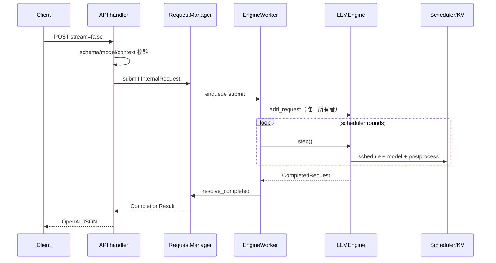
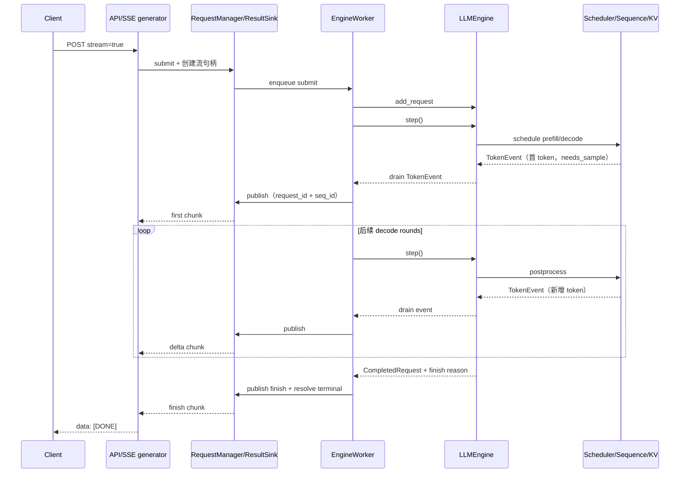
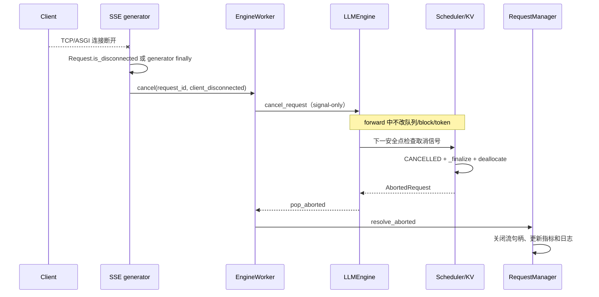

# Day 13–14 SSE 流式输出与可观测性设计

> 本文合并 `plan.md` 阶段三 Day13 与 Day14，目标是在 Day11–12 OpenAI 兼容 HTTP API 的基础上，增加可验证的 SSE 流式响应、客户端断连清理、Prometheus 指标和结构化请求日志。
>
> 本文是实施前的设计基线，描述需求、接口契约、模块调整、并发不变量、测试方案和验收标准；**不代表 Day13–14 已经完成**。实际实现状态、测试数字和 GPU/模型结果必须记录在后续 `day13-14-validation.md` 中。
>
> - 当前基线：`dev@1de08bc`（`merge: integrate Day11-12 OpenAI APIs`），工作区创建的功能分支为 `feature/sse-observability-day13-14`。
> - 设计范围：两个 OpenAI 风格接口的 `stream=true`、SSE 事件、客户端断连取消、请求级时间线、Prometheus `/metrics`、结构化日志和相应测试。
> - 继续复用：[Day 6 请求生命周期](./request-lifecycle.md)、[Day 9 混合 Prefill/Decode](./mixed-prefill-decode.md)、[Day 10 取消/超时/抢占](./request-cancellation-preemption.md)、[Day 11–12 OpenAI API](./openai-api-day11-12.md)。
> - 两天合并交付，但实现和验收仍分为 Day13（数据面流式协议）与 Day14（控制面观测能力）两条线；Day14 不得通过修改状态机来“修复”指标口径。

## 1. 需求背景与设计原则

### 1.1 当前基线解决了什么、还缺什么

Day11–12 已经建立了以下服务边界：

```text
HTTP JSON
   ↓
FastAPI schema 与错误映射
   ↓
InternalRequest
   ↓
RequestManager + EngineWorker
   ↓
LLMEngine.step()
   ↓
Scheduler / Sequence / BlockManager
   ↓
CompletedRequest 或 AbortedRequest
   ↓
OpenAI 风格非流式 JSON
```

`EngineWorker` 是唯一可以调用 `add_request()`、`step()` 和 `exit()` 的线程，底层 `Scheduler/Sequence/BlockManager` 是请求状态和 KV Cache 的唯一权威。当前 `CompletedRequest` 只在请求进入终态时产生，包含完整 completion token ID 列表；`step()` 的公开返回值也只报告正常完成的请求。因此现状可以可靠地生成非流式最终文本，却不能让 HTTP 层在生成中途看到每个 token。

当前 `stream=true` 明确返回 `501 stream_not_implemented`，没有：

- 首个 SSE chunk、增量文本、finish chunk 或 `[DONE]`；
- 中间 token 的服务层事件通道；
- ASGI 客户端断连到 Day10 `cancel_request()` 的连接；
- 请求接收、Engine admission、首 token、后续 token 和终态的统一时钟点；
- `/metrics`、请求级结构化生命周期日志和 prefix cache 命中统计。

Day13–14 的重点不是重写推理核心，而是补齐“增量结果”和“观测结果”两个只读出口，同时保持现有单 worker 和资源所有权不变。

### 1.2 不把 `generate()` 或 `step()` 放进 HTTP handler

不能让每个 HTTP 请求直接执行：

```python
engine.generate(...)
# 或
engine.step()
```

原因有三点：

1. 多个 handler 会并发进入同一个 Scheduler/ModelRunner，破坏连续批处理和 Engine 单所有者假设。
2. HTTP 线程无法安全地在 GPU forward 中途修改 `Sequence`、队列或 KV block。
3. SSE 生成器的生命周期长于单次函数调用，必须能够等待增量事件、观察断连并在 `finally` 中发出取消信号。

因此继续采用：

```text
HTTP / SSE 层
  只处理协议、连接、序列化、断连观察
        ↓
RequestManager / StreamingResultSink
  处理 request_id + seq_id、事件排队、Future/流终态
        ↓
EngineWorker
  唯一调用 Engine 的线程
        ↓
LLMEngine
  保持 step()/generate() 兼容，提供增量事件和快照适配
        ↓
Scheduler / Sequence / BlockManager
  状态机、取消安全点、KV 与 prefix cache 的唯一权威
```

### 1.3 设计原则

1. **接口兼容优先**：`stream=false` 的响应体、错误体、ID 前缀、usage、`step()` 和 `generate()` 行为不因新增流式路径而改变。
2. **状态单一权威**：服务层不复制或修改 `SequenceStatus`，不直接操作 Scheduler 队列、block table 或 BlockManager。
3. **Engine 单所有者**：所有 `add_request/step/exit` 仍只发生在 EngineWorker；断连线程只能调用已有的 signal-only `cancel_request()`。
4. **增量与终态分离**：新增 `TokenEvent`（或等价 DTO）通道；`CompletedRequest` 和 `AbortedRequest` 仍是一次性的终态记录。
5. **双重世代校验**：所有增量事件和终态记录同时校验 `request_id` 与 `seq_id`，防止旧请求迟到事件完成 ID 复用后的新请求。
6. **安全点取消**：取消、超时和断连在模型执行期间只置位信号；Scheduler 在安全边界决定终态、丢弃当前采样结果并释放 KV。
7. **单调时钟**：排队、TTFT、TPOT/ITL 和 latency 使用同一 `perf_counter()` 时间域；HTTP 响应的 Unix `created` 只用于协议展示，不能参与时延计算。
8. **低基数与隐私**：Prometheus label 不包含 request ID、seq ID、prompt、token 文本或原始 URL；日志不记录 prompt 明文、消息内容、token ID、block table 或堆栈全文。
9. **观测故障不影响推理**：指标更新和日志序列化必须是旁路操作；单条日志/指标异常不能阻止模型执行、终态清理或 KV 释放。
10. **有限等待、幂等收口**：事件队列、Future、线程 join 和关闭 drain 都有边界；完成、取消、断连和 shutdown race 不得造成重复发送、重复释放或悬挂请求。

## 2. 目标与非目标

### 2.1 Day13 必须达到的目标

1. `POST /v1/completions` 和 `POST /v1/chat/completions` 支持 `stream=true`，返回 `text/event-stream`。
2. 为 completion 和 chat 发送稳定的首 chunk、增量 delta、finish chunk 和 `[DONE]`，事件顺序可测试。
3. 增量文本只包含自上一事件以来新增的文本；聚合全部增量后与同一输入、同一采样配置的非流式最终文本一致。
4. 首 chunk 和 finish chunk 携带 OpenAI 兼容的 ID、object、model、choice/index 和 finish reason；chat 首 chunk 表达 assistant role。
5. 客户端断连时，SSE 生成器只通过 `worker.cancel(request_id, reason="client_disconnected")` 发出控制信号，最终由 Scheduler 安全点完成取消和 KV 清理。
6. 断连发生在首 token 前、token 之间、完成竞争和服务关闭期间时，均不会伪造成功完成，也不会让 pending Future 或流句柄永久悬挂。
7. 保留 `stream=false` 的现有行为，并保持 `CompletedRequest`、`AbortedRequest`、`LLMEngine.step()`、离线 `generate()` 和 request ID 世代保护兼容。

### 2.2 Day14 必须达到的目标

1. 增加可抓取的 `GET /metrics`，暴露计划要求的请求时延、token、并发、KV 和 prefix cache 指标或等价指标。
2. 为请求建立统一生命周期观测：接收/提交、Engine admission、首个真实生成 token、后续 token、完成或中止。
3. 记录 queue wait、TTFT、TPOT/ITL、端到端 latency，并明确成功、取消、超时和 Engine 异常的统计口径。
4. 以 JSON Lines 或 key-value 结构化日志串起至少一条请求的“接收—调度—首 token—完成/中止”全过程。
5. 提供 KV 物理使用率和 prefix cache 命中/未命中/容量失败的可解释快照与计数，不把 hash entry 数量误当命中率。
6. 指标和日志采集不跨 GPU forward 持有底层控制锁，不向 HTTP 层泄漏可写底层对象。

### 2.3 明确不做的事情

- 不支持 `n > 1`、prompt 数组、多模型、多候选、工具调用、函数调用或多模态 content。
- 不实现 SSE 重连、断点续传、跨进程共享事件总线、持久化流状态或客户端 token 回放。
- 不在 GPU kernel 执行中途强杀线程、修改 block table 或从网络线程直接释放 KV。
- 不改变 Day7–10 的预算、混合批、抢占和状态迁移策略；Day14 不新增调度策略。
- 不保证任意底层 Engine 永远可中断；worker 卡死和超过安全 shutdown join 上限仍按失败边界处理。
- 不引入 OpenTelemetry、远程日志平台、鉴权/租户维度、复杂告警规则或性能优化承诺。
- 不记录任意 prompt、消息正文、token 文本、token ID、完整异常堆栈或高基数 URL 参数。
- 没有增量 token 时间点时，不用完成时间差或 batch step 时长伪造 TPOT/ITL。

## 3. 端到端架构与时序

### 3.1 正常非流式路径（必须保持不变）



### 3.2 流式正常完成



### 3.3 客户端断连



### 3.4 超时、Engine 异常和优雅关闭

- **超时**：`deadline` 仍由 Day10 在调度边界检查；产生 `AbortedRequest(finish_reason="timeout"/"deadline_exceeded")`，流端不发送正常 finish chunk。
- **Engine 异常**：worker 将相关流句柄和非流式 Future 收口为 `EngineError`，保留 `request_id`；不在损坏的 Engine 上隐式重试。
- **优雅关闭**：先停止接收新请求，再由 worker 发送 `server_shutdown` cancel、有限 drain、`engine.exit()`，最后对未收口句柄返回 `ServiceDrainingError`。生命周期线程不能在 worker 仍执行 Engine 时跨线程调用 `engine.exit()`。

### 3.5 异步边界

FastAPI 的 `StreamingResponse` 可以使用 async generator，但阻塞等待 `queue.Queue.get()` 或 `Future.result()` 不得直接运行在事件循环中。推荐二选一并固定一种实现：

1. 使用 worker 线程向有界同步队列写入事件，async generator 通过 `asyncio.to_thread()` 等桥接在等待期间让出事件循环；或
2. 使用同步 generator，让 Starlette 将迭代放入线程池，同时通过 `Request.is_disconnected()` 和有界等待观察连接。

无论采用哪一种，Engine 的 `step()` 所有权都不能转移给 HTTP 线程；桥接层只搬运事件，不调用 Scheduler 或模型。

## 4. Day13 外部 SSE 契约

### 4.1 通用传输约定

每个事件按以下格式写出：

```text
data: {"id":"...","object":"...","created":1780000000,"model":"...","choices":[...]}

```

约定：

- Content-Type 为 `text/event-stream`，事件之间以两个换行结束。
- 建议响应头包含 `Cache-Control: no-cache`、`Connection: keep-alive`，并设置 `x-request-id` 为响应 ID。
- 不发送自定义 event 名，客户端按 `data:` 解析；`[DONE]` 是唯一非 JSON data 内容。
- 每个请求只产生一个流；不得通过同一 request ID 创建两个活动流。
- 事件发出后不可撤回；完成、异常、断连和 `[DONE]` 的收口必须幂等。
- 首事件前的校验、admission 或 Engine 错误使用统一 OpenAI 错误 JSON（必要时响应状态仍可为 4xx/5xx）；首事件已发出后不能再把错误伪装成成功 JSON，应结束流并记录结构化错误。

### 4.2 Completion chunk

`/v1/completions` 的 chunk 使用 `object="text_completion"`，choice 保持 `index=0`：

1. **首 chunk**：ID 为 `cmpl-<uuid>`，`text` 为空字符串，`finish_reason=null`。它标志请求已建立流，但不代表已经生成 token。
2. **增量 chunk**：`text` 只包含本次新 token 解码得到的文本，`finish_reason=null`。
3. **finish chunk**：`text` 为空字符串，`finish_reason` 只能是底层已有的 `stop` 或 `length`。如采用 OpenAI 兼容扩展携带 usage，必须固定在此 chunk 且与非流式 usage 一致。
4. **结束标记**：finish chunk 成功写出后紧接 `data: [DONE]\n\n`，不得漏发、重复或在断连后补发。

示意：

```json
{"id":"cmpl-...","object":"text_completion","created":1780000000,"model":"Qwen3-0.6B","choices":[{"index":0,"text":"","logprobs":null,"finish_reason":null}]}
{"id":"cmpl-...","object":"text_completion","created":1780000000,"model":"Qwen3-0.6B","choices":[{"index":0,"text":"分页","logprobs":null,"finish_reason":null}]}
{"id":"cmpl-...","object":"text_completion","created":1780000000,"model":"Qwen3-0.6B","choices":[{"index":0,"text":"","logprobs":null,"finish_reason":"stop"}],"usage":{"prompt_tokens":12,"completion_tokens":2,"total_tokens":14}}
data: [DONE]
```

### 4.3 Chat chunk

`/v1/chat/completions` 的 chunk 使用 `object="chat.completion.chunk"`，ID 为 `chatcmpl-<uuid>`，choice 仍为 `index=0`：

1. **首 chunk**：`delta` 至少包含 `{"role":"assistant","content":""}`，`finish_reason=null`。
2. **增量 chunk**：`delta` 只包含本次新增 `content`，不重复 role，不发送累计文本。
3. **finish chunk**：`delta` 为空对象或只包含协议允许的空字段，`finish_reason` 为 `stop` 或 `length`；usage 的策略与 completion 固定一致。
4. finish chunk 后只发送一次 `[DONE]`。

### 4.4 文本和 tokenizer 语义

- 增量 token 必须来自 Engine 实际采样结果；中间 prefill chunk 不产生 completion 文本。
- 使用与请求编码相同的 tokenizer 解码。实现可以按单 token 解码，也可以在服务层维护已解码前缀并计算新增片段，但不能把累计文本整段重复发出。
- 特殊 token 的可见文本处理必须与非流式 `CompletionResult` 使用同一规则；finish reason 仍由底层 EOS/length 语义决定。
- 一致性测试应固定 FakeTokenizer 的 decode 语义，并在可用 GPU 上用 greedy 配置比较聚合流文本与非流式最终文本。采样模式下不要求不同请求之间文本相同，但同一请求的流/非流路径必须使用一致采样参数。

### 4.5 错误和取消的公开语义

| 发生时机 | 对客户端的行为 | 服务内部行为 |
| --- | --- | --- |
| schema/model/context 校验前 | 4xx OpenAI 错误 JSON | 不 submit，不分配 KV |
| 首 chunk 前 Engine 拒绝 | 5xx/504 错误 JSON | 收口句柄，记录 error |
| 首 chunk 后 Engine 异常 | 结束流，不发送成功 finish；记录错误 | `EngineError` 收口、清理资源 |
| 客户端主动断连 | 不再发送任何事件 | `client_disconnected` cancel，安全点释放 KV |
| deadline 超时 | 不发送正常 finish | `TIMEOUT`、504 内部映射、释放 KV |
| shutdown | 流结束或异常关闭 | `server_shutdown`、有限 drain、终态清理 |

## 5. Day13 内部增量事件契约

### 5.1 `TokenEvent` 记录

新增独立的不可变 DTO，建议形状如下（字段名可按既有风格调整，但语义不可改变）：

```python
@dataclass(frozen=True, slots=True)
class TokenEvent:
    seq_id: int
    request_id: str
    round_id: int
    token_ids: tuple[int, ...]
    completion_index: int
    emitted_at: float
    is_first_token: bool
    is_final: bool = False
    finish_reason: str | None = None
```

要求：

- `request_id + seq_id` 是事件身份，不允许只按 request ID 关联。
- `token_ids` 只包含本次新增的 completion token；首 token事件的 `completion_index` 为 0。
- `round_id` 用于与已有 `scheduler_round`/`engine_round` 日志关联。
- `emitted_at` 使用 `perf_counter()`，代表 token 在 worker 可消费的安全点时间。
- 普通 token 事件 `is_final=False` 且 `finish_reason=None`；最终 finish 可作为独立终态事件或通过 `CompletedRequest` 关联，但不得重复产生 token。
- `phase`、`needs_sample`、`is_last_chunk` 等内部诊断字段可保留在内部事件或日志中；对外 SSE 不泄漏这些字段。

### 5.2 事件产生位置

`Scheduler.postprocess()` 已经知道本轮逐 item 的 `needs_sample`、token 归属、取消优先级和 `round_id`，因此推荐在逐 item 提交成功后产生 token event：

```text
schedule 混合 batch
  ├─ prefill 中间 chunk：needs_sample=False，不产生 TokenEvent
  ├─ prefill 最后 chunk：needs_sample=True，产生首 TokenEvent
  └─ decode item：needs_sample=True，产生一个 TokenEvent
```

事件写入必须发生在 token 已通过取消/超时检查、已追加到 Sequence、且本轮资源记账仍一致之后。若取消信号在 postprocess 前被观察到，则丢弃本轮 sample，不产生事件；若请求已进入终态，则不得再发事件。

### 5.3 事件排队、背压和 drain

- `LLMEngine` 提供与 `pop_completed()/pop_aborted()` 平行的公共 `pop_token_events()`（或等价 drain API）；服务层不能继续直接访问 Scheduler 私有列表和锁。
- 事件队列必须有界；默认取值应在实现配置中固定并写入日志。队列满时不能阻塞 GPU forward 无限等待，也不能丢失终态清理。推荐策略是将流句柄标记为 `stream_backpressure`、停止向该流发送后续 token，并仍然通过正常取消/异常路径释放 KV；非流式请求不应受到单个流句柄背压影响。
- worker 每次 `step()` 后按事件顺序 drain，再 drain `CompletedRequest/AbortedRequest`。同一请求的终态记录必须能够收口尚未发送完的事件：实现需要选择“终态先排空事件再 finish”或“终态携带序号并由 sink 串行化”，并通过测试固定顺序。
- 事件消费异常只影响对应流句柄，并记录 `EngineError`；不能阻止其他请求的事件和终态记录被消费。

### 5.4 终态与世代隔离

RequestManager/ResultSink 维护：

```text
(request_id, seq_id) -> StreamHandle
```

- admission 成功后绑定 `seq_id`；在绑定前允许事件暂存，但不能绕过世代校验。
- handle 一旦收到 final/abort/error，就从活动表移除；后续相同 ID 的迟到 token event、finish 或 abort 只能记录 warning 并丢弃。
- `CompletedRequest` 仍只出现一次，继续用于非流式最终文本、usage 和最终 finish reason；SSE 只把它作为完成确认和终态记账来源，不把它改造成增量记录。
- `[DONE]` 只由 HTTP/SSE 层在 finish chunk 成功排队/写出后发出，不能由 Engine 直接发网络标记。

## 6. Day13 客户端断连与资源安全

### 6.1 断连调用链

```text
ASGI Request.is_disconnected() 或 generator finally
        ↓
worker.cancel(request_id, reason="client_disconnected")
        ↓
LLMEngine.cancel_request()
        ↓
Scheduler.request_cancel()（只置位）
        ↓
安全点 check_deadlines/schedule/postprocess
        ↓
CANCELLED → _finalize()
        ↓
AbortedRequest + 幂等 deallocate
        ↓
RequestManager/StreamSink 收口、指标、日志
```

ASGI 层禁止直接调用 `scheduler.cancel()`、`block_manager.deallocate()` 或修改 `Sequence.token_ids`。取消函数可以从网络线程调用，但只能走已有的 Engine signal-only 入口。

### 6.2 四个关键竞争窗口

1. **首 token 前断连**：不产生任何成功增量；取消信号在下一安全点收口，pending handle 最终收到 abort。
2. **两个 token 之间断连**：已经成功写出的 token 不撤回；未产生的 token 不再发送，KV 由终态清理释放。
3. **完成竞争**：如果终态已经在线性化点完成，迟到 cancel 返回 `False`，SSE 可以正常完成；如果 cancel 先线性化，则不得再发送 finish 成功 chunk。
4. **shutdown 竞争**：停止接收新请求后，流请求按 `server_shutdown` 取消并有限 drain；超时的句柄得到明确错误，不无限等待。

所有 `queue.get`、Future 等待、generator 清理、线程 join 都必须采用有限 timeout。连接检测没有绝对实时保证，但退出 generator 时必须执行一次幂等 cancel 兜底。

## 7. Day14 指标契约

### 7.1 指标名称和类型

计划要求的名称保持为指标前缀；若使用 `prometheus-client`，Histogram 会额外导出 `_bucket/_count/_sum`，验收按前缀检查：

| 指标 | 类型 | 单位/口径 |
| --- | --- | --- |
| `request_queue_time_seconds` | Histogram | `admission_at - submitted_at`；秒 |
| `time_to_first_token_seconds` | Histogram | 建议定义为 `first_token_at - submitted_at` 的服务 TTFT；秒 |
| `time_per_output_token_seconds` | Histogram | 相邻真实 token 可用时间差；秒；没有至少两个 token 不观测 |
| `request_latency_seconds` | Histogram | `finished_at - submitted_at`；成功和异常终态均可记录 |
| `prompt_tokens_total` | Counter | 进入 Engine 的 prompt token 总数 |
| `generation_tokens_total` | Counter | 实际追加/发出的 completion token 总数 |
| `kv_cache_utilization` | Gauge | `used_blocks / total_blocks`，范围 `[0,1]` |
| `prefix_cache_hit_rate` | Gauge | 请求级 prefix lookup 中命中请求比例 |
| `running_requests` | Gauge | 当前处于 `RUNNING` 的请求数 |

推荐同时增加但不替代上述指标：

- `requests_received_total`、`requests_admitted_total`、`requests_completed_total`、`requests_aborted_total`；
- `request_first_token_total`、`engine_errors_total`；
- `request_cancelled_total`、`request_timeout_total`、`request_preemptions_total`、`request_resumes_total`；
- `prefix_cache_lookups_total`、`prefix_cache_hits_total`、`prefix_cache_misses_total`、`prefix_cache_capacity_failures_total`；
- `kv_cache_used_blocks`、`kv_cache_total_blocks`、`pending_requests`。

指标命名、单位、Histogram bucket 和 label 集合必须在代码与设计文档中保持单一权威，不能由不同路由各自定义。

### 7.2 时间点和计算公式

请求至少维护以下时间点，全部来自同一单调时钟：

```text
submitted_at   = API 完成内部请求构建并提交 Manager 的时间
admitted_at    = worker 在 Engine 中成功 add_request 的时间
first_token_at = 第一个真实 completion TokenEvent 可消费的时间
last_token_at  = 最后一个真实 completion token 可消费的时间
finished_at    = CompletedRequest/AbortedRequest 的底层终态时间
```

推荐口径：

```text
queue_wait = admitted_at - submitted_at
service_ttft = first_token_at - submitted_at
admission_ttft = first_token_at - admitted_at
itls[i] = token_available_at[i] - token_available_at[i-1]
request_latency = finished_at - submitted_at
```

对外计划指标 `time_to_first_token_seconds` 采用 `service_ttft`，同时在结构化日志中保留 admission 口径，避免把 HTTP/Manager 排队隐藏在 TTFT 中。若请求在首 token 前取消/超时，则不记录成功 TTFT，但可记录 aborted 状态和 latency。`finished_at` 优先使用底层记录的时间，不用 Manager 消费记录的晚到时间冒充模型完成时间。

`InternalRequest.created_at` 可以作为提交时间的基线，但实现时要明确是在 builder 完成还是 Manager 入队时采样，并保持所有请求一致；不能把 Sequence admission 创建时间误认为 HTTP queue wait 起点。

### 7.3 Token 计数口径

- `prompt_tokens_total`：只统计成功进入 Engine 的 prompt token；schema、model、context 错误不计入。
- `generation_tokens_total`：推荐统计实际通过 `TokenEvent`/Sequence append 的 completion token，即使之后请求因取消终止也计入已经产生的 token。
- `CompletedRequest.completion_tokens` 必须与增量事件累计数一致；终态记录是校验和，不是第二次累加来源。
- 若业务还需要“所有请求预留的 max_tokens”，另设独立指标，不能混入 generation total。
- AbortedRequest 当前没有 token usage 字段；若要审计中止请求已生成 token 数，应在底层终态记录补充只读计数，或在 worker 保留事件累计，不能从 finish reason 猜测。

### 7.4 running、KV 和 prefix cache

- `running_requests` 的定义固定为当前 `SequenceStatus.RUNNING` 的数量；建议同时暴露 active/waiting/paused，避免把 `requests`（包含 WAITING/PREEMPTED）误称 running。
- KV utilization 只使用物理 block 账本：`len(used_block_ids) / len(blocks)`，total 为零时定义为 0 或明确 `NaN`，并在测试中固定；prefix hash entry 数量不是物理使用率。
- Engine/Scheduler 提供加锁边界内的只读 `resource_snapshot()`，至少包含 running、waiting、paused、active、used_blocks、total_blocks；`/metrics` 只读取独立快照或 worker 更新的原子观测，不触碰私有锁。
- prefix lookup 在首次 prefill admission 时计数：`prefix_cache_lookups_total` 加 1；`num_cached_blocks > 0` 算请求级 hit，增加 hit blocks/tokens；首个 lookup 没命中算 miss；KV 容量不足返回 `-1` 单独计为 capacity failure，不作为 miss。
- `prefix_cache_hit_rate = hits / lookups`；零分母时固定返回 0（或不暴露样本，但实现和验收必须统一）。请求级分母只计首次 lookup，避免同一请求每个 chunk 重复放大命中率。

### 7.5 Labels 和观测成本

允许的低基数 label：

- `kind`: `completion` / `chat`；
- `status` 或 `reason`: `completed` / `cancelled` / `timeout` / `engine_error` / `server_shutdown`；
- `phase`: `prefill` / `decode` / `mixed`（仅适用于确实有阶段意义的指标）；
- 可选 `model_id`（单模型服务也可以省略）。

禁止作为 Prometheus label：`request_id`、`seq_id`、完整 prompt、token 文本/ID、消息 role 的任意用户扩展、URL 原值、异常全文。请求 ID 和 seq ID 可以出现在结构化日志字段中，但必须受采样/保留策略约束且不带用户内容。

指标更新不能在 `_control_lock` 下跨越模型执行，也不能因为 Prometheus client 或日志 handler 慢而阻塞 Engine worker。若更新失败，记录内部 warning 并继续终态清理。

## 8. Day14 结构化日志契约

### 8.1 事件 envelope

复用已有 `scheduler_round`、`engine_round`、`request_control` 等 JSONL 事件，不改变现有字段语义；服务层新增统一 envelope：

```json
{
  "schema_version": 1,
  "event": "request_first_token",
  "observed_at": 12345.678,
  "request_id": "cmpl-...",
  "seq_id": 7,
  "round_id": 12
}
```

字段约定：

- `schema_version`：整数；协议变更时递增。
- `event`：稳定的低基数事件名。
- `observed_at`：`perf_counter()`；若需人类时间可额外添加 Unix `logged_at`，不能替代计算时钟。
- `request_id`：适用于请求事件；日志关联字段，不是 Prometheus label。
- `seq_id`：内部调试/世代校验可用，不放到公开 API。
- `round_id`：可关联 Engine/Scheduler round；没有 round 时省略或为 null，不能伪造。

### 8.2 必需请求事件

| event | 产生位置 | 必填字段（除 envelope 外） |
| --- | --- | --- |
| `request_received` | API/请求构建入口 | `kind`, `model_id`, `prompt_tokens`, `max_tokens` |
| `request_submitted` | Manager 成功登记/入队 | `kind`, `queue_origin` |
| `request_admitted` | worker `add_request` 成功 | `seq_id`, `admitted_at` 或同义时间字段 |
| `request_first_token` | 首个 TokenEvent 消费 | `seq_id`, `completion_index`, `phase` |
| `request_token`（可选逐 token） | TokenEvent 消费 | `seq_id`, `completion_index`, `phase` |
| `request_finished` | CompletedRequest 收口 | `seq_id`, `status`, `finish_reason`, `prompt_tokens`, `completion_tokens`, `queue_wait_seconds`, `ttft_seconds`, `latency_seconds` |
| `request_aborted` | AbortedRequest 收口 | `seq_id`, `status`, `finish_reason`, `latency_seconds` |
| `request_disconnected` | SSE 断连 finally | `reason`, `observed_at` |
| `request_rejected` | admission/校验失败 | `stage`, `error_code` |

日志事件必须能够通过 `request_id` 串联，而无需把 prompt 作为关联键。若某个时间点不可用，字段为 null 或事件不发出，并在验收记录中说明；不得填入未经测量的 0。

### 8.3 敏感信息和异常处理

- 日志只记录 token 数、状态、原因、阶段和错误码，不记录 prompt、messages content、token ID、生成文本、block table 或完整采样参数。
- 异常日志使用稳定的异常类型和短错误摘要；保留 Python traceback 只给内部 debug handler，默认服务日志不输出用户输入。
- 库模块继续使用标准 `logging.getLogger(__name__)`，不在导入时调用 `basicConfig`；生产入口统一配置 handler/level/format。
- JSON 序列化或 handler 抛错时，捕获并降级为内部 warning；不能跳过 `_finalize`、`resolve_*`、KV 释放或下一个事件。
- 既有引擎事件的字段白名单验证器必须同步更新；新增 envelope 不得使 Day7–10 的日志回归失效。

## 9. 模块调整方案

### 9.1 `nanovllm/engine/completed_request.py`

- 新增 `TokenEvent` 或等价不可变记录。
- 保留 `CompletedRequest` 的“完整 completion token + usage + finish reason”终态语义。
- 保留 `AbortedRequest` 的取消/超时/异常语义；如需要中止 token usage，采用向后兼容的可选字段或独立统计记录。
- 继续保证控制面记录不进入 TP 模型 payload，且 pop 后幂等 drain。

### 9.2 `Scheduler`、`BlockManager` 和 `LLMEngine`

- 在 `postprocess` 逐 item 成功提交后产生 TokenEvent，只选择 `needs_sample=True` 的 item；混合 prefill 中间 chunk 永不产生 completion event。
- 为 token、完成、中止记录提供公共 drain API，消除服务层继续依赖 `_control_lock`、私有列表的需要。
- 在 `BlockManager.can_allocate`/Scheduler admission 边界补齐 prefix lookup、hit、miss、capacity failure 统计，区分完整块命中和 KV 容量失败。
- 提供锁内只读资源快照：running/waiting/paused/active、used/total blocks、prefix counters；快照返回不可变 copy，不能暴露可写 Sequence。
- 保持 `step()` 返回 `(outputs, num_tokens)`，保持 `generate()` 既有结果路径；离线调用也应 drain 新事件，避免控制面队列无界增长。
- Engine 事件和快照属于 rank 0 控制面；TP>1 时要明确只有控制面汇总一次，不能各 rank 重复计数。

### 9.3 `nanoserve/service.py` 与 `worker.py`

- 将当前完成 Future 管理扩展为流句柄/事件 sink；活动索引使用 `(request_id, seq_id)` 世代校验。
- 记录 submit、admission、first token、后续 token 和终态时间点；所有更新使用单调时钟。
- worker 每轮 drain token events，再按固定顺序 drain completed/aborted；单条事件异常隔离，不影响其他句柄。
- 增加 bounded stream wait、背压策略、终态幂等和断连 cancel 代理；`RequestManager.wait()` 的既有非流式接口若增加超时，需将超时映射为 Day10 cancel，而不是只让 HTTP 线程放弃 Future。
- 统一发出请求级 JSON 生命周期事件并更新 metrics；观测失败只能记录 warning。

### 9.4 `nanoserve/api.py` 与 `app.py`

- 保留现有 `stream=false` 两个同步路由的校验和响应包装。
- `stream=true` 分支创建流句柄并返回 `StreamingResponse`；completion/chat 使用各自 chunk formatter，但共享事件等待、断连和终态逻辑。
- generator 使用 `Request.is_disconnected()` 和 `finally`；finally 里只调用 worker cancel，不能触碰底层对象。
- 新增 `/metrics`，从独立 registry/collector 输出，不在路由中遍历 Scheduler 私有对象。
- ServiceState 在生命周期中装配 manager、worker、metrics registry；shutdown 时停止接收、排空流、关闭 Engine，指标和日志保留最后快照。

### 9.5 新增 `nanoserve/observability.py`

建议集中定义：

- Prometheus `Counter/Histogram/Gauge` 和默认 bucket；
- 低基数 label 校验；
- 请求时间线状态 DTO；
- JSON event logger/envelope；
- KV/prefix snapshot 到指标的适配；
- 观测异常隔离工具。

若选择第三方库，`prometheus-client` 应作为运行依赖声明（而非只放 test extra），版本需支持 Python 3.10–3.12。使用独立 `CollectorRegistry`，避免测试进程中重复注册和全局状态污染。

### 9.6 测试桩与配置

扩展 `nanoserve/testing.py` 的 FakeTokenizer/FakeEngine：

- 可脚本化逐轮 token、完成、取消、超时和 step 延迟；
- 可返回 request_id + seq_id 并生成 TokenEvent；
- 可提供 KV used/total 和 prefix hit/miss/capacity 快照；
- 可模拟事件队列满、日志/指标异常、Engine error 和 shutdown。

配置项建议：

- `NANOSERVE_STREAM_EVENT_QUEUE_SIZE`：正整数、有界；
- `NANOSERVE_METRICS_ENABLED`：默认启用，必要时可关闭暴露但不关闭内部时间点；
- `NANOSERVE_METRICS_PATH`：默认 `/metrics`，若支持自定义必须防止与 API 路由冲突。

Day13/14 不新增多租户、鉴权或动态配置系统；所有新配置必须有显式范围校验和默认值。

## 10. 关键不变量与并发协议

1. **Engine 所有权**：只有 EngineWorker 调用 `add_request`、`step`、`exit`；HTTP/SSE 线程只 submit、读取事件和发送 cancel signal。
2. **队列唯一性**：一个 request 最多对应一个活动 `StreamHandle`，一个事件最多被消费一次；终态后不再发送 token event。
3. **世代隔离**：完成、终态和 token event 都必须匹配 `request_id + seq_id`；迟到/未知事件只记录并丢弃。
4. **事件顺序**：同一请求按首 token、增量 token、终态 finish 的顺序串行化；finish chunk 后才允许 `[DONE]`。
5. **取消优先级**：取消/超时在安全点优先于本轮尚未提交的 sample；取消之后不得追加或发送 token。
6. **资源幂等**：终态 `_finalize`、`deallocate`、流句柄关闭、Future/指标收口重复调用均无副作用。
7. **完成语义不变**：`CompletedRequest` 仍是一次性完整结果；非流式响应和 `generate()` 不依赖 SSE sink 是否存在。
8. **快照只读**：服务层只能读 Engine/Scheduler 提供的不可变资源快照，不能保存 Sequence 引用或修改 block table。
9. **时间一致**：同一请求所有服务时延来自同一单调时钟；Unix `created` 不参与 Prometheus 计算。
10. **低基数**：request/seq/prompt/token 只能作为日志关联字段或计数，不得作为 Prometheus label。
11. **观测旁路**：指标或日志失败、缓慢或队列满不能阻止 Engine 的终态清理；流请求只能被明确标记失败/关闭。
12. **有限生命周期**：所有等待、断连检测、关闭 drain 和 join 有上限；任何异常都必须让句柄得到成功、取消、超时或错误之一的终态。

## 11. 分阶段实施步骤与交付物

### 阶段一：增量事件基础

1. 新增 `TokenEvent` DTO 和版本化字段说明。
2. 在 Scheduler/LLMEngine 中按 `needs_sample` 产生事件，并提供公共 drain。
3. 扩展 FakeEngine 为逐轮 token 脚本；加入 request/seq 世代校验。
4. 交付：事件单测、mixed prefill 过滤测试、旧 `step()/generate()` 回归。

### 阶段二：服务层流句柄

1. 在 RequestManager/worker 增加有界 `StreamHandle`/ResultSink。
2. 接通 admission、token、完成、中止记录和单调时间点。
3. 实现事件背压、迟到记录隔离和流/非流句柄独立收口。
4. 交付：worker 并发与事件顺序测试、Future/stream 不悬挂测试。

### 阶段三：SSE 协议与断连

1. 新增 completion/chat chunk formatter 和统一 SSE serializer。
2. 接入 `StreamingResponse`，实现首 chunk、delta、finish、`[DONE]`。
3. 在 generator `finally` 和断连检查中调用 `worker.cancel(...client_disconnected)`。
4. 覆盖首 token 前、token 间、完成竞争、shutdown 和 Engine error。
5. 交付：`tests/test_service_sse.py`、真实 TCP 断连验收脚本/证据。

### 阶段四：观测基础

1. 新增 `nanoserve/observability.py` 和运行时 `prometheus-client` 依赖。
2. 暴露指标定义、请求时间线、低基数 labels、KV/prefix snapshot。
3. 将服务请求事件接入结构化 JSON logger；复用并兼容既有 Engine/Scheduler JSONL。
4. 交付：`tests/test_observability.py`、指标文本契约、日志 envelope 契约。

### 阶段五：集成、文档和验收

1. 扩展 CPU fake 验收脚本，保存 `docs/evidence/day13-14/` 原始 JSONL/metrics/log 证据。
2. 运行 Day13/14 定向测试、Day11–12 服务回归、底层生命周期/KV 回归和全量回归。
3. 如有 GPU/模型，执行固定模型、固定采样参数下的流式 completion/chat 与 TCP 断连最小验证。
4. 新增 `docs/day13-14-validation.md`，逐项记录通过、未覆盖边界和真实执行命令。

### 11.1 不得修改的兼容面

- `stream=false` 的请求 schema、错误 payload、响应字段、ID 前缀和 usage 口径；
- `LLMEngine.step()` 的 `(outputs, num_tokens)` 返回格式；
- `LLMEngine.generate()` 的离线返回格式和完成记录兼容；
- Day10 的 `cancel_request` signal-only 边界、状态迁移和 KV 幂等释放；
- RequestManager 的 request ID + seq ID 迟到记录保护；
- 既有 Day7–10 JSONL 事件的字段含义和验证脚本契约。

## 12. 测试设计

### 12.1 `tests/test_token_events.py`

不加载 GPU/模型，使用 `Sequence.__new__`、`SimpleNamespace` 或 FakeEngine：

- `TokenEvent` 字段、不可变性、时间域和 completion index；
- prefill 中间 chunk 不发事件，最后 chunk/ decode 正确发事件；
- 一轮多请求按逐 item 映射，不因 batch zip 错位；
- token event 与 `CompletedRequest` 计数一致；
- 重复、未知、迟到 request ID/seq ID 被忽略；
- 取消/超时发生在 postprocess 前后时不产生取消后的 token；
- `pop_token_events()` 幂等，旧 `pop_completed/pop_aborted` 行为不变。

### 12.2 `tests/test_service_sse.py`

使用现有 `create_app`、FakeTokenizer/FakeEngine、FastAPI TestClient/ASGI 测试桩：

- completion/chat `stream=true` 返回 `text/event-stream` 和稳定 headers；
- 首 chunk 的 object、ID 前缀、model、choice/index、空文本/assistant role；
- 增量 chunk 只发新增文本，事件顺序和 JSON 字段稳定；
- finish chunk 的 `stop/length`、usage 口径和 `[DONE]` 恰好一次；
- SSE 内容聚合与相同 FakeEngine 脚本的非流式最终文本一致；
- stream=false 回归：原有成功响应、501 行为迁移后的新预期、错误体和 x-request-id；
- context/model/schema/Engine error 在首事件前后的映射；
- 同一 request 禁止创建两个活动流；事件队列背压有界且不泄漏其他请求；
- generator finally 触发 `client_disconnected`，Future/流句柄最终收口。

TestClient/ASGI 只能证明应用协议和模拟断连；不能单独作为真实 TCP 断连证据。

### 12.3 `tests/test_stream_disconnect.py` 或 worker 扩展测试

- EngineWorker 仍是唯一 `step()` 线程；并发流共享同一 worker；
- 首 token 前、两个 token 间、完成竞争时调用 cancel 的返回值和 reason；
- cancel 后 `active/pending` 清零，KV 账本恢复稳定，后续请求仍可提交；
- shutdown、step 异常、无进展和事件消费异常不造成悬挂；所有 `Future.result()`、join 使用 bounded timeout；
- request ID 复用时旧 event/abort 不能完成新句柄。

### 12.4 `tests/test_observability.py`

- `/metrics` 文本包含全部计划指标前缀、类型、单位和样本；
- Histogram/Counter/Gauge 更新次数与请求终态一致；无首 token时不伪造 TTFT/TPOT；
- queue wait、TTFT、ITL、latency 使用同一单调时钟，Unix created 不混入；
- successful/aborted/cancelled/timeout token 计数符合文档口径；
- running_requests、KV used/total/utilization 快照正确；零容量和空队列行为固定；
- prefix hit/miss/capacity failure 分母与计数正确，hash entry 数量不会直接成为命中率；
- label 白名单拒绝 request_id、seq_id、prompt 和 token；
- JSON envelope 字段稳定，日志不包含 prompt、生成文本、token ID 或堆栈；日志失败不影响 Future/Engine 收口；
- CollectorRegistry 可在多个测试 app 间隔离，重复创建 app 不重复注册全局指标。

### 12.5 底层回归与命令

推荐命令（实际执行结果写入验收记录，不在设计文档预填通过数字）：

```bash
python -m pytest tests/test_token_events.py tests/test_service_sse.py \
  tests/test_stream_disconnect.py tests/test_observability.py -q
python -m pytest tests/test_service_api.py tests/test_service_schemas.py \
  tests/test_chat_template.py tests/test_engine_worker.py -q
python -m pytest tests/test_request_lifecycle.py tests/test_request_control.py \
  tests/test_kv_cache_lifecycle.py tests/test_block_manager.py -q
python -m pytest -q
python -O -m pytest -q
```

没有 GPU/模型时，只报告 CPU 事件、SSE ASGI、断连桩、指标和日志测试；不得把真实 GPU 流式和 TCP 断连写成通过。

### 12.6 ASGI、TCP 和 GPU 集成测试

- **ASGI/CPU**：复用 `nanoserve.testing` FakeEngine，验证事件格式、首/增量/finish、指标和错误；用 bounded Event/轮询，不用无限 sleep。
- **真实 TCP/CPU fake**：复用动态 Uvicorn fixture，使用 `httpx.Client.stream()` 或 socket 读取至少一个 chunk 后主动 close；断言 `cancel_calls` 含 `client_disconnected`、pending/active 清零且 worker 可继续处理后续请求。
- **GPU（可用时）**：固定 Qwen3-0.6B（或环境中已记录的固定模型）、TP=1、`enforce_eager=True`，分别执行 completion/chat 流式多 chunk、聚合文本一致性和主动 TCP 断连后的资源快照；保存命令、硬件、commit、模型、配置和原始日志。
- **未默认承诺**：TP>1、CUDA Graph、真实高并发 GPU、长时间压力、异常网络代理和 Engine 永久阻塞场景；若执行失败或未执行，验收记录必须明确写出。

## 13. 验收方案与最终清单

### 13.1 Day13 功能验收

- [ ] completion `stream=true` 返回正确 SSE media type、headers 和事件格式。
- [ ] chat `stream=true` 返回正确 `chatcmpl-` ID、assistant role delta 和 chunk object。
- [ ] 两路由均有首 chunk、一个或多个增量 chunk、finish chunk 和恰好一次 `[DONE]`。
- [ ] 增量文本只包含新增内容，聚合结果与非流式最终文本一致。
- [ ] `stop` 和 `length` finish reason 与底层终态一致，取消/超时/Engine error 不伪装成功。
- [ ] mixed prefill/decode 只为 `needs_sample` item 发 token event，不发生请求错位。
- [ ] request ID + seq ID 可隔离迟到/重复事件和 ID 复用。
- [ ] 客户端断连经过 worker cancel signal，在 Day10 安全点释放 KV；不直接碰 Sequence/Scheduler/KV。
- [ ] 首 token 前、token 间、完成 race、shutdown race 均不会留下 pending、active、流句柄或重复 `[DONE]`。
- [ ] `stream=false`、离线 `step()/generate()`、Day11–12 错误和生命周期测试回归通过。

### 13.2 Day14 功能验收

- [ ] `/metrics` 可抓取，包含 `request_queue_time_seconds`、`time_to_first_token_seconds`、`time_per_output_token_seconds`、`request_latency_seconds`、`prompt_tokens_total`、`generation_tokens_total`、`kv_cache_utilization`、`prefix_cache_hit_rate`、`running_requests` 或明确等价前缀。
- [ ] 指标类型、单位、bucket、label 白名单和成功/中止/取消/超时口径可由测试复核。
- [ ] queue wait、TTFT、TPOT/ITL、latency 使用统一单调时间；没有增量证据时没有伪造 TPOT。
- [ ] prompt/generation token 计数与完成/TokenEvent 账本一致；中止请求口径已明确。
- [ ] running_requests 是 RUNNING 口径；KV utilization 是物理 used/total；零容量行为固定。
- [ ] prefix hit/miss/capacity failure 独立计数，hit rate 分母为首次请求级 lookup，解释与 hash entry 数量无关。
- [ ] 至少一条请求日志能按 request ID 串起 received、submitted/admitted、first token、finished/aborted；日志不含 prompt/token 明文。
- [ ] 日志/指标 handler 异常不会阻塞 Engine、终态收口或 KV 清理；重复创建 app 不造成指标注册冲突。

### 13.3 交付物验收

- [ ] 本设计文档加入 `docs/README.md` 索引。
- [ ] 实现阶段新增 `tests/test_token_events.py`、`tests/test_service_sse.py`、`tests/test_observability.py`（以及必要的断连测试）。
- [ ] 实现阶段新增或更新 `scripts/validate_openai_api.py`/专用验收脚本，并将 CPU/ASGI/TCP/GPU 原始证据写入 `docs/evidence/day13-14/`。
- [ ] 实现后新增 `docs/day13-14-validation.md`，注明分支、commit、执行命令、测试数字、GPU/模型可用性和未覆盖边界。
- [ ] 不修改本设计文档的验收清单来掩盖未完成项；通过情况只写入验收记录。

## 14. 风险、取舍与未覆盖边界

### 14.1 异步生成器与同步 Engine

SSE 连接可能持续很久，而当前 Engine 是同步 worker。桥接层若无界缓存会耗尽内存，若直接阻塞事件循环会拖累其他请求。因此采用单 worker + 有界事件队列 + 明确背压失败是推荐取舍；不以增加线程数量换取伪并行 Engine。

### 14.2 断连检测不是瞬时中断

ASGI server 只有在读取/发送边界或 `is_disconnected()` 检查时才能观察连接状态。允许少量已写出 token，但不能在检测后继续主动推进该请求；`finally` 的幂等 cancel 是最后防线。GPU kernel 中途不强杀仍是明确边界。

### 14.3 事件和终态的先后

最后一个 token、`CompletedRequest`、finish chunk 和 `[DONE]` 可能跨 worker drain 边界。必须用单调序号或固定 drain 顺序串行化，否则容易出现 `[DONE]` 先于最后 delta。该问题应在 FakeEngine 单测和 TCP 验收中同时覆盖。

### 14.4 TP 多进程与重复统计

Token event、prefix 统计和 Prometheus 更新只能由 rank 0 控制面汇总。TP>1 尚未默认实测；设计不允许每个 rank 各自向同一服务 registry 计数，也不允许把模型 payload pickle 协议当作事件总线。

### 14.5 prefix cache 统计分母

当前底层有 hash 到 block 的映射，但没有完整命中/未命中计数；`hash_to_block_id` 的长度不能直接成为 hit rate。实现必须在 `can_allocate`/admission 边界记录 lookup 结果，并将容量不足单独分类；否则 `/metrics` 的命名会造成误导。

### 14.6 中止请求 token usage

当前 `AbortedRequest` 没有 prompt/completion token 计数。推荐 generation counter 只由实际 TokenEvent 增加，并在需要时为 abort 记录补充可选计数；不能用 `max_tokens` 或 finish reason 推断已生成数量。

### 14.7 Prometheus 高基数和生命周期

按 request ID 建 histogram label 会造成不可控的时间序列增长。使用独立 registry 和低基数 label，应用关闭后保留最后内存快照即可；不承诺跨进程持久化指标。

### 14.8 worker 卡死与关闭

Python 线程无法安全强杀。若 Engine forward 或退出调用超过上限，服务应报告 failed、停止接收并依赖进程 supervisor 回收；验收不得把“join 超时后跨线程 exit”当作修复方案。

## 15. 与 Day 15–20 的衔接

- Day15 的统一 benchmark 可读取 `/metrics` 的 histogram 摘要和结构化日志原始事件，但 Day13–14 不提前承诺吞吐或时延提升。
- Day16 profiling 可用 `round_id`、`request_id`（日志中）和 token 时间点关联 CPU 调度、GPU forward 与 HTTP 流式发送，但不把日志时间冒充 CUDA kernel 时间。
- Day17 优化前后必须固定本设计的指标口径、label 和事件 schema，避免通过换统计定义制造提升。
- Day18 正确性/压力测试应复用流非流一致、断连 KV 释放、prefix hit rate 和长时间 running gauge 检查。
- Day19/20 README、演示和发布记录应明确 SSE、指标、真实 GPU 覆盖范围与未覆盖的 TP/压力边界。
