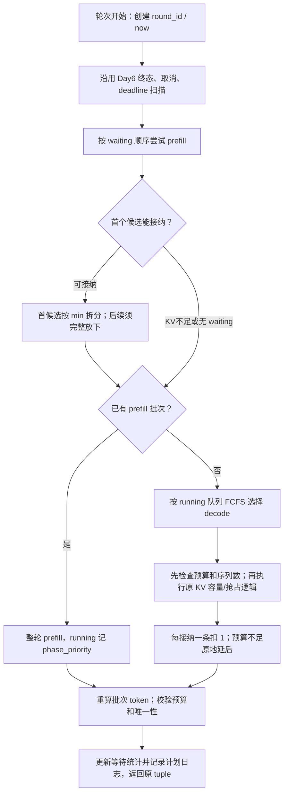

# Day 7 每轮 Token Budget 与 FCFS 调度设计

> 对应 `plan.md` 阶段二 Day7。本文件是**待实现的设计与验收标准**，不是实现完成报告。目标是让每次实际推理迭代都有统一、可验证的 token 上限，并能解释请求为何因预算延后、等了多久。本文的“当前代码”按下面区分的基线理解，不能把 Day6 feature 上的代码误认为已经存在于 dev。

- 功能分支：`feature/scheduler-token-budget`，从 `dev=555ef43` 创建。
- 设计前置：Day6 已在 `feature/request-lifecycle-state-machine` 提交，提交 `c84e73f42be21aff377798bf849113dc66d18c2d`（`feat(engine): complete Day6 request lifecycle state machine`）。
- **当前分支尚不包含 Day6**。本轮只写设计，不合并、不 cherry-pick、不移动 dev/main。开始 Day7 代码实现前，须在获得分支集成授权后让开发分支具备 Day6 基础；集成方式与冲突解决另行执行并记录，不在本文中假定已经完成。
- 相关设计：[请求生命周期](./request-lifecycle.md)、[架构](./architecture.md)、[KV Cache](./kv-cache.md)、[Prefill/Decode](./prefill-decode.md)。Day6 验收/三轮审查记录位于上述 Day6 提交的 `docs/day6-validation.md`、`docs/day6-review.md`，在当前 dev 基线工作树上尚不存在。
- 实现涉及：`nanovllm/config.py`、`nanovllm/engine/scheduler.py`、`nanovllm/engine/llm_engine.py`；原则上不改 `BlockManager` 分配语义、模型执行布局或 Sequence 的 TP 协议。

## 1. 需求背景与当前差距

`max_num_batched_tokens` 已存在于 Config，默认 16384。调度器 prefill 已按剩余预算分配 `num_scheduled_tokens`，且上游已经有“本轮第一个请求允许拆分 prefill、后续请求必须放得下才接纳”的行为。因此 Day7 不是简单增加一个同名字段，更不能把已有 chunking 删除后让长请求永远无法入队。

当前缺口：

1. **Decode 没有预算限制**：只按 `max_num_seqs` 选择请求。若 budget=2、可运行请求=8，可能执行 8 个 decode token，超过上限。
2. Prefill/decode 的 token 记账没有统一的最终校验与轮次记录，不能从日志证明“每一轮实际执行未越界”。
3. 没有区分预算不足、KV 不足、批序列数上限、prefill 阶段优先、显式暂停等原因；不能把所有没选中的请求都算为预算等待。
4. 没有预算导致的等待次数、人数和时间记录；请求终态会删除活动索引，统计若未及时结算便丢失。
5. Day6 已建立终态清理、取消/超时安全边界、ID 所有权、暂停无进展拒绝；Day7 不能因新增预算重引入空批次执行、资源抢占误用或旧对象污染新身份的问题。

## 2. 目标、非目标与需求映射

### 2.1 必须完成

| plan.md Day7 要求 | 本设计落实 |
| --- | --- |
| 增加预算配置或等价能力 | 复用已有 `max_num_batched_tokens`，补严格有效性校验，统一两阶段口径。 |
| 统计 waiting/running 本轮 token 需求 | 定义 prefill 未缓存输入需求、decode 单步需求、候选/未候选原因及不可执行状态。 |
| FCFS、预算不足延后、不越界 | 队列内 FCFS，不跳过放不下的队首去选更短尾部；decode 也受预算约束；保留上游首请求分块例外。 |
| 记录因预算不足等待的人数和时间 | 每轮拒绝原因快照、请求预算等待 episode、累计计数/秒数与终态结算日志。 |
| 空/单/刚好/不足/多请求单测 | §8 的 CPU 矩阵及确定性时钟测试。 |
| 日志证明每轮实际 token 不越界 | 调度计划日志 + Engine 模型返回后的执行日志，统一 round_id 可核对。 |

必须保持两条硬约束：

```text
0 <= planned_tokens = sum(seq.num_scheduled_tokens for seq in batch) <= B
0 <= len(batch) <= max_num_seqs
```

对于非空实际执行批次，每个 `num_scheduled_tokens` 必须为正整数。预算按**本轮模型输入 query token 的数量**计算，不是请求总上下文、不等于本轮输出 token 数，也不是物理 KV block 数。

### 2.2 明确不做

- 不引入 Day9 mixed prefill/decode batch；继续返回整轮单阶段批次。
- 不改成 decode-first、最短任务优先、轮转、公平调度或优先级策略；不承诺有限预算下每个 running 请求每轮都生成 token。
- 不新建 Day8 的 prefill_offset/chunk_size 体系；仅保留并验证既有首请求 chunked prefill 行为，不声称已完成 Day8 的 8K/输出一致性验收。
- 不改变 KV 分配粒度：长请求仍可能预先分配整个上下文所需 block，token 上限不是显存硬上限。
- 不实现新的抢占策略、后台超时线程、HTTP/SSE、Prometheus 或完整性能仪表盘。
- 不改变采样参数、输出格式、随机数语义；不以本日预算机制承诺吞吐提升或 TTFT 改善。
- 不在运行中热修改预算；预算与批序列上限由初始化配置固定。

## 3. Token 需求与预算口径

### 3.1 定义

令 `B = max_num_batched_tokens`，`U = 本轮已承诺的输入 token 数`，`remaining = B - U`。

| 对象/情况 | 本轮需求 `needed_tokens` | 实际接纳 `scheduled_tokens` |
| --- | --- | --- |
| 新 WAITING、无 prefix 命中 | `seq.num_tokens` | 首候选可 `min(needed, remaining)`，后续候选须完整满足。 |
| WAITING、prefix 命中且尚未分配 | `seq.num_tokens - cached_blocks * block_size` | 同上；缓存块本轮不再执行，不占 token budget。 |
| 已持有 block 的分块 WAITING | `seq.num_tokens - seq.num_cached_tokens` | 延续既有进度；本轮首候选可拆分。 |
| 抢占后 resume 的 WAITING | prompt + 已生成 token 中仍需重算的部分，按 prefix 命中重新计算 | 重算输入占预算；不是只算剩余 prompt。 |
| RUNNING，进入 decode 候选集 | `1` | 只能 0 或 1；0 表示整请求本轮延后。 |
| 终态或待取消/已过期 | 不作为执行候选 | 0，先按 Day6 清理。 |
| 独立 PREEMPTED，尚未 resume | 本轮不可执行 | 0，不算预算等待。 |

`needed_tokens` 表示当前阶段希望一次推进的输入数，不是 max_tokens 配额；`scheduled_tokens` 才用于本轮上限。需要记录的候选需求必须来自本轮实际使用的 prefix 查询结果，不重复猜测命中数。对尚未成为候选或 KV 查询失败的请求可记录 `needed_tokens=null` 与原因，不能假装已有准确可执行需求。

### 3.2 prefix 与 KV 顺序

- 当前 `can_allocate(seq)` 返回缓存块数或 `-1`，是只读容量/命中查询，不改变引用计数。返回 `-1` 时标记为 KV 不足，不再声称“本次明确被 budget 拒绝”。
- 只有候选通过预算/序列数规则后才 `allocate/may_append`。预算延后不得额外分配 block，不得通过抢占腾资源来解决 token 不足。
- 若本轮预算已耗尽且不再查询后续请求，不虚构它们的 KV 可行性；按 §5 的“未检查/队首阻塞”原因记录。
- prefix 命中不能把非空执行变成 0 token 批次。沿用 BlockManager 不缓存最后待执行块的协议；如不变量失效，应显式报错而非向模型传空请求。

### 3.3 不计入预算的内容

- 已缓存历史 token、attention 读取的历史 context 长度。
- KV block 对齐/碎片；CUDA Graph 为固定 batch size 使用的 padding 槽位。
- 本轮采样输出 token（其数量可小于输入数，chunk 中间结果可丢弃）。
- 模型初始化 warmup、图捕获不是请求调度轮次，不混入 Day7 请求预算日志；单独说明其配置和内存影响。

例：上下文 8192 的一个 decode 请求仍消耗 1 个输入预算；prefill 输入 512、prefix 命中 256，则消耗 256；采样返回 1 token 不代表该 prefill 只消耗 1。

## 4. 调度与模块调整方案

### 4.1 Config：复用而不是新增竞争字段

- 保留字段名、默认值及 `LLMEngine` 参数过滤方式。
- 显式验证 `type(max_num_batched_tokens) is int` 且 `> 0`；拒绝 0、负数、float、字符串、bool，抛带字段名和实际值的 ValueError。不使用可被 `python -O` 移除的 assert。
- 同时确保 `max_num_seqs` 为正整数，否则无法保证有效调度。无须要求 `B >= max_num_seqs`，小于时正是 decode 分批的正常配置。
- Config 为配置验证主入口；Scheduler 面向 SimpleNamespace 等直接构造路径，在初始化时调用同一校验函数/等价集中入口，避免两套口径漂移。校验应在创建资源账本之前完成。

### 4.2 Scheduler：统一预算与延后规则

保留 `schedule() -> tuple[list[Sequence], bool]`，不在 Day7 替换成 mixed-batch 对象。建议仅增加少量内部函数/轮次统计结构，避免大型调度框架：

```python
# 示意接口；统计字段详见 §5–6
schedule() -> tuple[list[Sequence], bool]
_estimate_prefill_tokens(seq) -> tuple[int, int | None]
_record_budget_decisions(round_id, decisions, now) -> None
_finalize_round(batch, is_prefill, decisions, now) -> None
```

`_estimate_prefill_tokens` 不分配资源；返回需求以及分配时沿用的缓存块数。预算承诺统一累计，每轮末以 batch 的实际字段重算校验，不只信任循环局部变量。

流程：



#### Prefill

1. 沿用 waiting 当前顺序，先检查批序列数上限。
2. 在尚有预算时查询队首 KV 与实际未缓存需求；容量不足则停止 prefill 接纳。
3. 若本轮尚未接纳任何请求，允许首候选使用 `min(needed, remaining)`，保留已有拆分行为。
4. 若本轮已有请求，而后续候选需求大于 remaining，则整请求延后并停止扫描，不绕过它接纳更短尾部。
5. 接纳时才分配 block、设置正 `num_scheduled_tokens`、扣预算。只把本轮已排入最后 prefill 片段的请求按 Day6 规则转为 RUNNING；中间 chunk 仍 WAITING。
6. 有 prefill 批次就返回 prefill，不再加入 decode。预算余量可以留空，**不要求把每轮填满**。
7. 若没有任何 prefill 被接纳，可进入 decode；KV 无法分配与预算延后不能混为一谈。

#### Decode

1. 先检查剩余预算、max_num_seqs，达到上限时**不先 popleft，不先 may_append，不先 preempt**。
2. 队首 eligible RUNNING 需要 1 token；预算满足后才执行既有 KV can_append/抢占流程。
3. 如果必须因 KV 不足抢占队尾，仍用 Day6 preempt/resume；这属于 KV 原因，不统计为 budget 拒绝。
4. 成功接纳的请求各 `num_scheduled_tokens=1`，累计 `U += 1`；延后请求保留 RUNNING、token、KV 与相对顺序。
5. 不把 budget 延后改成 PREEMPTED/WAITING，不重置已缓存进度、不释放 block。
6. 沿用当前将已选择 decode 批次恢复至 running 队首的规则；不引入轮转公平策略。取消/正常完成会让后续请求前移。

### 4.3 FCFS 的准确边界与例子

本日 FCFS 是**当前阶段队列内部的稳定顺序**，不是跨 waiting/running 的全局按 created_at 排序。prefill 优先与 resume 插队到 waiting 队首是既有策略例外，继续保留并记录。持续新 prefill 可使 decode 等待；小 B 时 running 尾部也可能等到前序请求完成才推进，本日不承诺公平延迟上界，Day9 再改变策略。

| 场景 | 预期选择 | 说明 |
| --- | --- | --- |
| B=8，prefill 需求 [3,5,2] | [3,5] | 刚好耗尽，第三条延后。 |
| B=8，prefill 需求 [6,4,1] | [6] | 第二条放不下，不跳过它选第三条；余量 2 可不用。 |
| B=4，首 prefill 需求 10 | 首请求 4 | 保留已有 chunking，后续轮续 4、2，不永久等待。 |
| B=2，running [A,B,C,D] | [A,B] | 2 个 decode 输入；C/D 不释放 KV。 |
| B=8，max_num_seqs=2，decode 4 条 | 前 2 条 | 限制来自 sequence cap，不能伪记为 budget。 |
| B=4，有可接纳 prefill 和 running | 仅 prefill | 未选 running 是 phase_priority，不是 budget。 |
| B=2，无 prefill，4 条 decode，前 2 条本轮完成 | 先前 2 条，下一轮后 2 条 | 测试预算分批与最终完成；不要求首轮选中所有请求。 |

### 4.4 Engine 与模型接口

- `step()` 继续返回 `(outputs, num_tokens)`：prefill 正数、decode 负数、空批次 0。benchmark 依赖该历史口径，不能改成两阶段都正数。
- 正值 `planned_tokens` 单独保存于本轮快照/统计，decode 也为正数；不得拿 step 返回的负数直接与 B 比较。
- 调度返回后、模型调用前保存 `sum(num_scheduled_tokens)` 和 `(seq_id, request_id, n)` 快照；postprocess 会把临时字段清零，不能在其后据此倒推执行工作量。
- 模型返回后记录 executed query token 数，与调用前快照一致；即使 postprocess 因取消/超时丢弃采样输出，这轮已经执行的输入仍计入预算。
- 空批次不调用 ModelRunner，仍有调度日志说明原因；健康暂停无进展保留 Day6 的 RuntimeError 拒绝契约。
- 不修改 ModelRunner `run(seqs, is_prefill)` 或 prepare_* 张量语义；测试用 spy 核对 prefill 展平 input_ids 数与快照相符、decode 序列数与预算相符。TP rank 0 是统计权威，worker 不独立累计。
- `benchmarks/run_baseline.py` 当前在 step 前用整个 running 队列推断参与者和阶段，decode 受预算后该推断会把未执行请求也计入，且不是可靠的首 token 观察点。Day7 不改写 Day5 历史 baseline 数据，也不将旧脚本结果当作预算/TTFT 验收证据；以本轮实际批次快照和新验证脚本为权威。后续 benchmark 适配须读取真实调度/输出事件，另行记录口径变化。
- 模型异常不假记成功执行：记录 error 与 planned_tokens，`executed_tokens=null`（工作量未知）；不把未返回或仅计划过的轮次记成“实际执行成功”。不在 Day7 新造 FAILED 状态或完整错误恢复策略。

## 5. 预算延后统计与时间语义

### 5.1 原因分类：不把所有等待算 budget

每个活动请求每轮至多一个主原因，按本轮实际控制流记录：

- `scheduled`：实际接纳正 token 工作；首请求部分 chunk 也属于 scheduled。
- `budget`：当前队首/候选需求大于 remaining；或 remaining=0 且序列数上限尚未命中时，不需查询 KV 即已确定无法接纳正 token 工作。后者是“预算检查先阻止继续”的观察归因，不承诺 KV 也足够。Decode remaining=0 时其余 RUNNING 候选均按已知单位需求记 budget。
- `sequence_cap`：序列数上限先阻止接纳；若 budget 与 cap 同时命中，统一优先记 sequence_cap，日志同时保留两个数值，不重复记两次。
- `kv_capacity`：已查询候选但 KV 容量不足或被 KV 抢占。
- `head_of_line`：prefill 在前序请求处停止，尾部未独立检查预算/KV；附 `blocked_by_seq_id`、`blocking_reason`，不能声称尾部每一条本身都不够预算。
- `phase_priority`：本轮已有 prefill，running 没有成为 decode 候选。
- `paused`：独立 PREEMPTED，未恢复。
- 终态/取消/到期：先清理，退出本轮活动统计，不继续累计 budget。

预算人数需要两种互不混淆的展示：

```text
budget_deferred_direct = 主原因 budget 的请求数
budget_deferred_hol = 主原因 head_of_line 且 blocking_reason=budget 的请求数
budget_deferred_requests = 两者之和（本轮去重）
```

这回答“因预算导致等待的人数”，同时解释直接不足与 FCFS 连带阻塞。KV/sequence_cap/phase_priority/paused 不计入。对非候选的 needed_tokens 可为 null；不为测量额外模拟资源分配，更不能扰动 prefix cache。

**Prefill 恰好耗尽规则：** remaining=0、尚未命中 sequence cap 时，首个未处理 waiting 请求记 budget，`needed_tokens=null`、`kv_checked=false`；其后请求记 head_of_line，blocking_reason=budget、blocked_by_seq_id 指向这个首个未处理请求。无需查询 KV，也不声称它们 KV 可执行。[3,5,2]/B8（cap足够）第三条为 direct budget=1、HOL=0；若尾部还有第四条，HOL=1、总人数=2。若 remaining 与 cap 同时耗尽，按既定优先级首个未处理请求记 sequence_cap，其余为 sequence_cap HOL，不计预算人数。测试必须断言这些精确原因与计数。

### 5.2 等待 episode 与累计值

统计由 Scheduler rank 0 拥有，建议 `budget_wait: dict[int, BudgetWaitStats]` 按 seq_id/对象所有权管理，不用可复用的 request_id 作为唯一 key。只为有过 budget episode 的请求创建记录，终态日志后删除，避免全历史驻留。

```python
# 内部统计结构示意，不改变 Sequence TP payload
budget_deferred_rounds: int = 0
budget_wait_started_at: float | None = None
budget_wait_seconds: float = 0.0
```

- 每次 schedule 用一次单调时钟 `now`；测试可注入确定值（例如可选 keyword now 或统一 mock 时钟，不改变默认调用）。Scheduler 直接观察的 cancel/timeout/preempt 使用该操作时刻结算（显式 now 优先，否则读取同一时钟）；外部 `Sequence.mark_*` 或取消标记无法立即通知统计所有者，使用 Scheduler 首次观察/清理时刻结算，不倒填外部时间。postprocess 的收尾沿用其入口 now；内部嵌套清理传递同一 now，不重复取时。
- 当前原因属于 direct budget 或 budget HOL：本轮 `budget_deferred_rounds += 1`；若此前无 episode，设置 started_at=now；已有 episode 不重开。
- 首次观察到原因不再属于 budget（本轮被调度、转为 KV/phase/cap/paused，或清理终态）：结算 `now - started_at` 后关闭 episode。
- **按调度边界采样归因**：两轮之间时段沿用上一轮观察原因，不声称能拆出 wall-time 中不可观测的精确反事实等待。结束前可展示 `closed_seconds + max(0, now - started_at)`。
- 明确区分“请求-轮次数”与“唯一请求数”：一条请求连续等三轮，deferred_rounds=3，unique_requests=1；多个请求并行等待时间相加为 request-seconds，可能大于引擎墙钟运行时间。
- 部分 chunk 本轮有推进，不把剩余未执行 token 当成“整请求预算等待”；其 chunk 数/剩余需求可单独展示，不增加该轮 deferred_requests。
- cancel/timeout/外部 mark_* 终态收尾都要关闭 episode 并发终态摘要；普通完成同理。关闭和累计必须幂等，重复 `_finalize()` 不重复增加累计计数或删除新对象记录。可复用 ID 的新请求从 0 开始。
- 显式 preempt 也会结束已有预算 episode，因为此后等待原因为 paused/KV；不要把暂停时长继续算预算等待。
- 不用 wall clock 判断 deadline 或计算等待，不用 created_at 代替 budget_wait_started_at，不等同于整体 queue time/TTFT。

可验算时间线：t=10 首次 budget，t=12 再 budget，t=15 scheduled：rounds=2、closed_seconds=5；t=20 又 budget，t=23 cancel：总 rounds=3、closed_seconds=8。重复清理不改变 8，新对象即使复用 ID 也仍从 0 开始。

### 5.3 累计与有界保存

Scheduler 生命周期内维护标量：`budget_deferred_unique_requests_total`、`budget_deferred_request_rounds_total`、`budget_wait_closed_seconds_total`。首次为一个请求对象创建 budget_wait 记录时 unique 加 1；episode 关闭后记录保留至终态，后续 episode 不再增加 unique。每轮被归因为 budget/direct 或预算 HOL 时 request_rounds 加 1；每次 episode 关闭仅把本次时长加到 closed_seconds_total，终态摘要不再重复加。复用 request_id 的新对象以新 seq_id/所有权独立计数。这样无需无限保存历史 ID 集合。

展示“截至 now 的总预算等待时间”时，可用 closed_seconds_total 加所有活动开放 episode 的 `now-started_at`；该实时值另命名 `budget_wait_observed_seconds_total`，不能再写回 closed 累计。每条记录也分别展示已结算与当前未结算值，避免同一秒数反复相加。

只保留本轮 `last_schedule_stats`、活动统计和标量累计；请求终态后输出摘要并删除其记录，不把无限轮次/全部 token_ids 常驻内存。需要完整运行历史时由日志文件负责，符合 Day6 终态索引回收和 ID 所有权规则。

## 6. 日志、统计接口与可核查证据

使用 Python 标准 logging 的模块 logger，不在库代码 `basicConfig()`、不每轮无条件 print。验收脚本负责开启 INFO 并输出 JSON Lines；生产是否开启由调用方决定。所有记录不包含 prompt 文本或 token 内容，仅 IDs、计数与原因。每个事件必须带单调时钟 `observed_at`；episode 关闭时另发 `budget_wait_episode` 事件，含 seq_id/request_id、started_at、ended_at、duration_seconds、关闭原因与关联 round_id（操作发生在轮外时 round_id 可为 null）。终态摘要保留累计值，解析器应能从 episode 原始起止时间独立重算等待秒数，而不是只相信最终计数。

### 6.1 调度计划事件 `scheduler_round`

最低字段：

```json
{"event":"scheduler_round","round_id":12,"phase":"decode","token_budget":2,
 "max_num_seqs":8,"planned_tokens":2,"scheduled_requests":2,
 "budget_deferred_direct":2,"budget_deferred_hol":0,"budget_deferred_requests":2,
 "decisions":[{"seq_id":21,"request_id":"req-21","needed_tokens":1,
               "scheduled_tokens":0,"reason":"budget","budget_wait_seconds":0.5}]}
```

示例 decisions 仅展示一项；实际接口需包含本轮接纳与延后快照，或提供可关联的分条记录，验收程序能核对每个批次成员和各类计数。phase 取 `prefill/decode/idle`；每次 schedule 分配唯一单调 round_id，空轮也记录，指标不要用外部 ID 作为轮次 ID。

### 6.2 Engine 执行事件 `engine_round`

字段至少含 round_id、phase、budget、planned_tokens、executed_tokens、model_called、outcome=`completed/idle/error`。completed 只在模型返回后记录，executed_tokens 是返回成功的模型输入 query token 数，**不是 completion 数**。idle 为 model_called=False、executed_tokens=0；error 为 executed_tokens=null，不虚报上限已验证成功。

在调用前显式检查 batch 内计数有效且不超预算，错误包含 round_id/需求/预算，不依赖 assert。正常返回轮次必须有 `executed_tokens == planned_tokens <= budget`；测试还应从 runner 入参/实际组装输入独立验证，不以同一变量自证。

### 6.3 请求等待摘要 `request_budget_wait`

至少包含 seq_id、request_id、budget_deferred_rounds、budget_wait_seconds、终态 status/finish_reason；该摘要用于终态索引删除后的验收，不改变 generate 返回结构。若没有预算延后，可输出 0；重复收尾不重复发终态累计事件。

### 6.4 验收工具（计划交付，不代表目前存在）

建议新增 `scripts/validate_token_budget.py`，提供 CPU trace 和显式 GPU 入口：

```bash
# 默认 CPU/runner 桩，固定时钟与请求集，输出 JSONL 并独立校验
python scripts/validate_token_budget.py --mode cpu --output /tmp/day7-budget-cpu.jsonl
# 真实本地模型，无自动下载；参数沿用 Config
python scripts/validate_token_budget.py --mode gpu --model "$MODEL_DIR" \
  --token-budget 8 --max-num-seqs 16 --max-new-tokens 4 \
  --output /tmp/day7-budget-gpu.jsonl
```

CPU trace 应用 block_size=8、小 B、固定注入 token，无模型初始化。GPU 使用默认物理 block_size=256，支持 eager/TP=1 默认，脚本自检输入样例能容纳 KV；budget=8 只控制请求迭代，不误改物理 block 大小。终端总结轮次数、非空轮次数、最大 executed_tokens、预算延后人数/轮次数/秒数、结束时 free/used block；日志解析失败或任一非空成功轮超限退出非零。不能只打印“通过”而不保存原始事件。

## 7. 必须维持的不变量与风险

1. **统一上限**：prefill/decode 都按实际输入 query token 计数，非空 batch 每条正值，总和不超过 B。
2. **两项约束独立**：同时满足 token cap 与 sequence cap；不能用一个替代另一个。
3. **延后零资源副作用**：仅因预算没选中的请求不分配、不释放、不抢占、不追加 token；相对队列顺序稳定。
4. **状态机单一权威**：继续使用 Day6 VALID_TRANSITIONS 和统一入口；预算是调度决策，不是新业务状态。
5. **清理/指标所有权**：资源、身份标记、预算等待累计都按当前对象所有权收尾，旧批次重复结果不污染新 ID。
6. **时间可复现**：统一 monotonic/perf_counter；连续 episode 不重开、终态/原因变更即结算；累计不为负。
7. **计划与执行区分**：在临时计数清零前采样；取消导致输出被丢弃不抵扣已执行 token；模型失败不记成功。
8. **无无效空轮忙循环**：合法 B>0 且有 KV 可执行候选时应推进；显式暂停沿用 Day6 拒绝；KV 根本不可满足的基线错误不得伪装成 budget 等待永久循环。
9. **接口兼容**：schedule tuple、step 正负号、generate 格式、TP 执行布局保持；统计为 rank 0 内部字段，不无故扩展 pickle。
10. **开销有界**：每轮至多线性扫描活动请求以记录原因，日志不载入 prompt/token 明细；不做 O(n²) 逐对象全队列查找或保存无限历史。必要时本轮构造 membership set/决策 map。

主要风险与取舍：

- 严格阶段内 FCFS 不等于公平；小预算可能降低尾部 decode 进度，必须明确展示，不擅自切换轮转。
- 首请求 chunking 已存在，是兼容性前提；不要为了“预算不足整请求延后”让需求大于 B 的首请求永远饿死。
- max_num_seqs 与预算同时触发的统计优先级必须固定，避免人数跨实现变化；日志保留原始 B/U/cap 方便解释。
- GPU 的小预算 warmup 与真实短输入配置不同于性能基线；本日证明上限和正确性，不用该 smoke 宣称性能提升。
- prefix 的容量可行性不是预算可行性，pending token 不能用 block_size 向上取整记为实际输入。
- Day6 健康暂停 RuntimeError 路径进度条未显式 close、异常不返回部分结果为已记录非阻塞限制；Day7 若触及 generate 的异常路径，可局部 finally 清理，但不新增失败原子性承诺。

## 8. 测试设计（先 CPU，后真实 GPU）

### 8.1 新增 `tests/test_token_budget.py`

文件头注明覆盖范围、无 GPU/模型依赖和执行命令。使用 SimpleNamespace、每测试 fixture 对齐并恢复 Sequence.block_size、runner spy 注入 token，时间使用注入或 mock。不要加载权重。

| 类别 | 必须覆盖的场景与断言 |
| --- | --- |
| 配置 | B=1、B<max_num_seqs 合法；0/负数/float/str/bool 拒绝；max_num_seqs 非法拒绝；优化模式显式验证不依赖 assert。 |
| 空与终止 | 初始空队列；最后取消/到期/外部 mark_* 被清理；空轮 token=0、runner 不调用、日志 idle；健康暂停沿用拒绝不忙循环。 |
| 单 prefill | 需求小于/等于 B；需求大于 B 分块推进；最后片段才 append completion，中间片段丢弃采样；block 不重复分配。 |
| 多 prefill | [3,5,2]/B8 刚好；[6,4,1]/B8 不跳过第二条；prefix 命中、部分缓存和 resume recompute 按未缓存 query 计费。 |
| Decode 硬上限 | 先以多轮 prefill 造出 N 个 RUNNING，再 B=2、N>2 选择恰好2；不得运行时改 B 造场景；spy 捕获实际输入成员。 |
| Decode 副作用 | 未选中请求 token/status/KV/ref_count 不变；B=1 的边界不为预算抢占队尾；资源不足时仍按原 KV 抢占，原因不是 budget。 |
| FCFS 与最终完成 | running [A,B,C,D]/B2，A/B 输出长度有界，完成后 C/D 推进；不重复入队、不逆序、不要求每轮全员公平。 |
| 相互限制 | max_num_seqs 先限制、与 B 同时限制、prefill 优先抑制 decode、KV 队首不足、未检查 HOL 原因分别正确。 |
| 统计人数 | direct/HOL 总数去重；多个延后轮只算一个 unique request；部分 chunk 不计整请求延后；不同非预算原因不混算。 |
| 统计时间 | t10/t12/t15 和 t20/t23 时间线精确为 rounds=3、seconds=8；无 sleep；原因切换、取消/超时、抢占、直接 mark_*、重复清理均正确。 |
| 所有权回归 | A 终态、B 复用 ID 后旧 A 重复 postprocess：B 身份与等待记录不变，终态摘要/累计不重复；两种结束方式均覆盖。 |
| Engine 观测 | prefill/decode 计划与 runner 输入相等；postprocess 清零后仍有正确执行日志；执行返回期间取消/到期 token 丢弃但 executed 不减；runner 抛错 executed=null。 |
| 日志 | caplog 或 JSON 解析验证每轮 ID 唯一、计划/执行关联、所有正常执行 <=B、空轮0、人数/秒数可重算、无 prompt 明文。 |
| 长序列混合 | 固定随机 seed 交错 add/cancel/timeout/preempt/resume/旧结果；轮次上限避免挂死，身份/队列/ref_count/free-used 全部平衡。 |

构造 decode N>B 的方式：B=2、prompt 长度=1、max_tokens 足够大，多轮 prefill 每轮接纳两条新请求且尚不完成，最后 waiting 空时检查 decode 只选两条。不要为了测试而热改预算，从而绕过真实初始化行为。

### 8.2 全量兼容回归

在已经集成 Day6 的工作区执行：

```bash
python -m pytest tests/test_token_budget.py -q
python -m pytest tests/test_request_lifecycle.py -q
python -m pytest tests/test_kv_cache_lifecycle.py tests/test_block_manager.py tests/test_sampler.py -q
python -m pytest -q
python -O -m pytest tests/test_token_budget.py -q
```

Day6 提交有 99 项正式测试（79 lifecycle + 20 既有），是实现起点；当前从 dev 迁出的 Day7 设计分支尚未具备该数量。新增测试后的总数由实际运行记录，不预填“99+某数 passed”。日志脚本和优化模式 warning 也如实写入验收记录。

### 8.3 GPU 最小验证

GPU + 本地模型可用时执行，不默认下载或改变权重。使用 Qwen3-0.6B、TP=1、eager，预算取 8/16/32，max_num_seqs 至少 16（包含 B<max_num_seqs 的场景），max_new_tokens=4 或 8，greedy。模型上下文上限与物理 KV 容量留足，不把容量不足误算为预算问题。

- 用短 token prompt 和不同到达轮次制造 decode 数量大于 B；日志必须看到 decode 受预算分批。
- 用 token 长度精确为 B-1/B/B+1、超过两轮 B 的 prompt 验证 prefill 计数与继承的 chunking；复用 prefix 的场景核对只计实际未缓存 token。
- 对至少 5 个固定 prompt，对比充裕预算与受限预算的最终 greedy token_ids/输出顺序。保留实际输入、seed/参数、输出；若因数值差异出现不同，分析并记录，不偷改预期或将随机采样跨 chunk 的 RNG 差异冒称回归。
- 执行边界取消/超时不追加过期 token，已经完成的模型输入仍记账；终态后 KV 与活动/等待统计索引清空。
- 保存 JSONL、模型/硬件/参数、实际命令、每轮最大 executed_tokens；验证脚本独立解析，没有一轮成功执行超 B。
- 没有 GPU/权重就明确未实测，CPU 通过不代替 GPU；TP>1/CUDA Graph 不强制扩展到本日，但必须记录是否执行。

## 9. 实现步骤与交付物

1. **基线准备**：经授权集成 Day6，确认分支含 c84e73f（或明确记录等价集成提交），先跑 99 项基线回归；保留 Day6 身份/暂停语义。
2. **先定义测试口径**：写配置边界、decode N>B、FCFS、时间线及日志字段测试，明确上游已有 prefill 行为，不追求先做完再补测试。
3. **统一计费**：复用配置，补显式校验、prefill 需求估算和两阶段 U/remaining 记账；decode 在出队/资源操作之前检查预算。
4. **接纳与延后原子性**：确保 budget defer 无 KV/状态变化；补 final batch 重算与 Engine 调用前检查，保留原返回协议。
5. **等待统计**：加入有界 rank 0 统计结构与原因决策，结算 episode，接入 cancel/timeout/preempt/finalize；复用 Day6 所有权保护避免迟到结果污染。
6. **可核查日志**：计划、执行、终态等待摘要；模型异常执行量未知，空轮不调用模型；标准 logging，不改全局日志配置。
7. **完整 CPU 回归**：新文件、Day6、KV/采样、全量与优化模式，固定 seed 混合检查加轮次上限。
8. **GPU 和证据**：按条件执行最小预算 sweep、greedy 对比、真实输入计数核对；保存原始日志与参数，不预先承诺性能。
9. **验收记录与审查**：新增 `docs/day7-validation.md`（实施后创建）、完善文档索引；逐项记录通过/失败/未测，不改设计标准规避失败。

计划交付：实现改动、`tests/test_token_budget.py`、`scripts/validate_token_budget.py`、本设计、实施后的 `docs/day7-validation.md`、可追踪 JSONL 证据（路径/复现方式写在记录内）。本次任务仅交付设计，不创建虚假的实施验收记录。

## 10. 最终验收清单（实施时逐项核对）

### 功能与口径

- [x] 复用单一预算配置，正整数显式校验，允许 B<max_num_seqs，优化模式仍生效。
- [x] Prefill、decode 每轮实际 query token 均不超过 B，非空请求的本轮计数为正（调度/执行快照层面）。
- [x] Prefix 命中、已缓存分块、抢占恢复按真实未缓存输入计费，不按总上下文/输出数/block 数误计（真实 runner 输入仍待独立核对）。
- [x] 阶段内 FCFS 不跳过放不下的前序请求；首请求既有 chunking 可持续推进。
- [x] 预算延后保留状态、KV、token 和顺序，不误抢占、不重复分配或重复入队。
- [x] 正确区分 budget/direct、预算 HOL、KV、sequence cap、阶段优先、暂停等原因。
- [x] 每轮预算延后人数、请求-轮次数、唯一请求数与预算等待秒数口径已定义并由单测覆盖（完整日志交叉重算仍待补）。
- [x] 时间 episode 在接纳/原因变化/终态/抢占时正确结算，重复清理及 ID 复用不污染新对象或重复累计。

### 接口、观测与兼容

- [x] schedule tuple、step 正负工作量、generate 输出、Day6 状态机与 TP 协议保持兼容（TP 实测仍未覆盖）。
- [ ] 计划日志与实际执行日志按 round_id 关联，postprocess 清零不丢证据，取消丢输出不抹去已执行输入（已补轮次对账；真实输入独立核对待补）。
- [x] 空轮不执行模型；模型异常不虚报成功 token；健康暂停不引入忙循环。
- [x] 标准日志配置由调用方控制，日志不含 prompt 明文，统计内存随活动请求数有界（日志测试场景仍需补强）。
- [x] 新 CPU 测试覆盖空/单/刚好/不足/多请求、统计时间、所有权与随机混合场景，并有防挂上限（部分资源硬断言待补）。
- [x] Day6 及 Day2–5 全量回归通过，数量与命令均为历史实际执行结果；本次审查未重新执行全量。

### 实测与交付

- [ ] 可解析日志证明每轮成功实际执行的 query token<=B，且有 decode 预算真正生效的证据（CPU 日志通过；独立输入核对与完整交叉重算待补）。
- [x] GPU/模型可用时完成最小实测与至少 5 个 prompt 的 greedy 对比；不可用或失败明确记录，不冒称通过（历史记录已提供 GPU 证据，本次未重跑）。
- [x] 设计与验收记录加入文档索引，保存配置、原始日志位置、未覆盖边界及已知策略限制。
- [ ] 实施前已完成经授权的 Day6 基线集成，提交说明覆盖预算、等待统计、资源/协议影响和实际测试（集成已完成，但当前实现未提交，提交说明证据待最终提交时补齐）。

## 11. 与 Day8–10 的衔接

- Day8 在统一 token 口径下引入明确 chunk 控制/进度接口；预算限制不变，但首候选 chunk 策略可扩展，仍需保证位置与输出正确。
- Day9 引入 mixed-batch 后，一轮总预算变为 `sum(prefill query tokens) + number_of_decode_queries`；需要新 batch 表示，不能仅把当前 bool 改名。届时 phase_priority 与公平指标重新设计，保留本日对 budget 的独立归因。
- Day10 增强资源/超时/抢占策略，应继续区别 token 算力约束与物理 KV 容量约束，继承幂等身份与等待统计收尾。
- Day14 可把已定义计数映射到 Prometheus；本日先把意义、时间口径和原始日志做正确，不提前承诺服务层指标接口。
